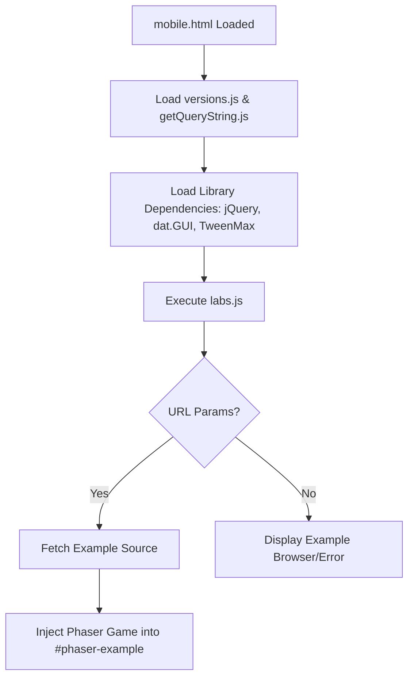

# Root — mobile.html

# Mobile Entry Point: `mobile.html`

The `mobile.html` file serves as the specialized entry point for running Phaser 3 examples on mobile devices. It provides a lightweight, full-screen shell that prepares the environment, loads necessary dependencies (like dat.GUI and TweenMax), and initializes the example runner.

## Core Purpose

Unlike a desktop-specific loader, this module is configured to handle the constraints of mobile browsers, specifically focusing on viewport scaling and ensuring the canvas occupies the full available screen real estate without unwanted padding or scrolling.

## Key Components

### 1. Mobile-Optimized Viewport
The document includes a specific meta tag to prevent scaling issues common on mobile handsets:
```html
<meta name="viewport" content="width=device-width, initial-scale=1, shrink-to-fit=no">
```
This ensures that the Phaser canvas renders at a 1:1 pixel ratio relative to the device's CSS pixels and prevents the browser from automatically zooming out.

### 2. The Script Stack
The file orchestrates the loading of several utility and library scripts required for the Labs environment:

| Script | Purpose |
| :--- | :--- |
| `versions.js` | Manages and selects the specific version of the Phaser library to use. |
| `getQueryString.js` | Parses URL parameters (e.g., to determine which example file to load via `?src=...`). |
| `jquery-3.1.1.min.js` | Used for DOM manipulation and internal Labs UI components. |
| `datgui.js` | Provides the debug/experimental UI overlay used to tweak variables in real-time. |
| `TweenMax.min.js` | GSAP library used for various UI and programmatic animations within the runner. |
| `labs.js` | **The Entry Point Script.** This script reads the environment state and bootstraps the actual Phaser game instance. |

### 3. Display Container
The module defines a single, critical DOM element:
```html
<div id="phaser-example"></div>
```
This ID is the hardcoded mounting point used by `labs.js`. The Phaser `Config` object generated by the runner targets this ID to inject the `<canvas>` or `<webgl>` element.

### 4. Full-Screen Styling
The internal CSS ensures there are no margins or padding, allowing the game canvas to behave as a standalone mobile application:
```css
body {
    margin: 0;
    padding: 0;
    width: 100vw;
    height: 100vh;
}
```

## Initialization Flow

The following diagram illustrates how `mobile.html` transitions from a static document to an active Phaser instance:



## Developer Notes

*   **Global Scope:** Because this file loads scripts sequentially in the global scope, variables defined in `versions.js` or `getQueryString.js` are immediately available to the subsequent `labs.js` execution.
*   **Targeting:** If you are debugging layout issues on mobile, check the `100vw/100vh` properties in the `<style>` block. Some mobile browsers (like Safari on iOS) handle "vh" units including the address bar, which might require adjustments in the Phaser Scale Manager settings rather than this HTML file.
*   **No Internal Logic:** This file is strictly a bootstrap shell. Logic for game initialization or Phaser engine configuration resides within `/js/labs.js`.