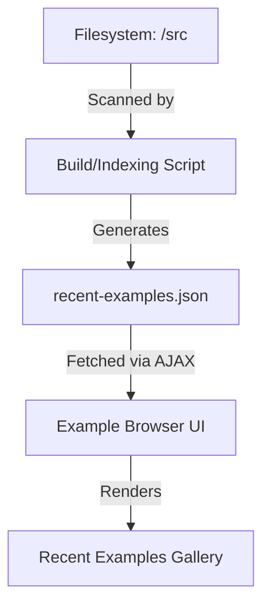

# Root — recent-examples.json

# Module: `recent-examples.json`

The `recent-examples.json` file serves as a static metadata registry for the codebase's example gallery. It acts as a cache of the most recently created or modified example scripts, allowing the front-end UI to display a "Latest Examples" or "Recently Updated" section without performing expensive filesystem crawls at runtime.

## Purpose

The primary objective of this module is to provide a sorted list of example files based on their creation time (`birthtimeMs`). By pre-calculating this list, the application minimizes latency when populating the landing page of the example browser.

## Data Structure

The module consists of a JSON array of objects. Each object represents a single source code example with the following schema:

| Property | Type | Description |
| :--- | :--- | :--- |
| `path` | `string` | The relative path to the source file (e.g., `src\tweens\relative value.js`). |
| `name` | `string` | The display name of the example, usually derived from the filename. |
| `birthtimeMs` | `number` | High-resolution timestamp representing the file's creation time on the disk. |

### Example Entry
```json
{
    "path": "src\\tweens\\relative value.js",
    "name": "relative value.js",
    "birthtimeMs": 1725593394961.764
}
```

## Architecture & Integration

While `recent-examples.json` is a static data file, it sits at the intersection of the build process and the client-side UI.



### 1. Generation (Build Time)
This file is typically generated by a Node.js utility script (not shown in this specific module) that uses `fs.statSync` or an equivalent to extract `birthtime` metadata from the `src/` directory. The script filters for `.js` files and sorts them descending by time.

### 2. Consumption (Runtime)
The client-side application (the Example Gallery) fetches this manifest. The data is used to:
- Populate the "Newest" sidebar or homepage section.
- Construct URLs for the code viewer by prepending the base repository path to the `path` property.
- Display file names in the navigation menu.

## Maintenance Notes

- **Manual Edits:** While this file can be edited manually, any changes will likely be overwritten the next time the indexing script runs.
- **Path Separators:** Note that the paths current use Windows-style backslashes (`\\`). If the deployment environment or the AJAX consumer expects POSIX-style paths, a sanitization step may be required in the UI component before usage.
- **Scope:** The current manifest is heavily focused on the `src/tweens/` directory, suggesting it may be a partial index or the current focus of development.

## Usage in Development

To reference an example from this module in a UI component (e.g., React or Vue):

```javascript
// Conceptual usage in a UI Component
import recentUpdates from './recent-examples.json';

function getLatestExample() {
    // Returns the first item as it is pre-sorted by birthtimeMs
    return recentUpdates[0];
}
```