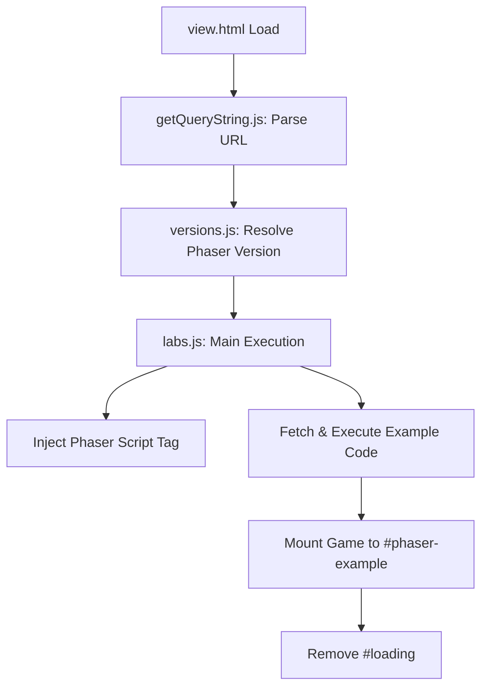

# Root — view.html

# Module: view.html

The `view.html` file serves as the primary host environment and runner for Phaser 3 examples. It provides a standardized wrapper that includes the game viewport, diagnostic tools, and a navigation interface for developers to interact with and debug specific example scripts.

## Purpose

This module acts as a "shell" that initializes the necessary environment for a Phaser example to execute. It manages:
1.  **Rendering Target**: Providing a specific DOM element for the Phaser Canvas/WebGL context.
2.  **Tooling Integration**: Loading `dat.gui` for runtime property manipulation and Spector.js hooks for WebGL debugging.
3.  **Developer Utilities**: Exposing a navigation bar with shortcut links for editing, viewing source, and switching rendering modes.
4.  **State Management**: Utilizing helper scripts to parse URL parameters and determine which version of Phaser and which specific example script to load.

## DOM Structure

The document is structured into three main functional areas:

### 1. Game Container
*   **`#phaser-example`**: The primary div where the Phaser game instance is injected.
*   **`#loading`**: A text element visible during the initialization phase, typically hidden once `labs.js` successfully boots the engine.

### 2. Navigation Control (`#nav`)
This section contains several interaction points used by `labs.js` to modify the environment or navigate the labs hierarchy:
*   **`backlink`**: Returns to the example browser.
*   **`sandboxlink`**: Opens the current code in an interactive sandbox.
*   **`sourcelink`**: Navigates to the raw source code of the example.
*   **`forcemode`**: Appends flags to the URL to force Canvas rendering over WebGL.
*   **`webgldebug`**: Triggers WebGL instrumentation.

### 3. Utility Elements
*   **`#phaser-spectorjs`**: A placeholder for the Spector.js UI when debugging GPU frames.
*   **`#clippy`**: A hidden input field used as a hack for "Copy to Clipboard" functionality (e.g., copying example URLs or snippets).

## Script Dependencies

The order of script execution is critical for the environment setup:

| Script | Responsibility |
| :--- | :--- |
| `versions.js` | Defines available Phaser builds and versioning logic. |
| `getQueryString.js` | Utility to parse URL parameters (e.g., identifying the `src` of the example). |
| `jquery-3.5.1.min.js` | Used by `labs.js` for DOM manipulation and event handling in the nav bar. |
| `datgui.js` | Provides the UI for tweaking live variables within examples. |
| `labs.js` | **Main Controller.** Orchestrates loading the specific Phaser build, fetching the example script, and wiring up the UI links. |

## Execution Flow

While `view.html` is a static file, it initiates the following logical flow via its scripts:

## Developer Usage

### Adding New Tools
If you need to add a global debugging tool (e.g., a performance profiler), it should be injected in the `<head>` of this file or added as a link within the `#nav` div. 

### Styling
Visual styles for the runner environment (the navigation bar, background, and fonts) are maintained in `css/labs.css`. The `#phaser-example` container is styled to be responsive or fixed based on the example's internal configuration, but `view.html` provides the baseline layout.

### URL Parameters
The behavior of this page is heavily driven by query strings parsed during load:
*   `src`: Path to the JavaScript example file.
*   `v`: The version of Phaser to load.
*   `forceCanvas`: Boolean to bypass WebGL.