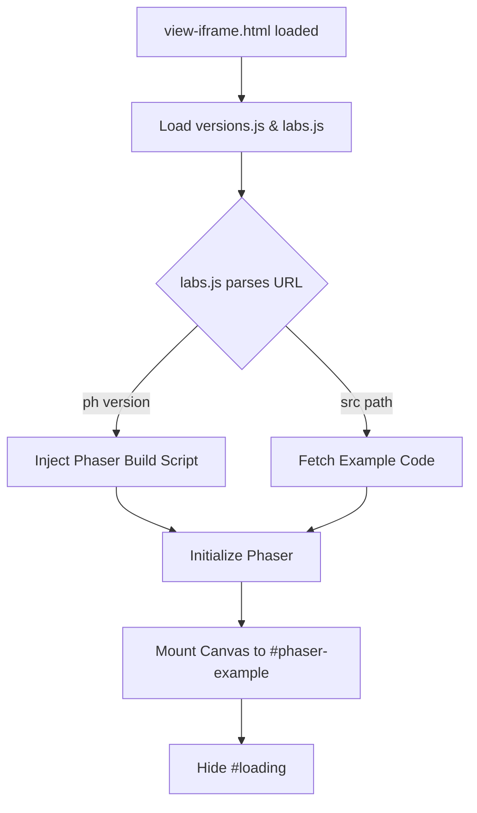

# Root — view-iframe.html

# View Iframe (`view-iframe.html`)

The `view-iframe.html` file serves as the isolated sandbox environment for running Phaser 3 examples within the Phaser 3 Labs ecosystem. It provides a clean, minimal DOM structure required to boot a Phaser instance and acts as the target for the example runner.

## Overview

This module is designed to be loaded inside an `<iframe>` by the main Labs transition/navigation logic. Its primary responsibility is to provide a mounting point for the Phaser game canvas and to load the orchestration scripts necessary to fetch and execute example code.

## DOM Structure

The document defines two key elements:

*   **`<div id="phaser-example"></div>`**: The container where the Phaser game instance is mounted. Most lab examples are configured to target this specific ID.
*   **`<p id="loading">`**: A simple UI element displayed to the user while the Phaser build and the example script are being fetched.

## Dependencies

The module loads several critical scripts that handle the environment setup:

| Script | Purpose |
| :--- | :--- |
| `versions.js` | Contains metadata regarding available Phaser versions (e.g., `beta`, `dev`, `stable`). |
| `getQueryString.js` | A utility for parsing URL parameters, used to determine which example and which version of Phaser to load. |
| `jquery-3.1.1.min.js` | Used for DOM manipulation and potential AJAX requests for source code fetching. |
| `labs.js` | **The Core Orchestrator.** This script reads the query parameters, selects the Phaser build, fetches the example JS file, and manages the lifecycle of the example. |

## Execution Workflow

Though `view-iframe.html` contains no inline logic, it initiates the following sequence via its dependencies:



## Integration Details

### Sandboxing
By running examples inside this iframe, the Labs site ensures that global variable collisions (common in Phaser example code which often uses global scope for simplicity) do not affect the main site's UI or navigation logic.

### Example Mounting
Standard Phaser 3 examples designed for the Labs usually follow this configuration pattern to match this module's DOM:

```javascript
var config = {
    type: Phaser.AUTO,
    parent: 'phaser-example', // Matches the div ID in view-iframe.html
    // ... rest of config
};
```

## Maintenance Notes
*   **Styling:** The `body` margin is set to `0` to ensure the game canvas sits flush against the iframe boundaries.
*   **Viewport:** The meta tags are configured for mobile responsiveness (`width=device-width`), ensuring examples scale correctly when viewed on mobile devices.
*   **Loading State:** If the `#loading` text persists, it typically indicates a failure in `labs.js` or a 404 error when fetching the requested Phaser build or example script.