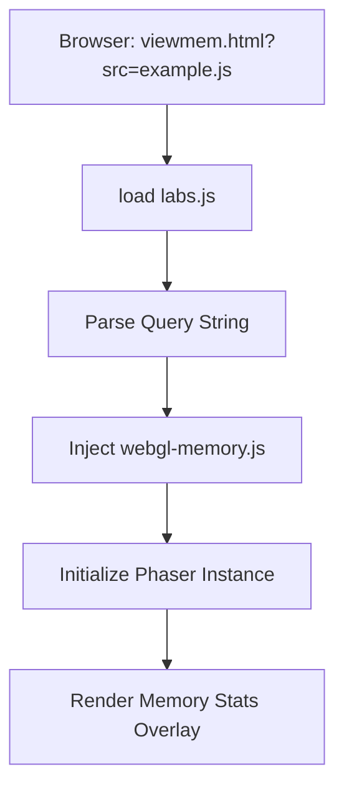

# Root — viewmem.html

# Module: Root — `viewmem.html`

The `viewmem.html` file is a specialized entry-point for the Phaser 3 Examples environment. Its primary purpose is to provide a wrapped execution context for Phaser examples that includes active **WebGL memory monitoring**.

## Purpose

While `view.html` is the standard runner for examples, `viewmem.html` includes the `webgl-memory.js` library. This library intercepts WebGL calls to provide a real-time count of resources such as textures, buffers, and shaders. 

It is designed for developers who need to:
1.  Debug GPU memory leaks.
2.  Verify resource cleanup during scene shutdowns.
3.  Analyze the memory footprint of complex assets in Phaser 3.

## Execution Flow

The module acts as a container that orchestrates the loading of a specific Phaser example based on URL parameters.

1.  **Environment Setup**: The browser loads the CSS and core utilities (`versions.js`, `getQueryString.js`).
2.  **Memory Instrumentation**: The `webgl-memory.js` script is loaded. This script must be loaded before the WebGL context is created to successfully proxy the drawing commands.
3.  **Lab Initialization**: `labs.js` executes. It identifies the target example script from the URL (e.g., `viewmem.html?src=src\physics\arcade\simple-body.js`) and dynamically injects the Phaser library and the example code into the page.
4.  **UI Linking**: The navigation elements (`#nav`) are populated with context-aware links (e.g., "Edit" leads to the code editor for that specific example).

## Key Components

### External Dependencies
- **webgl-memory.js**: A utility by Gregg Tavares that wraps `getContext` to track WebGL resource allocation.
- **labs.js**: The core logic driver for the Phaser Examples site. It handles the dynamic loading of example scripts and the communication between the UI and the running Phaser instance.

### DOM Structure
- `#phaser-example`: The target `div` where Phaser will inject its `<canvas>` element.
- `#loading`: A placeholder element that is hidden once the Phaser game instance is ready.
- `#nav`: A collection of developer tools.
    - `backlink`: Returns to the example browser.
    - `webgldebug`: Toggles specialized WebGL debugging views.
    - `sourcelink`: Links directly to the raw `.js` source code of the example.
- `#clippy`: A hidden input field used by `labs.js` for "Copy to Clipboard" functionality.

## Integration Patterns

### URL Parameters
`viewmem.html` behaves similarly to `view.html`. It relies on the `getQueryString.js` utility to extract parameters:
- `src`: The path to the JavaScript example file to execute.
- `v`: The version of Phaser to load (e.g., `v=3.55.2`).
- `ph`: Selects between the "Phaser" (default) or "Phaser 3" builds.

### Global Scope
The page relies on `labs.js` being the primary orchestrator. Note that since `viewmem.html` is at the root, all relative paths used in scripts (like `js/labs.js`) refer to the library directory of the examples repository.

## Developer Usage
To view an example with memory tracking enabled, you can manually swap `view.html` for `viewmem.html` in the URL:

**Standard:** `labs.phaser.io/view.html?src=src/path/to/example.js`  
**Memory Tracking:** `labs.phaser.io/viewmem.html?src=src/path/to/example.js`