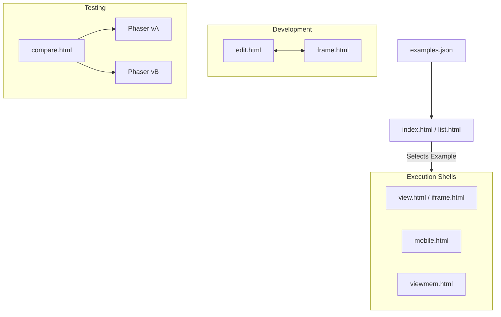

# Root

# Root Module: Phaser 3 Labs Environment

The **Root** module serves as the core orchestration layer and delivery system for the Phaser 3 Examples ("Labs") ecosystem. It provides the infrastructure to browse, edit, and execute thousands of code samples across diverse hardware and platform constraints.

## Overview

This module acts as a high-level "Shell" architecture. Instead of standalone files, the Root uses a combination of **Data Manifests** to index content and **Specialized Runners** (HTML host environments) to execute Phaser scripts in specific contexts (e.g., debug mode, mobile view, or Facebook Instant Games).

## Functional Groups

### 1. Discovery & Navigation
These modules provide the UI for exploring the example library. They consume structured JSON data to build the user's directory tree.

*   **Manifests**: `[examples.json](examples.md)` and `[recent-examples.json](recent-examples.md)` provide the hierarchical file index and the "latest updates" registry used by the UI.
*   **Browsers**: `[index.html](index.md)` and `[list.html](list.md)` act as the primary "Explorers," allowing users to navigate folders and search for specific scripts using a card-based interface.

### 2. Host Environments (Runners)
These are "shells" that provide the DOM structure (`#phaser-example`), load engine dependencies, and inject example code via URL parameters.

*   **Standard Viewers**: `[view.html](view.md)` and `[iframe.html](iframe.md)` are the primary entry points for viewing examples with navigation and developer tools.
*   **Specialized Runners**:
    *   `[mobile.html](mobile.md)` for responsive, full-screen mobile testing.
    *   `[fbinstant.html](fbinstant.md)` for Facebook Instant Games SDK integration.
    *   `[viewmem.html](viewmem.md)` for active WebGL memory and resource monitoring.
    *   `[100.html](100.md)` and `[css.html](css.md)` for clean, edge-to-edge rendering without UI chrome.

### 3. Development & Testing Tools
These modules extend the environment beyond simple playback, allowing for live iteration and regression testing.

*   **Authoring**: `[edit.html](edit.md)` provides a Monaco-based IDE that synchronizes with `[frame.html](frame.md)`, an isolated sandbox for live-coding.
*   **Alternative Debugging**: `[debug.html](debug.md)` and `[input.html](input.md)` provide lightweight harnesses for core engine testing and throttled logging.
*   **Regression**: `[compare.html](compare.md)` enables side-by-side execution of two different Phaser versions for visual diffing.

---

## Environment Architecture

The following diagram illustrates how navigation modules utilize manifests to route the user into specific execution environments.

## Key Workflows

*   **The Sandwich Pattern**: Most modules follow a "Sandwich" execution flow: The Shell (`view.html` or `iframe.html`) loads, initializes global utilities like `dat.gui` or `TweenMax`, and then uses `labs.js` to inject the user's specific JavaScript example into a `
` or `<iframe>` placeholder.
*   **Isolated Sandboxing**: To prevent memory leaks and global namespace collisions, the system heavily utilizes `[frame.html](frame.md)` and `[view-iframe.html](view-iframe.md)` to wrap user code in an isolated execution context.