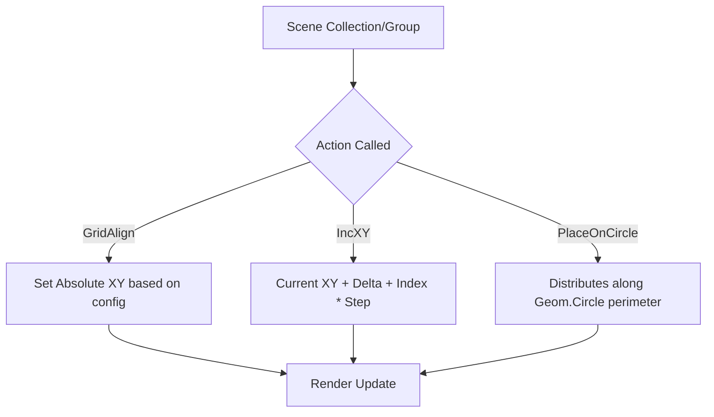

# src — actions

# Phaser Actions Module Documentation

The `Phaser.Actions` module provides a suite of static functional utilities designed to perform bulk operations on arrays of Game Objects. Instead of manually iterating over collections using `forEach` or `for` loops, these actions provide highly optimized, declarative ways to manipulate position, rotation, scale, and layout.

## Core Concepts

Phaser Actions generally follow a consistent signature:
1. **Target:** An array of Game Objects (often retrieved via `group.getChildren()`).
2. **Parameters:** The values to apply (e.g., `x`, `y`, `alpha`).
3. **Step/Offset (Optional):** Many actions support a "step" value, which increments the application for each subsequent member of the array.

### Functioning with Groups
While actions operate on arrays, they are most commonly used in conjunction with `Phaser.GameObjects.Group`. 

```javascript
const group = this.add.group({ key: 'ball', frameQuantity: 32 });
// Actions typically take the array returned by getChildren()
Phaser.Actions.PlaceOnCircle(group.getChildren(), circle);
```

---

## Technical Categories

### 1. Geometric Distribution
These actions map Game Objects to the perimeter or interior of `Phaser.Geom` objects.

*   **Placement (`PlaceOn...`):** Evenly distributes objects along the perimeter of a shape. Supports `Circle`, `Ellipse`, `Line`, `Rectangle`, and `Triangle`.
    *   *Patterns:* You can specify `startAngle` and `endAngle` for circular distributions to create arcs or semi-circles.
*   **Randomization (`Random...`):** Scatters objects randomly within the area of the geometric shape.
    *   *Usage:* `Phaser.Actions.RandomRectangle(particles, rect);`

### 2. Alignment and Layout
Designed for UI or grid-based game worlds.

*   **`GridAlign(items, config)`:** Arranges objects into a grid based on cell dimensions.
    *   `width`/`height`: The number of columns/rows.
    *   `cellWidth`/`cellHeight`: The size of each grid slot.
    *   `position`: Alignment within the cell (e.g., `Phaser.Display.Align.CENTER`).
*   **`AlignTo(items, position, [offsetX], [offsetY])`:** Positions objects relative to each other. The first item in the array acts as the anchor, and every subsequent item is aligned relative to the one before it.

### 3. Incremental Transformations
Used for animations or constant movements within the `update` loop.

| Function | Result |
| :--- | :--- |
| `IncX` / `IncY` | Adds a value to the current coordinate. |
| `IncXY` | Adds values to both X and Y simultaneously. |
| `Angle` | Adds to the rotation (degrees). |
| `RotateAround` | Rotates an array of objects around a specific point. |
| `RotateAroundDistance` | Rotates objects around a point while forcing a specific radius. |

**The Step Pattern:**
Many transformation functions allow a `step` argument. This applies `value + (index * step)` to the target property.
```javascript
// Each gingerbread will rotate slightly faster than the one before it
Phaser.Actions.Angle(this.gingerbreads, 1.5, 0.1); 
```

### 4. Search and Property Utility
*   **`GetFirst(items, compare, [index])`:** Searches the array for the first object matching specific properties (e.g., matching a specific frame or scale).
*   **`Spread(items, property, min, max)`:** Interpolates a specific property (like `alpha` or `scale`) between `min` and `max` across the entire array.
*   **`ShiftPosition(items, x, y, [direction])`:** Moves the first element to `(x, y)` and has every subsequent element take the previous position of the element before it. This is the standard implementation for "Snake" or "Trailing" effects.

### 5. Constraint Management
*   **`WrapInRectangle(items, rect, [padding])`:** Checks if objects have left the bounds of a `Phaser.Geom.Rectangle`. If they have, they are wrapped to the opposite side (Standard "Asteroids" wrap-around logic).

---

## Execution Flow: Alignment & Transformation

The following diagram illustrates how the Actions module typically processes a collection of objects within a Scene.



---

## Implementation Notes for Developers

### Performance
Phaser Actions are highly efficient because they perform direct property manipulation on the objects in the array. However, calling complex geometric actions (like `PlaceOnEllipse` with a changing ellipse size) every frame in `update()` can be intensive.

### Edge Case: The Lead Object
In actions like `AlignTo` and `ShiftPosition`, the **order of the array matters**. 
*   In `AlignTo`, the `items[0]` element stays at its current position, and `items[1]` aligns to `items[0]`.
*   In `ShiftPosition`, the coordinates `(x, y)` are applied to `items[0]`, then `items[1]` moves to the *previous* location of `items[0]`.

### Memory Management
Actions do not create new arrays; they mutate the properties of the objects contained within the provided array. If you need to preserve the state of your objects, clone the array or store the initial properties manually before applying destructive actions like `SetXY`.