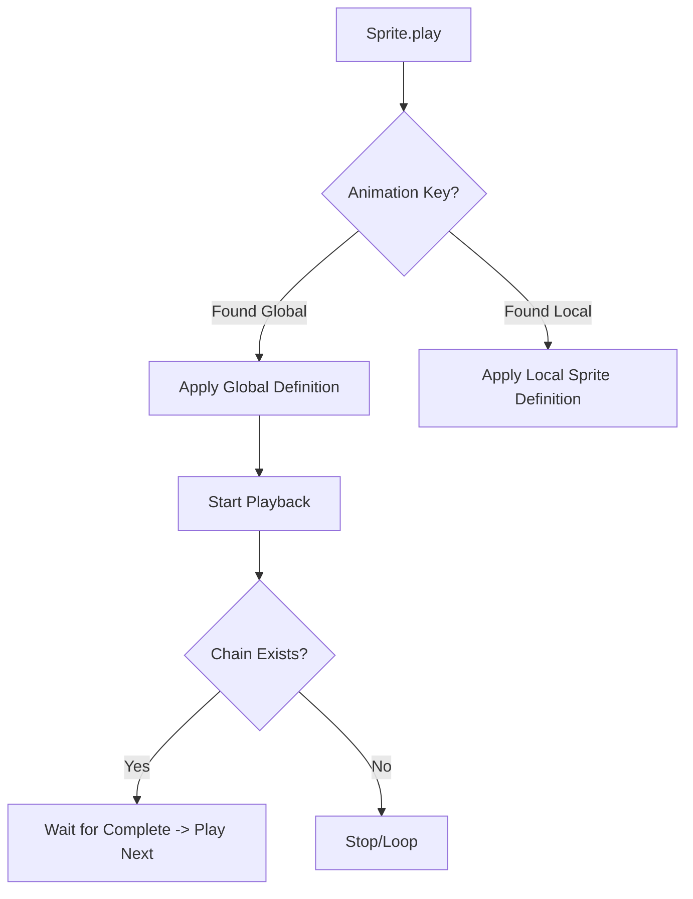

# src — animation

# Phaser 3 Animation Module

The `animation` module in Phaser 3 provides a robust system for managing frame-based animations. It is split into two primary layers: the **Global Animation Manager** (accessible via `this.anims` in a Scene), which handles definitions, and the **Animation Component** on individual Sprites, which handles playback and state.

## Core Concepts

### 1. The Animation Manager (`this.anims`)
The Global Animation Manager stores `Animation` objects. Once an animation is created here, it can be used by any Sprite in the game.

```javascript
// Creating a global animation
this.anims.create({
    key: 'walk',
    frames: this.anims.generateFrameNames('walker', { prefix: 'frame_', end: 8 }),
    frameRate: 60,
    repeat: -1
});
```

### 2. Defining Frames
Frames are typically sourced from three types of assets:

| Source Type | Helper Function | Description |
| :--- | :--- | :--- |
| **Spritesheet** | `generateFrameNumbers()` | Uses numeric indices (e.g., 0, 1, 2) from a fixed-grid image. |
| **Texture Atlas** | `generateFrameNames()` | Uses string keys from a JSON hash/array (e.g., `run_01`, `run_02`). |
| **Aseprite** | `createFromAseprite()` | Automatically generates animations based on Aseprite "tags". |

### 3. Sprite-Level Control
Individual Sprites interact with the manager but maintain their own playback state (current frame, progress, timeScale).

```javascript
const sprite = this.add.sprite(400, 300, 'gems');
sprite.play('diamond'); // Reference global animation by key
```

---

## Technical Workflows

### Animation Chaining and Delays
Phaser supports complex sequences beyond simple looping.

*   **Chaining:** Use `.chain()` to queue animations to play sequentially.
*   **Mixing:** Use `this.anims.addMix(key1, key2, delay)` to automatically insert a delay when transitioning between specific animations.
*   **Delayed Play:** `playAfterDelay(key, delay)` allows for specific timing before an animation begins.
*   **Repeat Delay:** Controlled via the `repeatDelay` property in the config, creating a gap between loops.



---

## Key API Patterns

### Creating Frames Dynamically
You aren't limited to pre-made atlases. You can generate animations from a `CanvasTexture` or raw image sequences.

```javascript
// From a list of separate images
this.anims.create({
    key: 'snooze',
    frames: [
        { key: 'cat1' },
        { key: 'cat2' },
        { key: 'cat3', duration: 100 } // Individual frame duration override
    ],
    repeat: -1
});
```

### Advanced Manager Controls
The manager can control all animations globally or perform bulk actions.

*   **Staggered Play:** `this.anims.staggerPlay(key, targets, staggerTime)` starts animations for a group of sprites with a progressive delay.
*   **Global Pause:** `this.anims.pauseAll()` and `this.anims.resumeAll()` are useful for game-wide pause menus.
*   **JSON Integration:** Use `this.anims.toJSON()` to export definitions or `this.load.animation()` to load them from an external file.

---

## Event Handling
The animation system emits events at both the Manager level (global) and the Sprite level (local).

### Sprite-Specific Events
These are the most commonly used for gameplay logic (e.g., dealing damage on a specific frame).

| Event Name | Constant | Description |
| :--- | :--- | :--- |
| `animationstart` | `Phaser.Animations.Events.ANIMATION_START` | Fired when playback begins. |
| `animationupdate` | `Phaser.Animations.Events.ANIMATION_UPDATE` | Fired on every frame change. |
| `animationrepeat` | `Phaser.Animations.Events.ANIMATION_REPEAT` | Fired at the end of a loop. |
| `animationcomplete` | `Phaser.Animations.Events.ANIMATION_COMPLETE` | Fired when a non-looping animation ends. |

**Example of frame-specific logic:**
```javascript
sprite.on('animationupdate', (anim, frame, gameObject, frameKey) => {
    if (frameKey === 'attack_frame_7') {
        spawnHitbox();
    }
});
```

### Manager Events
Used for tracking the library of definitions.
*   `ADD_ANIMATION`: When a new global key is created.
*   `REMOVE_ANIMATION`: When a definition is deleted to free memory.

---

## Best Practices for Developers
1.  **Memory Management:** If an animation is only used by one specific boss or character, consider creating it locally via `sprite.anims.create()` instead of the global manager.
2.  **Naming Convention:** Use `zeroPad` in `generateFrameNames` (e.g., `zeroPad: 4` for `frame_0001`) to ensure numeric sorting matches your export tool.
3.  **Yoyo and Reverse:** Instead of creating two animations for "opening" and "closing," create one and use `playReverse()` or the `yoyo` property.
4.  **Performance:** For massive numbers of identical animations (e.g., 1000+ coins), use `staggerPlay` or ensure `skipMissedFrames` is enabled (default) to maintain sync during lag.