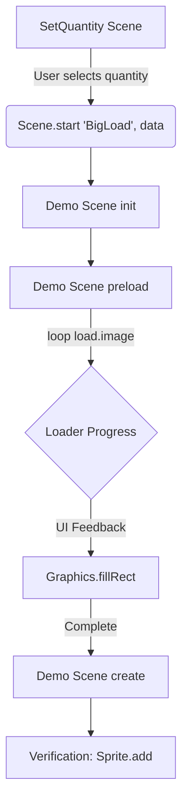

# src — bugs

# Phaser 3 Bug Regression and Performance Suite

The `src/bugs` module is a collection of minimal reproducible examples (repros), regression tests, and performance benchmarks for the Phaser 3 game engine. Rather than a cohesive library, this module serves as a laboratory for isolating engine-level issues and verifying fixes across different versions.

## Module Purpose

Developers use this module to:
1.  **Isolate Regressions:** Verify if a reported bug exists in the current version of the engine.
2.  **Verify Fixes:** Ensure that changes to the core engine resolve the targeted issue without breaking existing functionality.
3.  **Benchmark Performance:** Test high-stress scenarios (e.g., loading 10,000 textures) to monitor memory overhead and CPU usage.
4.  **Hardware/Browser Testing:** Compare rendering results between WebGL and Canvas across different devices (e.g., `0000 rt mac os.js` or `5538 ios input.js`).

## Organization & Naming Conventions

The files in this module generally follow two naming patterns:

*   **GitHub Issue ID:** Files named like `4337 drag destroy.js` correspond directly to GitHub issues in the [Phaser 3 repository](https://github.com/photonstorm/phaser).
*   **Performance/General Tests:** Files prefixed with `0000` (e.g., `0000 big load.js`) are general stress tests or tests that don't correlate to a single specific issue.

## Key Test Categories

### 1. Asset Loading & Memory Benchmarks
The `0000 big load` series tests the limits of the `Phaser.Loader` and the underlying renderer's ability to handle massive texture counts.

*   **Logic Pattern:** These scripts typically use a Two-Scene architecture:
    *   `SetQuantity`: Provides a UI to select how many thousands of assets to load.
    *   `Demo`: Executes the `preload` and measures performance.
*   **Memory Tracking:** Tools like `0000 dt mem.js` utilize the `GMAN_webgl_memory` extension to track precise GPU memory usage for textures and buffers.

### 2. Input System Edge Cases
Many files focus on complex interactions within the `Phaser.Input` system, particularly involving `Containers`, `Layers`, and `DOM Elements`.

*   **Interaction Conflicts:** Tests like `5508 input.js` and `5489 container input.js` investigate how `dropZone` interactions interact with `Container` click listeners.
*   **Draggable Lifecycle:** `4337 drag destroy.js` verifies that destroying a Game Object while it is being dragged does not cause null pointer exceptions in the Input Manager.

### 3. Rendering and Texture Management
This category tests Dynamic Textures, Render Textures, and Shaders.

*   **Texture Lifecycle:** `0000 rt mem.js` monitors if `DynamicTexture.destroy()` correctly releases GPU memory.
*   **Pipeline FX:** Tests like `5420 plugin.js` check the integration of custom `PostFXPipeline` logic via global plugins.
*   **Smoothing & Aliasing:** `0000 round pixels.js` allows toggling `cameras.main.roundPixels` at runtime to verify pixel-perfect rendering across different asset types (Sprites, Text, Graphics).

### 4. Physics Engine Regression
The `5617 debug` series provides an exhaustive suite for Arcade Physics, specifically testing:
*   Collision logic between `Circle` and `Rectangle` bodies.
*   The effects of `setPushable(false)` vs `setImmovable(true)`.
*   Collision order (Body A vs Body B vs Body B vs Body A).

## Common Code Patterns

Most files follow a standard Phaser Example structure, but often include custom debugging interfaces:

```javascript
// Verification pattern for Scene restart bugs
this.input.once('pointerdown', () => {
    this.scene.restart();
    console.log('restarted');
});

// Memory utility pattern
getMemoryInfo() {
    const totalMemoryInfo = this.game.renderer.gl.getExtension('GMAN_webgl_memory').getMemoryInfo();
    return Math.round(totalMemoryInfo.memory.texture / 1024 / 1024);
}
```

## Typical Test Flow (Large Asset Loading)

The following diagram illustrates the flow used by performance benchmarking scripts within this module:



## Developer Usage

To contribute to this module or use it for debugging:
1.  **Clone the reproduction:** Find a file similar to your issue.
2.  **Point to actual assets:** Ensure the `setBaseURL` or asset paths point to a valid dev server or the Phaser CDN (`https://cdn.phaserfiles.com/v385`).
3.  **Use the Labs Runner:** These files are designed to be loaded by the Phaser Labs environment, which provides version switching (e.g., comparing "Live" vs "3.55.2").