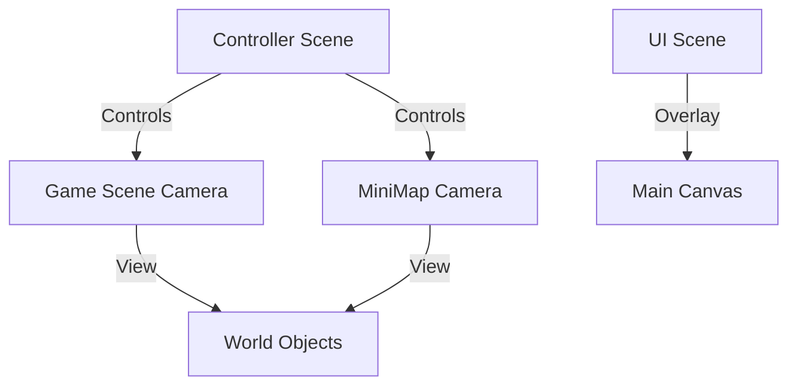

# src — camera

# Phaser 3 Camera Module Documentation

The Camera module is responsible for viewing the game world. It acts as a window (viewport) into a Scene, determining which Game Objects are visible, how they are transformed (zoom, rotation), and what special effects (shake, flash, fade) are applied to the view.

## Core Concepts

### Viewport vs. World Bounds
In Phaser 3, cameras distinguish between where they appear on the screen and what they can see in the world:
- **Viewport**: Defined by `x`, `y`, `width`, and `height`. It is the rectangular area on the HTML5 Canvas where the camera renders.
- **World Bounds**: Set via `setBounds(x, y, width, height)`. This restricts the camera's movement, preventing it from scrolling outside defined limits (e.g., the edges of a tilemap).

### Multi-Camera Support
A single Scene can support an arbitrary number of cameras.
- **Main Camera**: Automatically created by the Scene, accessible via `this.cameras.main`.
- **Additional Cameras**: Created using `this.cameras.add(x, y, width, height)`. This is commonly used for mini-maps, split-screen multiplayer, or UI overlays.

## Key Functionality

### 1. Following Game Objects
The most common use case is making the camera follow a player sprite.
```javascript
// Basic follow
this.cameras.main.startFollow(player);

// Advanced follow with lerp (smoothing) and deadzone
this.cameras.main.startFollow(player, true, 0.1, 0.1);
this.cameras.main.setDeadzone(400, 200);
```
- **Lerp**: Values between 0 and 1 that determine how "snappy" the follow is.
- **Deadzone**: A central region where the target can move without triggering camera scroll.
- **Follow Offset**: Offset the target's position within the viewport using `followOffset.set(x, y)`.

### 2. Camera Transformations
Cameras support real-time zooming and rotation without affecting the actual coordinates of world objects.
- `setZoom(value)`: 1 is standard, < 1 is zoomed out, > 1 is zoomed in.
- `setRotation(angle)`: Rotates the entire viewport.
- `centerOn(x, y)`: Instantly snaps the camera to world coordinates.
- `pan(x, y, duration, ease)`: Smoothly interpolates the camera position to a target coordinate.

### 3. Visibility and Filtering (`ignore`)
The `ignore` method is critical for multi-camera setups (e.g., a UI camera that shouldn't render game world sprites).
- `camera.ignore(gameObject)`: Prevents a specific object from rendering in that camera.
- `camera.ignore([obj1, obj2])`: Prevents an array of objects.
- `camera.ignore(container)`: Prevents an entire container and its children.

### 4. Special Effects (FX)
The module includes built-in hardware-accelerated effects:
- **Flash/Fade**: `flash(duration)` and `fade(duration)`. Useful for damage indicators or scene transitions.
- **Shake**: `shake(duration, intensity)`.
- **Callbacks**: Effects support completion callbacks (e.g., `this.camera.fade(1000, 0, 0, 0, false, callback)`).

## Architectural Flow: Multi-Scene Coordination

A common pattern (as seen in `multi camera/Controller.js`) involves using a dedicated "Controller" scene to manipulate the viewports of other active scenes.



### Coordinate Conversion
Since cameras can zoom and scroll, the "Screen Position" (where a mouse clicks) is rarely the "World Position."
- `camera.getWorldPoint(x, y)`: Converts screen pixels to world coordinates.
- `setScrollFactor(x, y)`: Used on Game Objects to determine how much they move relative to camera scroll (0 = fixed to camera/UI, 1 = regular world object).

## Post-Processing Shaders
Cameras in WebGL mode can have specialized pipeline shaders applied to the entire viewport using `setPostPipeline`.

```javascript
// Applying a pipeline at runtime
this.cameras.main.setPostPipeline(HueRotatePostFX);

// Combining multiple shaders
this.cameras.main.setPostPipeline([ BendPostFX, HueRotatePostFX ]);
```
Multiple cameras can have different pipelines simultaneously, allowing for effects like a "blurred" background camera behind a "sharp" UI camera (demonstrated in `camera blur shader.js`).

## Best Practices for Contributors
1. **Performance**: Every additional camera adds a full render pass for all non-ignored objects. Use `ignore()` aggressively to hide off-screen layers.
2. **Input**: Remember that input events are camera-aware. When using multiple cameras, the `pointer.camera` property identifies which camera was clicked.
3. **Rounding**: When using pixel art, call `setRoundPixels(true)` on the camera to prevent sub-pixel "bleeding" during scrolls and pans.