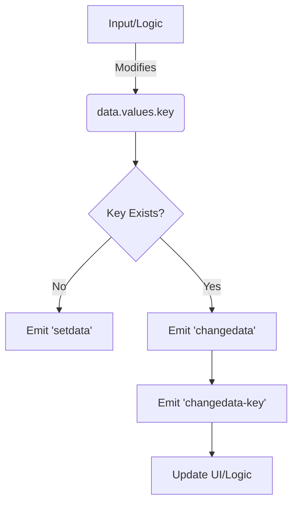

# src — components

# Data Component Module

The `src/components/data` module illustrates the usage of Phaser 3's **DataManager** system. This system provides a standardized way to store, retrieve, and monitor custom state on both individual Game Objects and entire Scenes without polluting the base class instances with custom properties.

## Overview

The Data Manager acts as a key-value store. It is particularly powerful because it integrates with Phaser's Event Emitter, allowing developers to create "reactive" logic—such as updating UI text automatically when a player's gold or health changes.

### Key Capabilities
- **Decoupled State**: Store metadata (level, health, owner) directly on the object it describes.
- **Event-Driven UI**: Listen for specific data changes to trigger animations or text updates.
- **Scene-Level Storage**: Use `this.data` within a Scene to manage global game state (score, lives).
- **Regex Querying**: Filter and retrieve groups of data keys using regular expressions.

---

## Data Initialization

Data management is not enabled by default on Game Objects to save memory. You must initialize it before use.

### Enabling Data
You can enable data explicitly or implicitly:

```javascript
// Explicit initialization
gem.setDataEnabled();
gem.data.set('gold', 50);

// Implicit initialization via convenience method
gem.setData('gold', 50);

// Initializing multiple values at once
gem.setData({ name: 'Red GemStone', level: 2, gold: 50 });
```

### Scene Data
Every Scene has a built-in `DataManager` accessible via `this.data`. This is ideal for variables that persist across the lifetime of the Scene.

```javascript
this.data.set('score', 2000);
console.log(this.data.get('score'));
```

---

## Accessing and Modifying Data

There are two primary ways to interact with the data store:

### 1. Functional API
Standard getter and setter methods.
- `getData(key)` / `setData(key, value)`
- `data.get(key)` / `data.set(key, value)`

### 2. The `values` Proxy
The Data Manager provides a `values` object. Modifying properties on this object directly updates the data store and triggers the relevant events.

```javascript
// This triggers the 'changedata-gold' event automatically
gem.data.values.gold += 100;
```

### 3. Querying
You can retrieve a subset of the data store using a Regular Expression via `query()`.

```javascript
// Returns an object containing all keys starting with 'armor_'
const armorStats = image.data.query(/^armor/);
```

---

## Event Lifecycle

The Data Manager emits events that allow your game logic to react to state changes.

| Event | Description |
| :--- | :--- |
| `setdata` | Fired when a **new** data key is added to the manager. |
| `changedata` | Fired when an **existing** data key is updated. |
| `changedata-[key]` | A specific event fired only when a specific key (e.g., `gold`) is updated. |

### Execution Flow: Data Update


### Example: Specific Key Listener
Listening to a specific key (like `gold`) is more performant than filtering a general `changedata` event.

```javascript
gem.on('changedata-gold', (gameObject, value) => {
    if (value > 500) {
        gameObject.data.values.gold = 500; // Clamp value
    }
    scoreText.setText('Gold: ' + value);
});
```

---

## Best Practices

1.  **Use `changedata-[key]` for UI**: Instead of checking which key changed inside a general listener, use the specific key event to keep logic clean and performant.
2.  **Scene Data for Globals**: Use `this.data` in your Scene for stats like "Lives" or "Level" rather than creating global variables.
3.  **Data Persistence**: Note that Game Object data is destroyed when the Game Object is destroyed. If data needs to persist across scene transitions, move it to a Registry or a global State Manager.
4.  **Formatting**: When setting multiple initial values, use the object-based `setData({ ... })` pattern to reduce boilerplate.