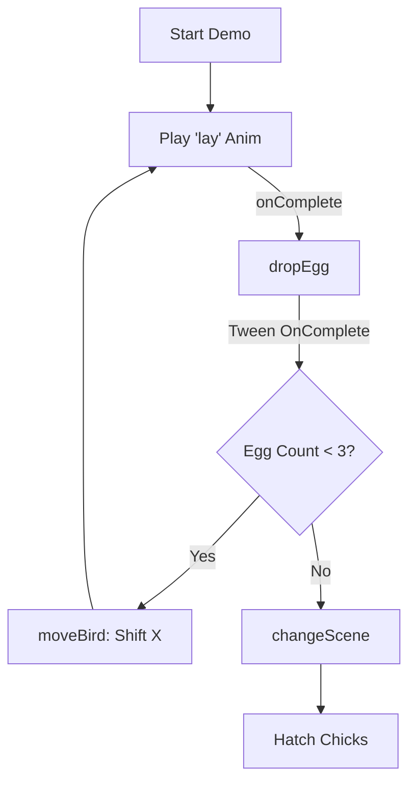

# src — demoscene

# Demoscene Module

The `src/demoscene` module is a collection of Phaser 3 implementations of classic "demoscene" visual effects. These scripts demonstrate how to use Phaser’s Core systems—specifically **Tweens**, **Groups**, and **Animations**—to recreate retro aesthetics like raster bars, color cycling, and sequenced sprite-based storytelling.

## Core Concepts

The module is built around three primary techniques:
1.  **Sine-based Motion:** Heavy use of `Sine.easeInOut` tweens to create smooth, organic waving motions.
2.  **Iterative Delaying:** Applying staggered delays to members of a `Phaser.GameObjects.Group` to create wave offsets.
3.  **HSV Color Cycling:** Utilizing `Phaser.Display.Color.HSVColorWheel()` to generate vibrant, retro-style gradients.

---

## 1. Raster Effects

The files `chunky raster bars.js`, `raster carpet.js`, and `raster wave.js` implement various forms of horizontal and vertical bars that simulate the limited hardware capabilities of 8 and 16-bit machines.

### Implementation Pattern
The standard pattern across these effects involves creating a group of narrow images and iterating through them to apply a delayed tween:

```javascript
const group = this.add.group();
group.createMultiple({ key: 'raster', repeat: 64 });

let i = 0;
group.children.iterate(child => {
    child.depth = 64 - i;
    child.setTint(hsv[i * 4].color); // Apply HSV color

    this.tweens.add({
        targets: child,
        y: 500,
        yoyo: true,
        repeat: -1,
        ease: 'Sine.easeInOut',
        delay: 32 * i // The "Wave" offset
    });
    i++;
});
```

### Key Variations
*   **Chunky Raster Bars:** Uses individual 64px high images with fixed tints.
*   **Raster Carpet/Wave:** Uses 800x16px bars with dynamic `scaleX` tweens to simulate perspective or warping.
*   **Vertical Raster Wave:** Utilizes a spritesheet (`bars.png`) and adjusts `displayHeight` to stretch 1-pixel high frames into vertical columns that wave horizontally.

---

## 2. Sprite Animation (Birdy Nam Nam)

The `birdy nam nam.js` WIP (Work In Progress) is a tribute to classic Amiga demos (specifically Budbrain). Unlike the mathematical raster effects, this module focuses on **frame-based animation sequencing** and **event-driven scene transitions**.

### Animation Workflow
The demo uses a texture atlas (`birdy`) and an animation JSON configuration. It demonstrates manual animation control through lifecycle listeners:

1.  **Bootloader Scene:** Handles initial asset loading.
2.  **Sequence Logic:**
    *   `startDemo()`: Plays background music and triggers the initial "lay" animation.
    *   `dropEgg()`: Triggered via the `animationcomplete` event on the bird sprite. It creates a new image and uses a tween with an `onComplete` callback to progress the state.
    *   `moveBird()`: Adjusts the X-position and re-triggers the loop until a condition (egg count) is met.



### Audio Synchronization
The module tracks the `sound.locked` state to handle browser autoplay policies. It uses `this.sound.once('unlocked', ...)` to ensure the visual demo and the `jungle` audio track start in perfect synchronization.

---

## Technical Patterns

### Tween Prop Chaining
In `raster carpet.js`, multiple properties are tweened simultaneously to create complex behavior (movement, scaling, and holding):

```javascript
this.tweens.add({
    targets: child,
    props: {
        x: { value: 300, duration: 700 },
        y: { value: 500, duration: 2500 },
        scaleX: { value: 0.1, duration: 4000, hold: 2000, delay: 2000 }
    },
    yoyo: true,
    repeat: -1
});
```

### Depth Management
To ensure correct overlapping (e.g., bars appearing to go "behind" or "under" others), the module frequently assigns depth based on the iteration index:
`child.depth = totalItems - currentItemIndex;`

## Dependencies
*   **Phaser.GameObjects.Group**: Used for mass-manipulation of bars.
*   **Phaser.Animations.AnimationManager**: Heavily used in the Birdy demo for generating frame names from atlases (`generateFrameNames`).
*   **Phaser.Display.Color**: Essential for the HSV routines used in raster effects.