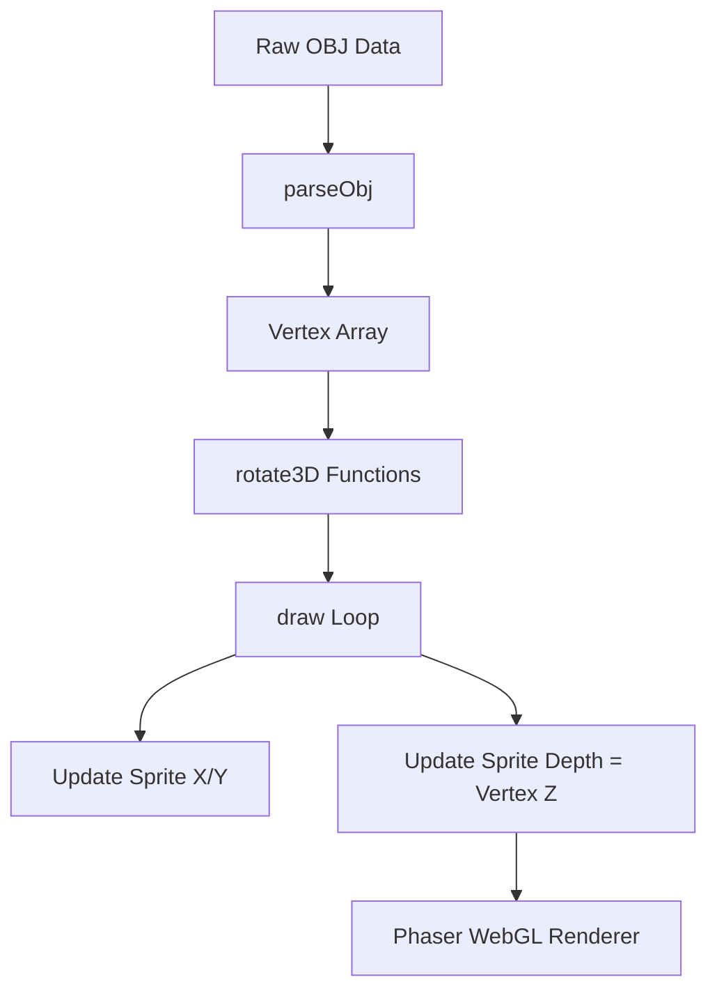

# src — depth sorting

# Depth Sorting Module

The **Depth Sorting** module provides patterns and implementations for managing the rendering order (Z-index) of 2D and pseudo-3D objects in Phaser 3. It covers techniques ranging from simple display list manipulation to complex depth-based projections for isometric maps and 3D wireframes.

## Core Concepts

Phaser 3 handles rendering order through two primary mechanisms demonstrated in this module:

1.  **The Display List**: The natural order in which objects are added to the Scene. Objects added later appear on top of earlier ones.
2.  **The Depth Property**: An explicit `depth` (or `setDepth()`) value. When set, Phaser overrides the display list order and sorts objects based on this numerical value.

## Implementation Patterns

### 1. Simple Display List Manipulation
The simplest way to manage depth is by reordering the display list without assigning explicit depth values.

*   `bringToTop(child)`: Moves a Game Object to the end of the display list, rendering it on top of all siblings.
*   `remove(child)`: Removes an object from the list, effectively "unrendering" it.

### 2. Y-Based Depth (The Painter's Algorithm)
Used extensively in top-down and isometric views, this pattern calculates depth based on a Sprite's vertical position to simulate perspective.

In `sprite depth index.js` and `isometric map.js`, depth is calculated dynamically:
```javascript
// Dynamic update during movement
this.mushroom.depth = this.mushroom.y + this.mushroom.height / 2;

// Static tile placement in an isometric grid
tile.depth = centerY + ty;
```

### 3. Isometric Logic
The `isometric map.js` implementation provides a robust pattern for moving entities (`Skeleton` class). It updates `depth` every frame that the entity moves along the Y-axis:

```javascript
// Skeleton update logic
if (this.direction.y !== 0) {
    this.y += this.direction.y * this.speed;
    this.depth = this.y + 64; // Horizontal offset adjusted for sprite height
}
```

### 4. 3D Projection Depth
The `ball mesh depth sort.js` example demonstrates depth sorting for a 3D point cloud projected onto a 2D plane. It parses `.obj` files into vertices and faces, then maps the 3D `z` coordinate directly to the Phaser Sprite `depth`.

**Key Transformation Flow:**
1.  **Rotate**: `rotateX3D`, `rotateY3D`, `rotateZ3D` modify the raw vertex data.
2.  **Project**: Map 3D coordinates to 2D screen space (`centerX + v.x * scale`).
3.  **Sort**: Assign the transformed `z` value to the sprite's `depth`.



## Functional Reference

### Array Sorting
The `children.depthSort(array)` method is used to sort a custom array of Game Objects based on their existing depth values within the scene.

```javascript
// From get top object.js
const testArray = [ image6, image4, image2 ];
this.children.depthSort(testArray);
// testArray is now ordered by their render depth
```

### Manual Depth Control
Manual depth assignment (`setDepth`) overrides the order of creation. An object with `depth = 1` will always appear above an object with `depth = 0`, regardless of which was created first.

### Geometry and Lines
While Sprites use the `depth` property, custom `Phaser.GameObjects.Graphics` calls (like `drawLine` in the 3D mesh example) are rendered in the order they are called within the `draw` sequence. To depth-sort lines, the faces themselves must be sorted before the `graphics.strokePath()` call (though the provided example focuses on sorting the vertex "balls").

## Architecture Considerations for Contributors
- **Performance**: In scenes with 2000+ objects (see `sprite depth index.js`), updating `depth` every frame is performant in WebGL, as Phaser handles the batch re-sorting efficiently.
- **Coordinate Systems**: When implementing isometric or 3D world-to-screen transforms, always apply the depth update *after* the transformation is calculated but *before* the render cycle completes.
- **Parsing**: The `parseObj` function is a specialized utility for this module; it converts string-based OBJ data into a `verts` and `faces` object structure suitable for iteration.