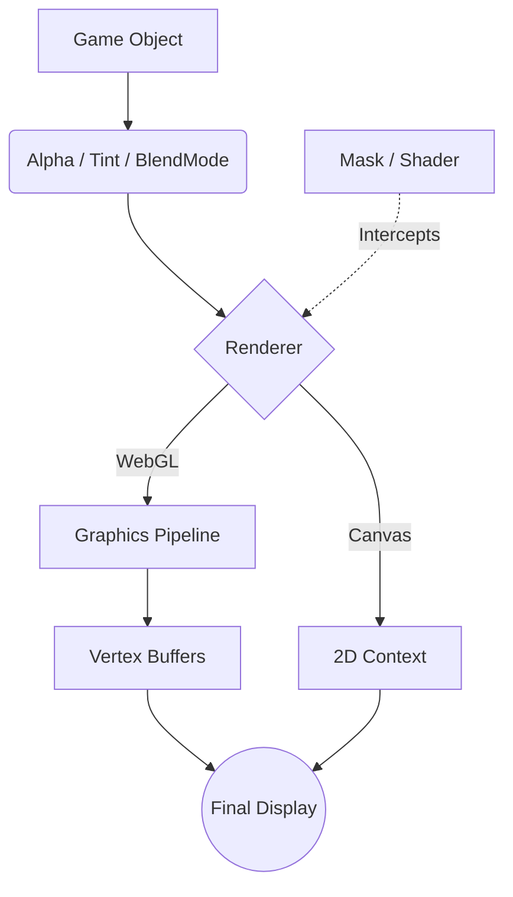

# src — display

# Phaser 3 Display Module

The `Phaser.Display` module provides essential utilities for manipulating the visual properties, positioning, and rendering behavior of Game Objects. It bridges the gap between raw Game Object data and the final pixel output handled by the Renderer (Canvas or WebGL).

## Module Overview

The module is partitioned into several specialized sub-modules:

*   **Align**: Logic for positioning objects relative to one another or defined bounds.
*   **Alpha**: Controls for transparency and per-vertex opacity.
*   **Blend Modes**: Implementation of standard and custom pixel-blending equations.
*   **Color**: A robust class and set of utilities for color conversion and manipulation.
*   **Masks**: Systems for clipping and hiding parts of visual objects.
*   **Shaders**: Integration of custom GLSL fragment and vertex shaders.
*   **Tint**: Color multiplication and fill effects.

---

## 1. Alignment (Align)

The `Phaser.Display.Align` sub-module allows you to position a Game Object (the "child") relative to another object or a `Phaser.GameObjects.Zone` (the "container").

### Key Patterns
Alignment is categorical: `In`, `To` (Relative), etc. The most common use case is `Phaser.Display.Align.In.[Position]`.

```javascript
// Align a block to the bottom-center of a background image
Phaser.Display.Align.In.BottomCenter(block, backgroundImage);

// Center an image within a specific coordinate zone
const zone = this.add.zone(400, 300, 800, 600);
Phaser.Display.Align.In.Center(player, zone);
```

**Supported Positions:** `TopLeft`, `TopCenter`, `TopRight`, `LeftCenter`, `Center`, `RightCenter`, `BottomLeft`, `BottomCenter`, `BottomRight`.

---

## 2. Alpha & Transparency

Alpha manages the visibility level of Game Objects. Phaser supports both global alpha (standard) and per-vertex alpha (WebGL only).

*   **Global Alpha**: `gameObject.setAlpha(0.5)` sets the transparency for the entire object.
*   **Per-Vertex Alpha**: Passing four values to `setAlpha` allows gradients of transparency across the corners: `top-left`, `top-right`, `bottom-left`, `bottom-right`.

```javascript
// WebGL only: Fade out the bottom of an image
image.setAlpha(1, 1, 0, 0); 

// Direct property access
image.alphaTopLeft = 0.5;
```

---

## 3. Blend Modes

Blend modes determine how a Game Object's pixels interact with those already drawn to the canvas.

### Standard Blend Modes
Accessible via `Phaser.BlendModes` (e.g., `NORMAL`, `ADD`, `MULTIPLY`, `SCREEN`). 

### Custom WebGL Blend Modes
Developers can create advanced blending by defining WebGL equations and factors via the renderer.

```javascript
const renderer = this.sys.game.renderer;
const gl = renderer.gl;

// Create a custom cut-out effect
const modeIndex = renderer.addBlendMode([ gl.ZERO, gl.SRC_COLOR ], gl.FUNC_ADD);
gameObject.setBlendMode(modeIndex);
```

---

## 4. Color Manipulation

The `Phaser.Display.Color` class is the primary tool for managing color data. It can store RGBA values and convert between various formats.

### Common Utilities
*   **Conversion**: `HexStringToColor`, `RGBStringToColor`, and the versatile `ValueToColor` (which handles strings, numbers, and objects).
*   **Adjustments**: Methods like `brighten()`, `darken()`, and `lighten()` modify the color by a percentage.
*   **Generators**: `Random()` and `RandomGray()` generate colors within specific brightness thresholds.

```javascript
const color = Phaser.Display.Color.ValueToColor('#ffeedd');
color.darken(10); // Reduce brightness by 10%
rectangle.setFillStyle(color.color); // .color returns the numeric hex value
```

---

## 5. Masking

Masks restrict the visible area of a Game Object.

| Mask Type | Description | Source Requirement |
| :--- | :--- | :--- |
| **Geometry Mask** | Uses a `Graphics` object to define a clipping shape (Stencil). | `Phaser.GameObjects.Graphics` |
| **Bitmap Mask** | Uses an image or texture's alpha channel to determine visibility. | `Image`, `Sprite`, `DynamicTexture` |

```javascript
const mask = this.add.bitmapMask(maskImage);
targetImage.setMask(mask);
```

---

## 6. Shaders

Phaser integrates custom GLSL code through the `Shader` Game Object. This requires a `Phaser.Display.BaseShader` which acts as the template for the shader instances.

1.  **Define**: Create a `BaseShader` with fragment (and optionally vertex) GLSL source code.
2.  **Apply**: Add it to the scene via `this.add.shader()`.
3.  **Interact**: Bind uniforms (like `time`, `resolution`, or `mouse`) or swap shaders at runtime.

```javascript
const base = new Phaser.Display.BaseShader('MyShader', fragmentSource);
const shaderObj = this.add.shader(base, x, y, width, height);
shaderObj.setUniform('size.value', 1.0);
```

---

## 7. Tinting

Tinting applies a color overlay to a Game Object. In WebGL, this is extremely efficient as it is calculated per-vertex during the batching process.

*   **Multiplicative Tint**: `setTint(color)` multiplies the texture colors by the tint color. White texture areas become the tint color; black areas remain black.
*   **Tint Fill**: `setTintFill(color)` replaces the texture's non-transparent pixels entirely with the solid tint color, useful for "flash" effects or silhouettes.

```javascript
// Application to corners: TL, TR, BL, BR
image.setTint(0xff0000, 0x00ff00, 0x0000ff, 0xffff00);

// Toggle a solid white hit-flash
image.setTintFill(0xffffff);
```

## Data Flow: Object to Screen



## Developer Notes
*   **Performance**: Per-vertex Alpha and Tint are virtually "free" in WebGL as they are handled in the standard shader. Multiple blend modes or heavy masking can cause "batch breaks," increasing draw calls.
*   **Coordinate System**: Remember that `Align` works on the bounds of Game Objects. Ensure `setOrigin` is considered if you are manually calculating offsets after an alignment.