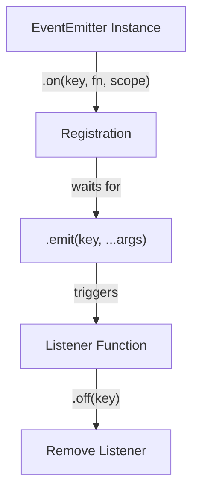

# src — events

# Phaser 3 Events Module

The **Events** module is a core part of Phaser's architecture, providing a robust event-driven system used for decoupling game logic. It is built around the `Phaser.Events.EventEmitter` class, which allows objects to emit named events and register listeners.

In Phaser, almost every major system—including Scenes, Game Objects, and the Input Manager—either inherits from or contains an instance of an `EventEmitter`.

## Core Components

### 1. `Phaser.Events.EventEmitter`
This is the base class for all event handling. You can instantiate it manually to create custom communication bridges that aren't tied to a specific Scene or Game Object.

```javascript
// Manually creating a custom emitter
const messenger = new Phaser.Events.EventEmitter();

messenger.on('powerUp', (type) => { console.log(type); });
messenger.emit('powerUp', 'shield');
```

### 2. Scene Event Emitter (`this.events`)
Each `Phaser.Scene` has its own built-in `EventEmitter` accessible via `this.events`. This is the primary way to handle Scene-specific lifecycle events or communicate between entities within the same Scene.

### 3. Game Object Events
Every Game Object (Images, Sprites, Text, etc.) is also an `EventEmitter`. This allows objects to manage their own state-related events independently.



---

## Usage Patterns

### Listening and Emitting
Events are keyed by strings or **ES6 Symbols**. Symbols are useful for ensuring event keys do not collide in complex plugins or large codebases.

| Method | Description |
| :--- | :--- |
| `on(event, fn, context)` | Adds a persistent listener. |
| `once(event, fn, context)` | Adds a listener that triggers once and then removes itself. |
| `emit(event, ...args)` | Dispatches the event, passing all subsequent arguments to listeners. |
| `off(event, fn)` | Removes a specific listener. |

### Context Binding
When registering an event, the third argument defines the **execution context** (`this`). This is critical for accessing Scene properties or methods from within a handler.

```javascript
// 'this' inside the handler refers to the Scene instance
this.events.on('updateScore', this.updateUI, this);
```

### Passing Data
The `emit` method supports an arbitrary number of arguments which are passed directly to the listener function.

```javascript
// Emitting with arguments
this.events.emit('spawnEnemy', x, y, 'goblin');

// Receiving arguments
handler(x, y, type) {
    this.add.image(x, y, type);
}
```

---

## Management and Cleanup

### Removing Listeners
To prevent memory leaks and unexpected behavior, listeners should be removed when they are no longer needed.

1.  **Specific Removal**: Use `off(key, handler)` to remove a specific function.
2.  **Total Removal**: Use `off(key)` (without a handler argument) to remove *all* listeners for a specific event key.
3.  **Self-Removal**: A listener can remove itself during execution by calling `off` within its own body.

```javascript
handler() {
    this.events.off('uniqueEvent', this.handler);
}
```

### Event Propagation with Input
While Base Game Objects emit events manually, they are often paired with the **Input System**. For example, you can map a generic Scene input event to a specific Game Object event:

```javascript
// Map an input event to a Game Object's custom event
this.input.on('gameobjectup', (pointer, gameObject) => {
    gameObject.emit('clicked', gameObject);
});

// The object listens to its own 'clicked' event
sprite.on('clicked', (obj) => { obj.setTint(0xff0000); });
```

## Best Practices
- **Use Symbols for Plugins**: If writing a system intended for others, use ES6 Symbols for event names to avoid overwriting existing string-based events.
- **Scope Awareness**: Always provide the `this` context (usually `this` for the Scene) when your handler needs to call Scene methods like `this.add.image`.
- **Prefer `once` for Initialization**: If an event should only happen at the start of a level or transition, use `once` to avoid manual cleanup logic.