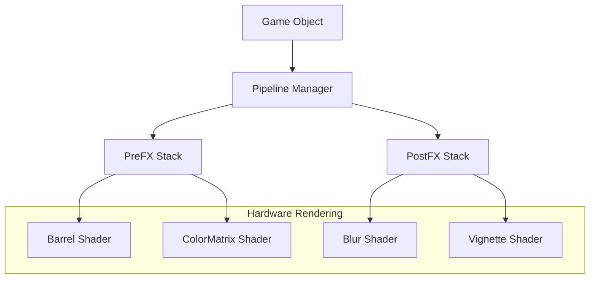

# src — fx

# Phaser FX Module Documentation

The `fx` module provides a comprehensive suite of hardware-accelerated visual effects that can be applied to individual Game Objects, Containers, Layers, and Cameras. Phaser separates these effects into two pipelines: **PreFX** (applied during the initial draw call) and **PostFX** (applied as a post-processing pass).

## Core Concepts

### PreFX vs. PostFX
Digital effects in Phaser are accessed via the `preFX` and `postFX` properties available on most Game Objects.

*   **PreFX:** Integrated directly into the object's fragment shader. It is highly efficient and operates within the object's local coordinate space. It often requires `setPadding()` to ensure the effect (like a glow or shadow) isn't clipped by the object's original bounds.
*   **PostFX:** Operates on the rendered texture of the object or group. This is used for effects that require multiple passes (like high-quality Blurs or Bokeh) or for applying effects to entire Containers and Cameras.

### The FX Controller
When you call a method like `addGlow()`, Phaser returns an FX Controller object. This object contains properties (e.g., `amount`, `progress`, `strength`) that can be directly manipulated or targeted by the **Tween Manager** for dynamic animations.

---

## Effect Reference

### Distortion & Geometry
| Effect | Method | Key Properties |
| :--- | :--- | :--- |
| **Barrel** | `addBarrel(amount)` | `amount` (Pincushion/Fish-eye) |
| **Displacement** | `addDisplacement(key, x, y)` | Uses a texture for per-pixel offset. |

### Color & Lighting
| Effect | Method | Key Properties |
| :--- | :--- | :--- |
| **ColorMatrix** | `addColorMatrix()` | Methods: `sepia()`, `hue()`, `night()`, `grayscale()`, `lsd()`. |
| **Glow** | `addGlow(color, outer, inner)` | `outerStrength`, `innerStrength`. Requires padding for PreFX. |
| **Bloom** | `addBloom(color, x, y, blur, strength)` | Creates a glowing "light leak" effect. |
| **Shine** | `addShine(speed, rayWidth, gradient)` | A moving light reflection (e.g., for "shiny" cards). |
| **Gradient** | `addGradient(color1, color2, alpha)` | `fromX`, `toX`, `fromY`, `toY`, `size` (chunky). |

### Focus & Stylization
| Effect | Method | Key Properties |
| :--- | :--- | :--- |
| **Blur** | `addBlur(quality, x, y, strength)` | `strength`. Applied to the whole texture. |
| **Bokeh** | `addBokeh(radius, amount, contrast)` | Simulates camera depth of field. Used in `addTiltShift`. |
| **Pixelate** | `addPixelate(amount)` | `amount` (size of pixels). Value of `-1` is original size. |
| **Shadow** | `addShadow(x, y, soft, samples)` | `x`, `y` (offset), `color`. |
| **Vignette** | `addVignette(x, y, radius, strength)` | Darkens edges of the object or screen. |

### Transitions
The **Wipe** and **Reveal** effects are specialized for hiding or showing objects.
*   `addWipe(wipeWidth, direction, axis)`: Animates via the `progress` property (0 to 1).
*   `addReveal(wipeWidth, direction, axis)`: Similar to wipe but reveals the object from transparency.

---

## Integration Patterns

### 1. Animating Effects with Tweens
Most FX controllers are designed to be tweened. This is the standard way to create "pulse" or "fade" effects.

```javascript
// Add a barrel effect
const barrel = sprite.preFX.addBarrel(1);

// Create a "pulse" animation
this.tweens.add({
    targets: barrel,
    amount: 1.2,
    duration: 400,
    yoyo: true,
    repeat: -1
});
```

### 2. Scene Transitions (Camera PostFX)
Effects can be applied to `this.cameras.main.postFX` to affect the entire viewport, which is particularly useful for Scene transitions.

```javascript
// In Scene A
const fx = this.cameras.main.postFX.addPixelate(-1);

this.add.tween({
    targets: fx,
    amount: 40,
    onComplete: () => this.scene.start('SceneB')
});
```

### 3. Handling Padding
For effects that extend outside the sprite's texture (Glow, Shadow, Barrel), use `setPadding` to avoid visual cropping.

```javascript
const sprite = this.add.sprite(x, y, 'key');
sprite.preFX.setPadding(32); // Adds 32px buffer around the sprite
sprite.preFX.addGlow();
```

---

## Architecture

Visual effects are managed per-object. When an object is rendered, the pipeline checks its FX stack and applies the shaders in sequence.



## Developer Notes
- **WebGL Only:** These effects require a WebGL renderer. They will silently fail/ignored in Canvas mode.
- **Performance:** PreFX is generally faster as it combines with the primary draw call. PostFX creates an internal framebuffer, which has a higher memory overhead.
- **Resolution:** Textures and Text objects may require `setResolution()` or high-quality settings to prevent artifacts when effects like `addGlow` or `addBlur` are applied.
- **Global Config:** Some effects (like PreFX Glow) can have their default quality and distance set in the `Phaser.Game` configuration object under the `fx` key.