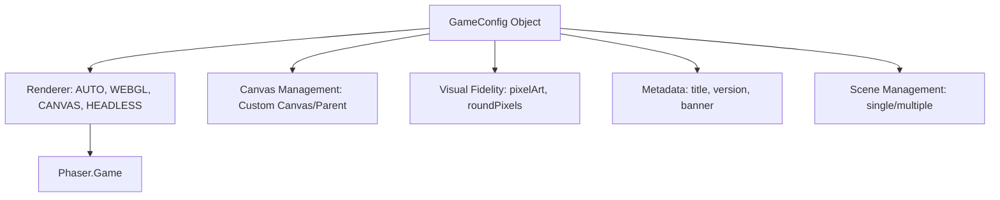

# src — game config

# Game Configuration Module

The **Game Config** module demonstrates how to initialize and customize a Phaser 3 application. It centers around the `Phaser.Types.Core.GameConfig` object, which is passed into the `new Phaser.Game(config)` constructor to define the renderer, viewport, metadata, and engine-level behaviors.

## Architectural Overview

The configuration object acts as the blueprint for the entire lifecycle of the game. It bridges the gap between the browser's DOM and the Phaser engine.



---

## Core Configuration Categories

### 1. Rendering and Canvas Management
Phaser allows for granular control over how and where the game is rendered.

*   **Renderer Choice (`type`):** Use `Phaser.AUTO`, `Phaser.CANVAS`, `Phaser.WEBGL`, or `Phaser.HEADLESS`. Headless mode is useful for server-side logic or unit testing where no visual output is required.
*   **Custom Contexts:** You can pass an existing canvas or a pre-defined WebGL/WebGL2 context via the `canvas` and `context` properties.
    ```javascript
    const myCustomCanvas = document.createElement('canvas');
    const myCustomContext = myCustomCanvas.getContext('webgl2', contextCreationConfig);
    const config = {
        canvas: myCustomCanvas,
        context: myCustomContext,
        type: Phaser.WEBGL
    };
    ```
*   **Buffer Control:** Properties like `preserveDrawingBuffer` and `clearBeforeRender: false` can be used to create specific visual effects (like "trails") or optimize performance by preventing the renderer from clearing the canvas every frame.

### 2. Visual Fidelity
For specific art styles, two properties are critical:

*   **`pixelArt: true`**: Automatically sets `antialiasing: false` and `roundPixels: true`. It also sets the CSS `image-rendering` property on the canvas to `pixelated`, essential for crisp low-res graphics.
*   **`roundPixels: true`**: Forces Game Objects to render at whole integer coordinates, preventing the "blurriness" often seen when sprites sit at sub-pixel positions (e.g., `x: 10.5`).

### 3. Application Metadata & Banner
Phaser logs a "banner" to the browser console on startup. This is highly customizable via the `banner` property.

*   **`title`, `version`, `url`**: These strings appear in the banner and are accessible via `game.config.gameTitle`, `game.config.gameVersion`, and `game.config.gameURL`.
*   **Banner Styling**:
    ```javascript
    banner: {
        text: '#ffffff',
        background: ['#fff200', '#38f0e8', '#00bff3', '#ec008c'],
        hidePhaser: true // Removes the Phaser version info
    }
    ```

### 4. Deterministic Randomness (RNG)
By providing a `seed` in the config, you ensure that `Phaser.Math.RND` produces the same sequence of numbers across different sessions. This is vital for procedural generation or debugging.

```javascript
const config = {
    seed: ['your-custom-seed-string']
};
// Use within a scene: Phaser.Math.RND.between(0, 50);
```

### 5. Canvas Transparency
To allow HTML elements behind the Phaser canvas to be visible, use `transparent: true` and set the `backgroundColor` using an RGBA value with 0 alpha.

```javascript
backgroundColor: 'rgba(0,0,0,0)',
transparent: true
```

---

## Lifecycle Management

### Destroying Game Instances
The `game.destroy(true)` method gracefully shuts down the engine, removes internal event listeners, and wipes the renderer. 

In environments where games are loaded dynamically (like a React or Vue app), you must call this to prevent memory leaks. The boolean parameter determines if the canvas element itself should be removed from the DOM.

### Multiple Instances
You can run multiple `Phaser.Game` instances on a single page by defining unique `parent` containers and distinct `GameConfig` objects. Each instance operates in its own memory space with its own set of Scenes and Globals.

---

## Configuration Reference Table

| Property | Type | Description |
| :--- | :--- | :--- |
| `type` | integer | `Phaser.AUTO`, `CANVAS`, `WEBGL`, or `HEADLESS`. |
| `parent` | string \| HTMLElement | The DOM ID or element where the canvas will be injected. |
| `width` / `height` | number \| string | The resolution of the game world. |
| `pixelArt` | boolean | Enables/disables anti-aliasing for the whole game. |
| `clearBeforeRender` | boolean | Whether to clear the canvas before every frame. |
| `scene` | Class \| Function \| Array | The scene(s) to initialize on startup. |
| `banner` | object \| boolean | Settings for the console log output. |