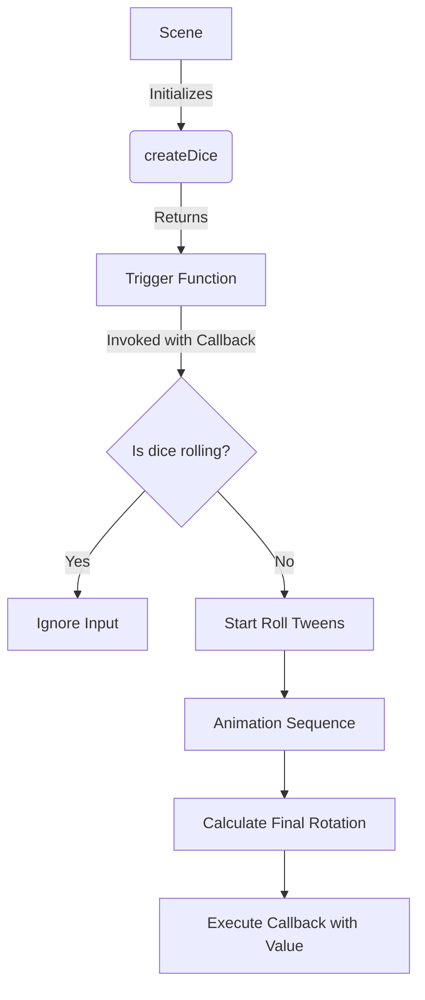

# src — game elements

# Game Elements: Dice Module

The `src/game elements/dice.js` module implements a faux-3D dice rolling mechanic using Phaser 3’s Mesh capabilities. It handles the loading, rendering, animation, and result-reporting of a six-sided die.

## Overview

Unlike standard 2D sprites, this module utilizes a 3D `.obj` model to create a realistic rolling effect. The module exports a factory function, `createDice`, which encapsulates the internal state of the die and returns a trigger function to initiate rolls.

## Core Component: `createDice`

The `createDice` function initializes the dice object within a given scene.

### Parameters
| Parameter | Type | Description |
| :--- | :--- | :--- |
| `x`, `y` | `number` | The screen coordinates where the dice mesh is placed. |
| `scene` | `Phaser.Scene` | The parent scene context. |
| `duration` | `number` | The length of the roll animation in milliseconds (default: 1000). |

### Internal State & Setup
1.  **Mesh Initialization**: It creates a `Phaser.GameObjects.Mesh` using the `dice-albedo` texture and `dice-obj` geometry.
2.  **Shadow FX**: A shadow is attached via `dice.postFX.addShadow` to provide depth during the "jump" animation.
3.  **Concurrency Control**: A local `diceIsRolling` boolean prevents multiple roll animations from overlapping.

## Execution Flow

When `createDice` is called, it returns a **trigger function**. This pattern allows the scene to store the dice instance and roll it on demand (e.g., on a pointer event).



### Roll Logic & Animations
When the trigger function is invoked, three concurrent tweens are managed:

1.  **Rotation (The Roll)**:
    *   Updates `dice.modelRotation.x` and `y` continuously during the tween.
    *   On completion, it snaps the `modelRotation` to hardcoded constants corresponding to the `diceRoll` (1-6).
2.  **Scale (The Jump)**:
    *   Tweens the mesh scale to `1.2` and yoyos back to `1`. This simulates the die being thrown "at" the camera.
3.  **Shadow (The Depth)**:
    *   Tweens the `shadowFX` offset (`x: -8, y: 10`) to match the scale increase, creating a parallax-style illusion of height.

## Final Result Mapping

The orientation of the die is determined by a random integer between 1 and 6. Upon the completion of the animation, the mesh is rotated to the following Euler angles (converted to Radians):

| Value | X Rotation | Y Rotation |
| :--- | :--- | :--- |
| **1** | 0° | -90° |
| **2** | 90° | 0° |
| **3** | 180° | 0° |
| **4** | 180° | 180° |
| **5** | -90° | 0° |
| **6** | 0° | 90° |

## Integration Example

To use the dice within a Scene, initialize it in the `create` method and provide a callback to handle the result.

```javascript
// Inside a Phaser.Scene
create() {
    // 1. Initialize the dice
    const rollDice = createDice(400, 300, this);

    // 2. Trigger on input
    this.input.on('pointerdown', () => {
        rollDice((result) => {
            console.log(`The player rolled a: ${result}`);
            // Update UI or Game State here
        });
    });
}
```

## Dependencies
*   **Assets**: Requires `dice-albedo` (Image) and `dice-obj` (OBJ File) to be preloaded in the scene.
*   **Renderer**: Requires `Phaser.WEBGL` as the `Mesh` game object is not supported in Canvas mode.