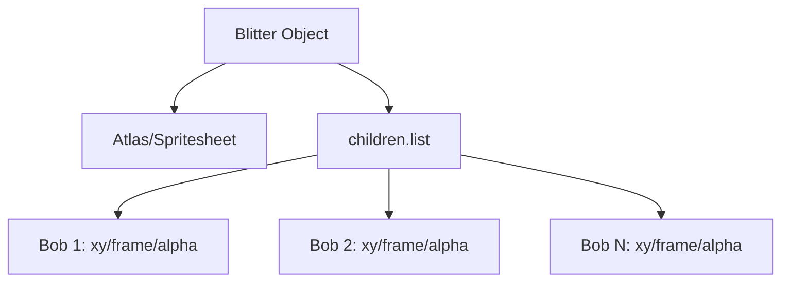

# src — game objects

# Phaser 3 Game Objects: BitmapText, Blitter, and Containers

This module provides specialized rendering and grouping entities designed for high-performance text display, batch rendering of "bobs," and hierarchical object management.

---

## 1. BitmapText
BitmapText uses a texture and an XML/JSON configuration file (containing character coordinates) to render text. This is significantly faster than standard Text objects in high-stress scenarios because it avoids canvas drawing calls.

### Types of BitmapText
*   **Static BitmapText:** Created via `this.add.bitmapText`. Best for labels and UI elements that don't change internal character properties frequently.
*   **Dynamic BitmapText:** Created via `this.add.dynamicBitmapText`. Offers a `displayCallback` that allows per-character manipulation during the render loop.

### Character Manipulation (Dynamic Only)
The `setDisplayCallback` is the core of dynamic text effects. It receives a `data` object for every character rendered.

```javascript
// data = { index, charCode, x, y, scaleX, scaleY, color, rotation, tint }
text.setDisplayCallback((data) => {
    data.y += Math.sin(this.time.now + data.index) * 10; // Wave effect
    data.rotation = 0.5; // Fixed rotation per char
    return data;
});
```

### Retro Fonts
Phaser can parse "Retro Fonts" — images where characters are laid out in a fixed grid without an accompanying XML file.
*   **API:** `Phaser.GameObjects.RetroFont.Parse(scene, config)`
*   **Registration:** The result must be added to the BitmapFont cache using `this.cache.bitmapFont.add(key, data)`.

---

## 2. Blitter
The Blitter object is a high-speed engine for rendering large numbers of similar images, known as **Bobs**. It trade-offs the full functionality of a Sprite (like Input or individual Physics) for raw rendering speed.

### Key Concepts
*   **Bobs:** These are the children of the Blitter. Created via `blitter.create(x, y, frame)`.
*   **Performance:** Bobs are batched together. In WebGL, this results in significantly fewer draw calls compared to individual Sprites.
*   **Data Storage:** Bobs possess a `data` property (Object) often used to store custom variables like velocity or bounce factors for custom physics loops within an `update` function.

### Execution Flow: Scroller Pattern
1.  **Creation:** `blitter.createFromCallback` or manual `create`.
2.  **Update Loop:** Iterate through `blitter.children.list` to apply custom logic.
3.  **Rendering:** Batched render of all bobs using the Blitter's texture.



---

## 3. Containers
Containers are grouping objects used to manage a logical hierarchy. A Container is a Game Object itself; transforming the parent (position, scale, rotation) automatically transforms all children.

### Coordinate Systems
Children in a Container use **local coordinates**. An image at `(0, 0)` inside a Container will be rendered at the Container's world position.

### Features & Limitations
*   **Physics:** To use Arcade Physics on a Container, you must call `container.setSize(w, h)` before enabling the body, as Containers default to `0x0`.
*   **Input:** Containers can have their own hit area via `container.setInteractive()`, or they can contain interactive children.
*   **Masking:** Containers can act as a parent for a `BitmapMask`.
*   **Nesting:** Containers can contain other Containers, but excessive nesting can impact performance due to recursive matrix calculations.

### Common Patterns

| Requirement | Implementation |
| :--- | :--- |
| **Depth Sorting** | Use `container.bringToTop(child)` or `container.sendToBack(child)`. |
| **Batch Alpha** | Setting `container.setAlpha(n)` modifies the transparency of all children. |
| **Input Masking** | Set an interactive shape on the container to define a group click area: `container.setInteractive(shape, callback)`. |

---

## 4. Selection Criteria
Choosing the right Game Object is critical for scene performance:

1.  **Use `Container`** when you need a complex entity made of multiple parts (e.g., a character with a separate sword, hat, and shadow) that move together.
2.  **Use `Blitter`** for "Bullet Hell" patterns, starfields, or retro-style "Bob" effects where you have 100+ items and need to maximize FPS.
3.  **Use `DynamicBitmapText`** for dialogue systems requiring "wiggle" text, typewriter effects, or localized rainbow gradients.
4.  **Use `RetroFont`** when working with assets from 8-bit or 16-bit era tile-sheets that lack metadata files.