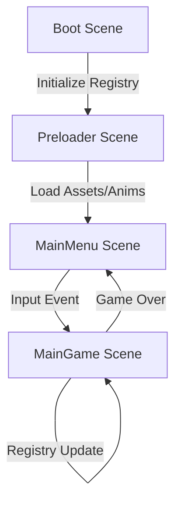

# src — games

# Games Module Documentation

The `src/games` module contains a collection of reference implementations and mini-games built with Phaser 3. These examples serve as both playables and architectural templates for common game genres, demonstrating patterns for physics integration, scene management, asset preloading, and custom game object components.

## Core Architecture

Most games in this module follow a standardized Phaser Scene lifecycle. This ensures clean separation between asset loading, menu logic, and core gameplay.



### 1. Avoid the Germs
A survival-style game focusing on object pooling and basic AI tracking.

*   **Key Classes:**
    *   `Germs.js`: A `Phaser.Physics.Arcade.Group` that manages a pool of `Germ` objects. It uses `releaseGerm()` to either resurrect an inactive germ or instantiate a new one, practicing efficient memory management.
    *   `Germ.js`: Extends `Phaser.Physics.Arcade.Sprite`. It implements a "chase" state where it uses `scene.physics.moveToObject` to track the player's coordinates.
*   **Logic Pattern:** The game uses the `registry` (e.g., `this.registry.set('highscore', 0)`) to persist the high score across scene restarts.

### 2. Bank Panic
A complex implementation involving component-based logic within a `Phaser.GameObjects.Container`.

*   **The Door Component (`Door.js`):** 
    Instead of handling all logic in the main scene, each door is a self-contained Unit. It manages:
    *   **State:** `isOpen`, `isBandit`, `isDead`.
    *   **Timers:** Internal property `timeToKill` determines when the bandit shoots the player.
    *   **Interaction:** Overrides `pointerup` to handle shooting logic (`shootCharacter` vs `shootHat`).
*   **Execution Flow (Shoot to Reset):**
    1.  `Door.shoot()` triggers `shootCharacter`.
    2.  If successful, calls `MainGame.addGold()`.
    3.  If 12 goals are met, `levelComplete()` triggers.
    4.  `nextLevel()` iterates through all doors to call `door.reset()`.

### 3. Card Memory
Demonstrates the use of Phaser's 3D Plane features for card-flip effects.

*   **Component Factory (`createCard.js`):** 
    Uses `scene.add.plane` to create a mesh that can rotate on the Y-axis. The `flipCard` function uses a tween to animate `rotation.y` and swaps textures (`setTexture`) mid-flip when the plane is perpendicular to the camera.
*   **Match Logic (`Play.js`):** 
    Tracks the `cardOpened` state. If a second card is flipped, it compares `cardName`. If they don't match, it shakes the camera (`cameras.main.shake`) and flips both back.

### 4. Coin Clicker
A high-speed interaction game focusing on physics-based spawning and UI transitions.

*   **Physics Interaction:** Coins are spawned with random X velocities (`setVelocityX`) and high bounce values. Interaction is handled via `this.input.on('gameobjectdown')`.
*   **Vanish Pattern:** When clicked, the coin's physics body is disabled, a 'vanish' animation plays, and it is destroyed upon `animationcomplete-vanish`.

### 5. Emoji Match
A grid-based logic game emphasizing grid alignment and staggered animations.

*   **Layout:** Uses `Phaser.Actions.GridAlign` (via the Group config) to layout sprites in a 4x4 grid.
*   **Dynamic Round Generation:** `arrangeGrid()` ensures exactly one valid pair exists by using `Phaser.Utils.Array.RemoveRandomElement` to pick frames and grid positions.
*   **Visual Feedback:** Uses concentric circles (`circle1`, `circle2`) with different stroke styles to highlight selections and matches.

## The Tutorial Series: `firstgame`

The `firstgame/` directory contains a 10-part progression showing how to build a platformer from scratch. This is useful for onboarding new developers to the Phaser ecosystem.

*   **Parts 1-4:** Configuration, asset loading, and static physics groups (platforms).
*   **Parts 5-7:** Sprite instantiation, animations, and Keyboard input (`createCursorKeys`).
*   **Parts 8-10:** Interactive objects (Stars), Score tracking, and dynamic hazard spawning (Bombs).

## Implementation Details

### Scene Transitions
Games utilize both direct starts and transitions:
```javascript
// In Coin Clicker's Preloader.js
this.scene.transition({
    target: 'MainMenu',
    duration: 1000,
    onUpdate: (progress) => {
        this.cameras.main.setAlpha(1 - progress);
    }
});
```

### Global State & Registry
The `registry` is the primary method for cross-scene data sharing (like high scores) without using global variables:
*   **Setup:** `this.registry.set('highscore', 0)` (usually in `Boot.js`).
*   **Access:** `this.registry.get('highscore')` (in `GameOver.js` or `MainMenu.js`).

### Physics Patterns
Most modules utilize **Arcade Physics**. Common patterns found:
*   **Static Groups:** Used for platforms or level boundaries that don't move.
*   **Overlap vs Collider:** `overlap` is used for pickups/germs where no physical bounce is needed; `collider` is used for platforms and world bounds.