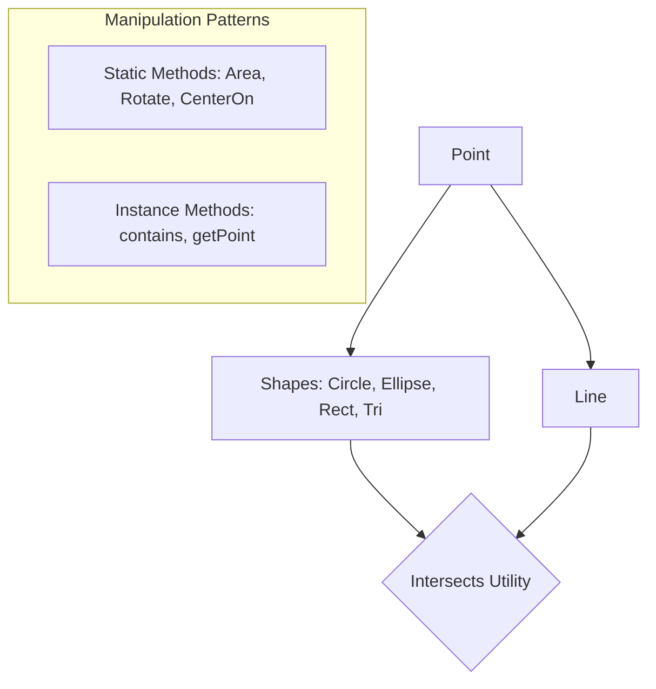

# src — geom

# Phaser Geometry Module (`src/geom`)

The `geom` module is a high-performance suite of geometric primitives and spatial utility functions. It provides classes for defining shapes (Points, Lines, Circles, Ellipses, Rectangles, Triangles, and Polygons) and an extensive static utility library for manipulating these shapes and detecting intersections.

## Architectural Overview

The module is designed for performance, minimizing garbage collection by frequently utilizing "out" parameters. It operates on a dual-layer pattern:

1.  **Data Classes**: Lightweight objects (e.g., `Phaser.Geom.Circle`) that hold state.
2.  **Static Utility Namespaces**: Logic-heavy functions (e.g., `Phaser.Geom.Circle.Area`) that perform calculations on the data classes.



---

## Core Primitives

### Point (`Phaser.Geom.Point`)
The foundation of the module. Beyond simple `x` and `y` coordinates, the `Point` namespace provides vector-like math.
- **Interpolation**: `Phaser.Geom.Point.Interpolate(p1, p2, t)` for linear movement.
- **Centroids**: Calculate the center of a cloud of points via `GetCentroid`.
- **Rounding**: Instance manipulation via `Ceil`, `Floor`, and `Invert`.

### Line (`Phaser.Geom.Line`)
Defined by two points `(x1, y1)` and `(x2, y2)`.
- **Normals**: `GetNormal` calculates a perpendicular vector, essential for physics reflections.
- **Rotation**: Lines can be rotated around their center, specific coordinates, or another `Point` object using `RotateAroundPoint`.
- **Sampling**: `BresenhamPoints` returns an array of coordinates along the line, while `GetPoints` allows for fixed-step sampling.

### Circle & Ellipse
- **Circle**: Defined by `x`, `y`, and `radius`. It includes helpers for `diameter` and `circumference`.
- **Ellipse**: Defined by `x`, `y`, `width`, and `height`.
- **Boundary Logic**: Both support `GetBounds`, which returns a `Phaser.Geom.Rectangle` tightly fitting the shape.
- **Point Extraction**: `CircumferencePoint` calculates coordinates at a specific angle, whereas `getRandomPoint` returns a point inside the area.

---

## The Intersection Engine (`Phaser.Geom.Intersects`)

The `Intersects` namespace is a specialized utility for collision detection without the overhead of a full physics engine.

### Common Intersection Patterns
The module supports cross-shape detection, including:
- **Line Intersections**: `LineToLine`, `LineToCircle`, and `LineToRectangle`.
- **Shape Overlap**: `CircleToCircle`, `RectangleToTriangle`, and `TriangleToCircle`.
- **Rectangle Specials**: 
    - `RectangleToValues`: Checks if a rectangle overlaps a defined coordinate range (top, bottom, left, right).
    - `GetRectangleIntersection`: Returns a new `Rectangle` representing the overlapping area of two shapes.

---

## Key Developer Patterns

### 1. Avoiding Garbage Collection (The `out` Parameter)
Most functions that return a new object (Point, Rectangle, etc.) allow you to pass an existing instance as the final argument. This is critical for logic inside an `update` loop.

```javascript
// BAD: Creates a new Point object every frame
update() {
    const p = circle.getRandomPoint(); 
}

// GOOD: Reuse the same Point instance
create() {
    this.tempPoint = new Phaser.Geom.Point();
}
update() {
    this.circle.getRandomPoint(this.tempPoint);
}
```

### 2. Static vs. Instance Methods
While instance methods like `circle.contains(x, y)` are convenient, the static counterparts often provide more flexibility:
- **Instance**: `myCircle.contains(x, y)`
- **Static**: `Phaser.Geom.Circle.ContainsPoint(myCircle, myPoint)` — useful when checking against other geometric objects rather than raw numbers.

### 3. Shape Modification
Shapes can be transformed using standard utility patterns:
- **`Offset`**: Shifts the shape by `x` and `y` without changing dimensions.
- **`CenterOn`**: Moves the shape so its center matches a target coordinate.
- **`SetTo`**: Directly redefines the shape's properties in a single call (e.g., `circle.setTo(x, y, radius)`).

### 4. Property Syncing
Many shapes feature getters/setters that automatically sync related properties. For example, changing a `Circle.radius` automatically updates its `diameter`, and modifying `Line.left` shifts the entire line while maintaining its length.

## Use Cases for Contributors
- **Adding New Intersections**: Logic should be placed in `src/geom/intersects/` and follow the `ShapeAToShapeB` naming convention.
- **Extending Shapes**: Ensure new shapes implement `GetPoints` and `getRandomPoint` to remain compatible with the `Graphics` module's drawing functions.