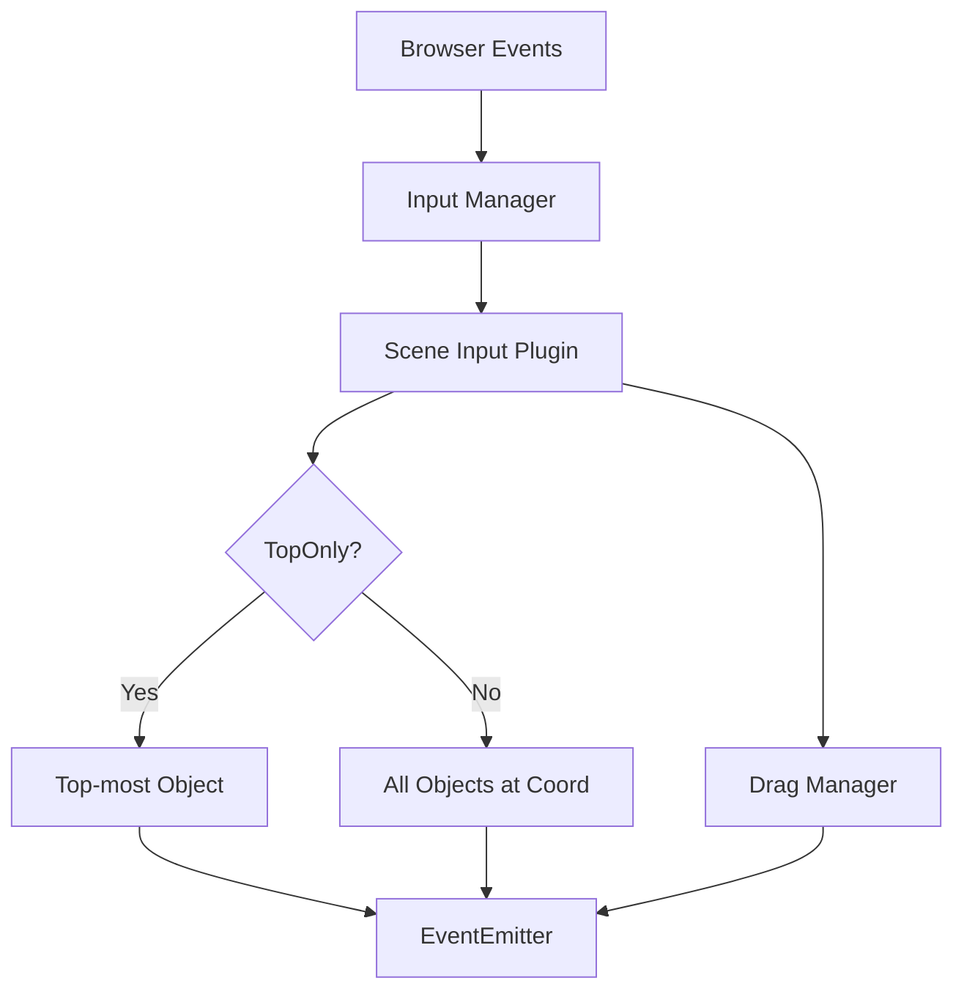

# src — input

# Phaser 3 Input Module Documentation

The `src/input` module is a high-level orchestration layer in Phaser 3 that translates raw browser events (Pointer, Keyboard, Gamepad) into Scene-specific interactions. It manages hit testing, dragging, event propagation, and coordinate transformation across multiple cameras.

## Core Interaction Architecture

The interaction flow follows a specific hierarchy:
1. **Raw Event**: The browser captures a mouse, touch, or key event.
2. **Input Manager**: The global manager handles DOM-level events (like `gameout` or `gameover`).
3. **Scene Input Plugin**: Accessed via `this.input`, this plugin processes events relative to the Scene's display list.
4. **Camera Mapping**: The Pointer transforms screen coordinates into "World Space" based on the camera’s scroll, zoom, and rotation.
5. **Hit Testing**: The plugin determines which Game Objects (if any) are under the pointer based on their `hitArea`.



---

## Game Object Interactions

To make any Game Object (Sprite, Image, Text, Container) reactive, you must call `setInteractive()`.

### Hit Areas and Shapes
By default, `setInteractive()` creates a rectangle based on the object's texture dimensions. However, you can define custom geometry:

*   **Custom Shapes**: Pass a `Phaser.Geom` object and a "contains" callback.
    ```javascript
    // Using a circle for hit detection
    const shape = new Phaser.Geom.Circle(48, 48, 48);
    sprite.setInteractive(shape, Phaser.Geom.Circle.Contains);
    ```
*   **Manual Adjustments**: Directly modify the `hitArea` property.
    ```javascript
    sprite.input.hitArea.setTo(-30, -30, sprite.width + 60, sprite.height + 60);
    ```

### Debugging Hit Areas
To visualize hit areas during development, use `this.input.enableDebug(gameObject, color)`. This renders the hit shape over the object, respecting its scale and rotation.

---

## Drag and Drop Pipeline

The drag system is managed via the `drag` events on the Input Plugin.

### Lifecycle Events
1.  **`dragstart`**: Fired when a pointer moves beyond the threshold or is held long enough.
2.  **`drag`**: Fired every frame the pointer moves while down. Provides `dragX` and `dragY` which are pre-calculated world coordinates.
3.  **`dragend`**: Fired when the pointer is released.
4.  **`drop`**: Fired if the object is released over a valid **Drop Zone** (`setDropZone()`).

### Thresholds and Constraints
You can filter "accidental" drags using global settings:
*   `this.input.dragDistanceThreshold`: Minimum pixels moved before dragging starts.
*   `this.input.dragTimeThreshold`: Minimum milliseconds held before dragging starts.

**Constraint Example: Axis Locking**
```javascript
this.input.on('drag', (pointer, gameObject, dragX, dragY) => {
    // Only allow horizontal movement
    gameObject.x = dragX; 
});
```

---

## Camera and World Coordinates

Input is inherently tied to the Camera system. A single pointer might overlap different objects in different cameras (e.g., a UI camera vs. a Game World camera).

### Coordinate Transformation
*   **`pointer.worldX / worldY`**: Returns coordinates based on the `main` camera.
*   **`pointer.positionToCamera(camera)`**: Converts the screen position into coordinates specific to a given camera's zoom and rotation.

### Camera Interaction Filters
*   **`camera.ignore(gameObject)`**: Prevents a specific camera from rendering an object. This also effectively removes that object from the hit-test list for that specific camera view.
*   **Stacked Cameras**: If multiple cameras overlap, Phaser checks them in the order they were added (top-to-bottom). Use `this.input.setTopOnly(true)` to stop processing after the first camera/object hit.

---

## Specialized Input Sub-modules

### Keyboard Input
Keyboard interaction can be handled via polling (checking state in `update`) or events.
*   **Polling**: `this.input.keyboard.addKey(Phaser.Input.Keyboard.KeyCodes.SPACE)` creates a `Key` object with an `isDown` property.
*   **Global Events**: `this.input.keyboard.on('keydown-A', callback)` fires specifically for the A-key.
*   **Combos**: `this.input.keyboard.addKeys('W,A,S,D')` returns an object with multiple key states for easier management.

### Gamepad Input
Enabled via the game config (`input: { gamepad: true }`).
*   **Axes**: `pad.axes[0].getValue()` typically retrieves the horizontal value of the left stick (-1 to 1).
*   **Thresholds**: Set `pad.setAxisThreshold(0.3)` to ignore minor stick drift.
*   **Stick Objects**: Access simplified properties via `pad.leftStick` and `pad.rightStick`.

### Mouse / Pointer Lock
For 3D-style controls (FPS) or infinite scrolling, use the Pointer Lock API:
```javascript
this.input.on('pointerdown', () => {
    this.input.mouse.requestPointerLock();
});
```
When locked, `pointer.movementX` and `movementY` provide delta values regardless of the screen edges.

---

## DOM and Canvas Events

The module provides hooks into the relationship between the game canvas and the browser window:
*   **Focus**: Listen for `gameout` and `gameover` on `this.input` to pause the game or hide tooltips when the mouse leaves the canvas.
*   **Buttons**: Use `pointer.rightButtonDown()` to detect right-clicks (requires `disableContextMenu: true` in game config).
*   **Pinch/Zoom**: Multitouch is supported; use `this.input.addPointer(num)` to enable support for more than the default 2 simultaneous touches.