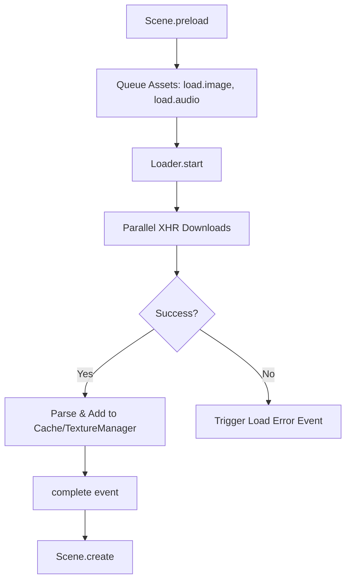

# src — loader

# Phaser 3 Loader Module

The `Loader` module is a core system of Phaser 3, responsible for the external acquisition of assets. It handles the asynchronous loading of images, audio, data files, scripts, and plugins, transforming raw network responses into usable objects within the Phaser `Cache` or `TextureManager`.

In most scenarios, the Loader is accessed via `this.load` within a `Phaser.Scene`.

---

## The Loading Lifecycle

Loading typically occurs during a Scene's `preload` phase. However, Phaser supports dynamic loading at any time during game execution.

1.  **Queue Phase**: Asset requests are added to a queue (e.g., `this.load.image`).
2.  **Start Phase**: The Loader begins processing the queue. If in `preload`, this happens automatically. If loading dynamically, `this.load.start()` is required.
3.  **Process Phase**: Files are downloaded via XHR (default) or tag-loading (for scripts/HTML5 audio).
4.  **Complete Phase**: Assets are parsed and moved to their respective storage (Textures, Cache, etc.), and the Scene moves to `create`.



---

## Key Configuration & Paths

To reduce boilerplate, the Loader provides methods to manage global URL prefixes and folder structures.

- **`setBaseURL(url)`**: Prepends a string to every URL requested. Useful for CDNs.
- **`setPath(path)`**: Sets a folder prefix for subsequent load calls. Can be changed multiple times within one `preload` function.

```javascript
this.load.setBaseURL('https://cdn.example.com/game/');
this.load.setPath('assets/sprites/');
this.load.image('player', 'hero.png'); // Loads from https://cdn.example.com/game/assets/sprites/hero.png
```

---

## Supported Asset Types

### Graphics & Textures
The Loader can handle various formats including WebP and SVG. Most graphic loaders allow for an optional `Normal Map` to be passed as an array for use with the Light2D pipeline.

| Method | Purpose | Key Data Handled |
| :--- | :--- | :--- |
| `image(key, [url, normalMap])` | Standard images. | TextureManager |
| `spritesheet(key, url, frameConfig)` | Animations via fixed-width frames. | TextureManager |
| `atlas(key, textureURL, atlasURL)` | Texture Packer JSON or Unity YAML maps. | TextureManager |
| `svg(key, url, [svgConfig])` | Vector graphics (scaled during load). | TextureManager |
| `htmlTexture(key, url, width, height)` | Renders HTML files into a texture. | TextureManager |

### Audio
Phaser supports multi-format fallback and streaming.
- **Multi-format**: Pass an array of URLs (e.g., `['audio.ogg', 'audio.mp3']`). The loader automatically selects the format supported by the browser.
- **Audio Sprites**: Use `load.audioSprite(key, jsonURL, [audioURL])` to load a single file containing multiple sound effects.
- **Streaming**: Use the `stream: true` flag in the XHR settings for large background music to begin playback before the full file is downloaded.

### Data & Scripts
| Method | Purpose | Storage |
| :--- | :--- | :--- |
| `binary(key, url, [dataType])` | Loads raw data into a `Uint8Array` or similar. | `cache.binary` |
| `bitmapFont(key, imgURL, xmlURL)` | XML or JSON based bitmap fonts. | `cache.bitmapFont` |
| `json(key, url)` | Standard JSON objects. | `cache.json` |
| `plugin(key, url, start)` | Global system plugins. | PluginManager |
| `sceneFile(key, url)` | Dynamically loads a new Scene class. | SceneManager |
| `script(key, url)` | External JS files. | Document Head |

---

## Event System

Monitoring the loader is critical for building progress bars. The Loader emits events that provide granular data on the queue's state.

### Progress Tracking
- **`progress`**: Emits a value from 0 to 1 representing the entire queue.
- **`fileprogress`**: Emits the specific `File` object and its individual progress (0 to 1). Useful for tracking large individual downloads (like audio).

```javascript
this.load.on('progress', (value) => {
    progressBar.width = 800 * value;
});
```

### Completion Tracking
- **`filecomplete`**: Emitted when any single file finishes loading. Supports specific file-key patterns: `filecomplete-image-logo`.
- **`complete`**: Emitted when the entire queue has been processed.

---

## Advanced Usage

### Scene Payload (Pre-Loading)
If you need assets available *before* the Scene's `init` or `preload` (e.g., a logo for the loading screen itself), you can define a `pack` in the Scene configuration.

```javascript
class Preloader extends Phaser.Scene {
    constructor() {
        super({
            key: 'Preloader',
            pack: {
                files: [
                    { type: 'image', key: 'loadingBar', url: 'bar.png' }
                ]
            }
        });
    }
}
```

### Base64 Loading
The Loader can accept Data URIs instead of URLs for images, atlas JSON, and bitmap fonts. This is useful for small assets bundled directly in your JS source.

```javascript
import { playerBase64 } from './assets.js';

// Preload understands it is base64 automatically
this.load.image('player', playerBase64);
```

### Dynamic & Manual Loading
To load assets after a Scene has started (e.g., clicking a "Level 2" button), you must call `load.start()` manually. Phaser will not automatically process the queue outside of the `preload` lifecycle.

```javascript
this.load.image('boss', 'boss.png');
this.load.once('complete', () => {
    this.add.image(400, 300, 'boss');
});
this.load.start(); // Kick off the loader manually
```

### XHR Settings
You can pass custom XHR credentials (user/password), headers, or timeouts on a per-file or per-loader basis via the `xhr` configuration object.

```javascript
this.load.image({
    key: 'secret-map',
    url: 'assets/map.png',
    xhr: {
        header: 'Authorization',
        headerValue: 'Bearer token-123'
    }
});
```