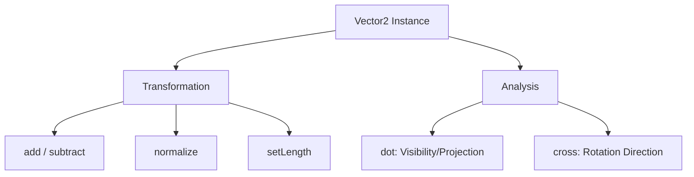

# src — math

# Phaser 3 Math Module

The `src/math` module provides essential utilities for geometric calculations, spatial reasoning, and vector manipulation. It acts as the backbone for positioning, movement logic, and collision detection within the Phaser framework.

This documentation focuses on the **Distance** and **Vector2** sub-modules, which are the primary tools for handling 2D spatial data.

---

## 1. Distance Utilities
The `Phaser.Math.Distance` namespace provides static methods to calculate the spatial gap between two points using different metrics.

### Euclidean Distance
The most common measurement, representing a straight-line distance.
*   **`Between(x1, y1, x2, y2)`**: Calculates the absolute distance between two sets of coordinates.
*   **`BetweenPoints(a, b)`**: A convenience wrapper for `Between` that accepts any object with `x` and `y` properties (e.g., Sprites, Images, or Points).

### Grid-Based Metrics
Used for specific movement constraints, such as tile-based games or procedural generation.
*   **`Chebyshev(x1, y1, x2, y2)`**: Returns the maximum of the horizontal and vertical distances. This is often called "Chessboard distance," representing the number of moves a King needs to reach a destination.
*   **`Snake(x1, y1, x2, y2)`**: Also known as Manhattan or "L1" distance. It calculates the sum of the absolute differences of their coordinates, representing distance traveled along a grid (no diagonals).

---

## 2. Vector2 Class
`Phaser.Math.Vector2` is a high-performance class representing a 2D vector $(x, y)$. It is used for velocity, acceleration, and complex point transformations.

### Core Transformations
| Method | Description |
| :--- | :--- |
| `add(vector)` | Adds the given vector to the current instance. |
| `subtract(vector)` | Subtracts the given vector from the current instance. |
| `multiply(vector)` | Performs component-wise multiplication. |
| `divide(vector)` | Performs component-wise division. |
| `setLength(value)` | Forces the vector to a specific magnitude while preserving its direction. |
| `normalize()` | Scales the vector to a magnitude of 1 (a "unit vector"). |

### Directional & Angular Logic
The `Vector2` class includes methods for calculating relational data between vectors:

*   **`dot(vector)`**: Returns the Dot Product. This is useful for determining if an object is "in front of" or "behind" another point.
*   **`cross(vector)`**: Returns the 2D Cross Product (a scalar). In Phaser, this is primarily used to determine the winding direction (clockwise vs. counter-clockwise) between two vectors.
*   **`normalizeLeftHand()` / `normalizeRightHand()`**: Rotates the vector 90 degrees to create a perpendicular (normal) vector.



---

## 3. Practical Patterns

### Constant-Velocity Tracking
When you need a sprite to move towards a target at a fixed speed regardless of distance, use `normalize` and `setLength`:

```javascript
// In update()
const target = new Phaser.Math.Vector2(pointer.x, pointer.y);
const movement = target.subtract(player.body.position);

// Ensure the player doesn't move faster if the pointer is further away
movement.normalize().scale(speed);
```

### Determining Field of View (FOV)
The Dot Product is used to see if a point is within a specific arc. If `A.dot(B)` is greater than 0, the points are generally facing the same direction.

```javascript
const dotProduct = playerVector.dot(enemyVector);
const area = playerVector.length() * enemyVector.length();
const angle = Math.acos(dotProduct / area);

if (angle < FOV_THRESHOLD) {
    // Enemy is within the player's view cone
}
```

### Perpendicular Movement
To create "strafing" logic or calculate wall reflections, use the perpendicular methods:

```javascript
// Get a vector perpendicular to the current heading
const strafeDir = headingVector.clone().normalizeLeftHand();
player.body.setVelocity(strafeDir.x * speed, strafeDir.y * speed);
```

---

## 4. Integration with Game Objects
The math module does not exist in a vacuum; it is designed to consume and drive Phaser Game Objects:

1.  **Input**: `pointermove` events provide coordinates that are frequently converted into `Vector2` objects for physics calculations.
2.  **Graphics**: Methods like `graphics.fillPointShape(point)` or `graphics.lineBetween()` directly accept coordinates derived from `Math.Distance` or `Vector2` outputs.
3.  **Update Loop**: Most manual movement (as seen in the provided samples) involves modifying `sprite.x/y` based on `Vector2` addition or trigonometric functions (`Math.sin`, `Math.cos`) provided by the broader Math API.