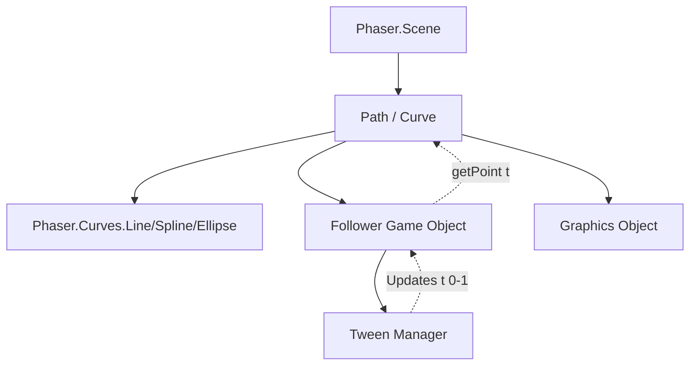

# src — paths

# Phaser 3 Paths and Curves Documentation

The `src/paths` module provides a comprehensive API for defining mathematical paths and animating Game Objects along those paths. It bridges the gap between geometry and game logic, allowing developers to create complex motion patterns beyond simple linear tweens.

## Core Concepts

The module architecture revolves around three primary entities:
1.  **Curves**: Individual mathematical segments (Lines, splines, ellipses, Beziers).
2.  **Paths**: A collection of one or more curves joined together to form a continuous track.
3.  **Followers**: Specialized Game Objects that automate the logic of moving along a path.

---

## 1. Mathematical Curves
Curves are the building blocks of the path system. They reside in `Phaser.Curves` and share a common interface for sampling points and drawing.

### Available Curve Types
*   **`Phaser.Curves.Line`**: A straight segment between two points. Defined by `p0` and `p1`.
*   **`Phaser.Curves.Spline`**: A smooth curve passing through a series of points using Catmull-Rom interpolation. 
*   **`Phaser.Curves.Ellipse`**: Circular or elliptical arcs. Supports radii, rotation, and start/end angles.
*   **`Phaser.Curves.QuadraticBezier`**: A curve defined by a start point, one control point, and an end point.
*   **`Phaser.Curves.CubicBezier`**: A curve defined by a start point, two control points, and an end point.

### Key Curve Methods
All curves implement these core methods for spatial calculation:
*   `getPoint(t, optionalTarget)`: Returns a point at position `t` (0.0 to 1.0) along the curve.
*   `getSpacedPoints(divisions)`: Returns an array of points equally spaced by distance along the curve.
*   `getTangent(t)`: Returns a unit vector representing the direction of the curve at `t`.
*   `getBounds(target)`: Populates a `Phaser.Geom.Rectangle` with the curve's bounding box.
*   `draw(graphics, [pointsTotal])`: Renders the curve to a Graphics object.

---

## 2. Path Construction
A `Phaser.Curves.Path` acts as a container. You can load a path from a JSON definition or build it procedurally by chaining segments.

### Procedural Chaining
Paths track a "current position," allowing you to add segments relative to the last point:
```javascript
const path = new Phaser.Curves.Path(50, 500); // Start at 50, 500
path.splineTo([164, 446, 274, 542]);
path.lineTo(700, 300);
path.ellipseTo(200, 100, 100, 250, false, 0);
path.cubicBezierTo(222, 119, 308, 107, 208, 368);
```

### JSON Serialization
Paths can be instantiated directly from data exported by tools like the Phaser Path Editor:
```javascript
// src/paths/followers/path from json.js
const path = new Phaser.Curves.Path(this.cache.json.get('waves'));
```

---

## 3. Path Followers
Followers are a specialized Game Object type (created via `this.add.follower`) that simplifies path-based animation.

### Initialization & Control
To begin movement, use `startFollow()`. This method accepts a configuration object that controls the tween-like behavior.

```javascript
// src/paths/followers/rotate to path.js
const lemming = this.add.follower(curve, 50, 300, 'lemming');

lemming.startFollow({
    duration: 10000,
    yoyo: true,
    repeat: -1,
    rotateToPath: true, // Automatically aligns the sprite's rotation to the curve tangent
    verticalAdjust: true, // Flips the sprite correctly when moving backwards
    startAt: 0.5 // Start halfway through the path
});
```

### Motion Management
Followers integrate directly with Phaser’s Tween manager but provide specific state checks:
*   `isFollowing()`: Returns true if the object is currently in motion.
*   `pauseFollow()` / `resumeFollow()`: Controls the path progression without destroying the tween.
*   `setPath(newPath)`: Switches the active path dynamically (the follower will snap to the start of the new path).

---

## 4. Technical Architecture

The module structure manages data from mathematical definitions to screen rendering.



---

## 5. Advanced Usage Patterns

### Boundary Handling and Intersections
Developers can use curve data for collision detection. By sampling points via `getDistancePoints()`, you can perform line-segment-to-rectangle intersection tests to determine if a sprite has hit a path boundary.
*   See `src/paths/curves/rectangle spline intersection.js` for an implementation of this pattern.

### Custom Animation via `t`
If the Follower component is too restrictive, you can animate a simple JavaScript object's `t` property and update a sprite in the `Scene.update` loop:
```javascript
// src/paths/all types.js
update() {
    this.path.getPoint(this.follower.t, this.follower.vec);
    this.sprite.setPosition(this.follower.vec.x, this.follower.vec.y);
}
```

### Tangents and Velocity
The `getTangent(t)` method is essential for physically-accurate orientation. In `src/paths/velocity from tangent vectors.js`, tangents are used to calculate the necessary velocity to steer an object toward the next path node while maintaining a specific heading.

---

## 6. Path Editor Integration
The directory `src/paths/_path editor/` contains a boilerplate structure for building path editing tools. It uses a `Phaser.Scene` called `Controller` to manage the UI and logic for placing path nodes, though specific UI implementation details (buttons, drag handles) are typically handled via `Scene.input` events as seen in `src/paths/curves/spline builder.js`.