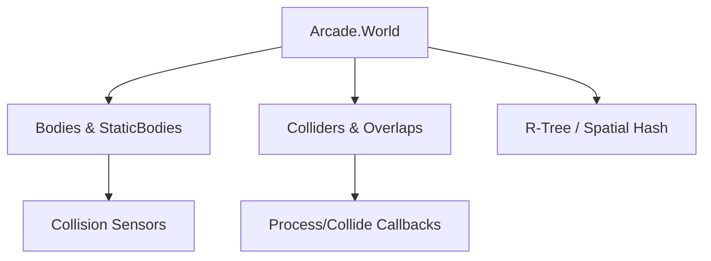

# src — physics

# Arcade Physics Module Documentation

The `src/physics/arcade` module implements a high-performance, lightweight AABB (Axis-Aligned Bounding Box) physics engine. It is designed for games where speed is prioritized over realistic rigid-body simulation, making it ideal for platformers, shoot-'em-ups, and arcade titles.

## Core Concepts

Arcade Physics operates on three primary layers:
1.  **The World (`Phaser.Physics.Arcade.World`)**: The manager of the simulation, handling gravity, bounds, and the spatial tree.
2.  **The Body**: The physical representation of a Game Object.
    *   **Dynamic Body**: Affected by velocity, acceleration, and gravity.
    *   **Static Body**: Fixed in space, unaffected by forces, used for level geometry.
3.  **The Collider/Overlap**: Decoupled objects that define how two bodies (or groups) interact.

## Module Architecture



## Key Components

### 1. Configuration and initialization
Arcade Physics is typically configured in the Game Config. Key performance and behavior flags include:

*   `gravity`: Global acceleration applied to all dynamic bodies.
*   `fps`: The frequency of the simulation.
*   `useTree`: If `true`, uses an R-Tree for spatial queries. For extremely high body counts (e.g., 40,000+), setting this to `false` can sometimes improve performance as seen in `src/physics/arcade/40000 world bodies.js`.
*   `fixedStep`: Determines if the simulation uses a fixed or variable time step.

### 2. Body Dynamics and Movement
The module provides several ways to move bodies beyond simple velocity:

*   **Acceleration & Drag**: Use `setAcceleration(x, y)` to apply force and `setDrag(x, y)` to simulate air resistance.
*   **Damping**: When `body.useDamping = true`, drag acts as a multiplier (0.99) rather than a linear reduction.
*   **Vector Movement**: Functions like `physics.velocityFromRotation()` and `physics.accelerateToObject()` provide high-level steering behaviors.
*   **Direct Control**: Methods like `body.setDirectControl()` allow external systems (Tweens or Input) to drive position while the physics engine remains responsible for calculating velocity and handling collisions.

### 3. Collision and Overlap Logic
Interaction is managed through the `Factory` (accessible via `this.physics.add`):

```javascript
// Basic collider
this.physics.add.collider(player, platforms);

// Callback-led overlap
this.physics.add.overlap(player, gems, (obj1, obj2) => {
    obj2.disableBody(true, true);
}, processCallback, this);
```

*   **Process Callback**: A filter function that returns a boolean. If it returns `false`, the collision overlap is ignored. This is used for "one-way" platforms by checking `player.body.velocity.y >= 0`.
*   **Collision Events**: Bodies can emit events by setting `body.onCollide = true` or `body.onWorldBounds = true`, which are then handled via `this.physics.world.on('collide', ...)`.

### 4. Body Geometry
While primary AABB-based, the module supports:
*   **Rectangular**: Default hitbox.
*   **Circular**: Set via `body.setCircle(radius)`. Note that circular bodies collide using distance checks but still treat tilemap collisions as squares.
*   **Offset/Size**: Use `body.setOffset()` and `body.setSize()` to align hitboxes with textures.

## Advanced Execution Flows

### Post-Update Synchronization
Arcade Physics runs during the Game Object `preUpdate` or a dedicated `world.step`. A critical internal flow occurs during the `postupdate` event where `deltaXFinal()` and `deltaYFinal()` are calculated. These represent the "true" movement after collisions and separation logic have occurred.

### Manual World Stepping
For specialized simulations (like path-following platforms in `src/physics/arcade/body follow path.js`), you can disable the automatic update and call `world.update(time, delta)` manually.

## Performance Optimization Patterns

1.  **Static Groups**: Always use `this.physics.add.staticGroup()` for objects that never move (tiles, walls). This avoids unnecessary position calculations.
2.  **Pooling**: As seen in `src/physics/arcade/bullets group.js`, use `Phaser.Physics.Arcade.Group` with `getFirstDead` to reuse bodies rather than instantiating new ones.
3.  **Body Disabling**: Instead of `destroy()`, use `body.enable = false` or `gameObject.disableBody(true, true)` to remove a body from the simulation while keeping it in memory for reuse.

## Connectivity to Other Modules

*   **`src/curves`**: Integrated via path-following behaviors where bodies are placed on `Phaser.Curves.Path` objects.
*   **`src/geom`**: Used extensively for `World.bounds` (Rectangles) and `world.wrap` (wrapping bodies around game boundaries).
*   **`src/input`**: Directly connects via methods like `this.physics.moveToPointer()`.
*   **`src/tilemaps`**: Arcade Physics has dedicated logic for colliding with `TilemapLayer` objects, handling complex edge-case separation for tile-based levels.