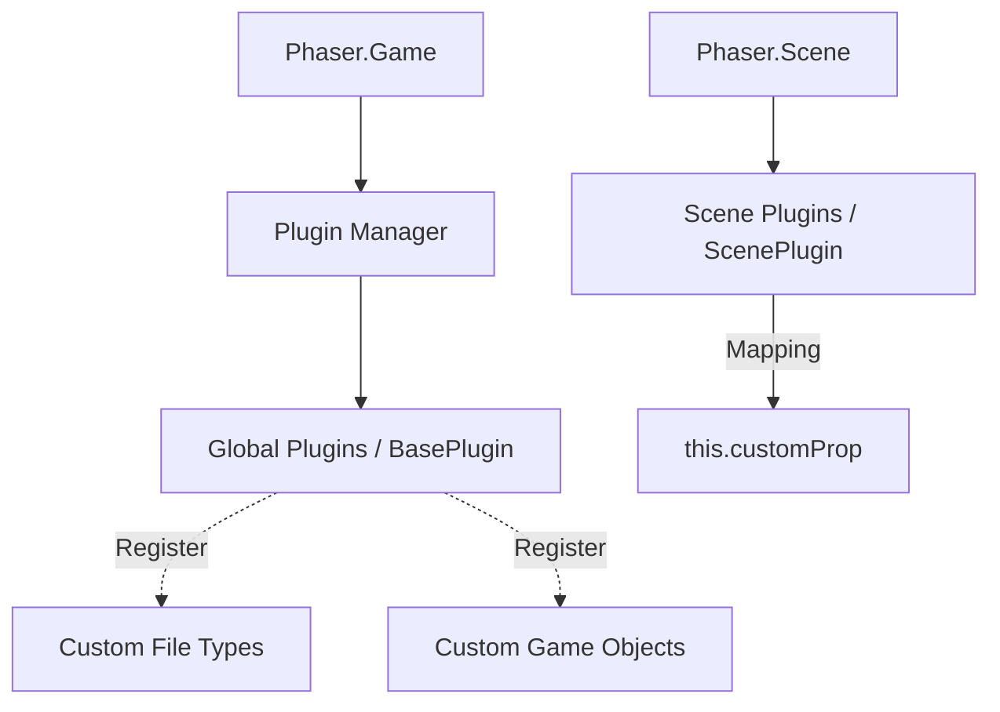

# src — plugins

# Phaser 3 Plugins Module

The **Plugins** module provides a robust architecture for extending Phaser’s core functionality. Plugins allow developers to encapsulate logic, register custom Game Objects, define new Loader file types, or inject global utilities that persist across scenes or are scoped to specific scene lifecycles.

## Architecture Overview

Phaser distinguishes between two primary types of plugins:

1.  **Global Plugins (`BasePlugin`)**: Attached to the `Game` instance. They are ideal for systems that need to persist across the entire game lifecycle (e.g., a global Achievement system or a custom Asset Loader).
2.  **Scene Plugins (`ScenePlugin`)**: Scoped to the `Scene` that creates them. They have direct access to Scene-specific systems like the Display List, Update events, and the Camera.

### Plugin Relationships



---

## Core Plugin Classes

### 1. Phaser.Plugins.BasePlugin (Global)
Used for logic independent of a specific scene. 

*   **Access**: Retrieved via `this.plugins.get('key')`.
*   **Key Capability**: Can register global extensions via the `pluginManager`.

**Example: Registering a Custom Loader File Type**
As seen in `custom file type.js`, a Global Plugin can register a new method on the Loader:
```javascript
class LeetSpeakPlugin extends Phaser.Plugins.BasePlugin {
    constructor (pluginManager) {
        super(pluginManager);
        // Register 'this.load.leet'
        pluginManager.registerFileType('leet', this.leetTextFileCallback);
    }
}
```

### 2. Phaser.Plugins.ScenePlugin
Designed to interact with a Scene's internal systems.

*   **Access**: Accessed via a "mapping" property on the Scene (e.g., `this.fractals`).
*   **Lifecycle**: Can boot into the Scene's event emitter to listen for `UPDATE`, `PAUSE`, or `SHUTDOWN`.

**Example: Scene Update Integration**
As seen in `scene plugin test 3.js`, Scene Plugins can bind to the Scene's heartbeat:
```javascript
boot() {
    // Listen for the Scene's update event
    this.systems.events.on('update', this.update, this);
}
```

---

## Plugin Integration Methods

Developers can add plugins to a project in three ways:

### A. Game Configuration
Pre-defining plugins in the `Phaser.Game` config object. This ensures plugins are available as soon as the game boots.

```javascript
const config = {
    plugins: {
        global: [{ key: 'MyGlobal', plugin: MyGlobalPlugin, start: true }],
        scene: [{ key: 'MyScene', plugin: MyScenePlugin, mapping: 'myProp' }]
    }
};
```

### B. The Loader (`this.load`)
Loading plugins dynamically as assets. This is useful for large plugins that shouldn't bloat the initial bundle.

*   `this.load.plugin(key, url, start)`: Loads a Global Plugin.
*   `this.load.scenePlugin(key, url, systemKey, sceneKey)`: Loads a Scene Plugin and maps it to a Scene property.

### C. Runtime Installation
Plugins can be installed or started dynamically via the `PluginManager` available in any Scene.

*   `this.plugins.install(key, Class, start)`: Registers and optionally starts a plugin.
*   `this.plugins.start(key)`: Activates an installed but inactive plugin.

---

## Extension Patterns

### Custom Game Objects
Plugins are the standard way to add factory methods to `this.add`. By calling `pluginManager.registerGameObject`, you allow the plugin to inject a helper method directly into the Scene's GameObjectFactory.

```javascript
// Inside a BasePlugin constructor
pluginManager.registerGameObject('clown', (x, y) => {
    return this.displayList.add(new ClownGameObject(this.scene, x, y));
});

// Usage in Scene
this.add.clown(400, 300);
```

### Multiple Instances
The Plugin Manager supports running multiple instances of the same plugin class with unique keys. This is demonstrated in `multiple global plugin instances.js`, allowing different configurations of the same logic to run in parallel.

```javascript
let plugin1 = this.plugins.start('RandomNamePlugin', 'ref1');
let plugin2 = this.plugins.start('RandomNamePlugin', 'ref2');
plugin2.changeSet(); // Only affects the second instance
```

---

## Lifecycle Management

Plugins have a controlled lifecycle that developers can hook into:

*   **`init()`**: Called when the plugin is first created.
*   **`start()`**: Called when the plugin is activated/started.
*   **`stop()`**: Called when the plugin is paused or deactivated.
*   **`destroy()`**: Called when the plugin instance is being removed from memory.

In `start and stop a plugin.js`, the `stop` method is used to clean up event listeners to prevent memory leaks:
```javascript
stop() {
    this.game.events.off('step', this.update);
}
```