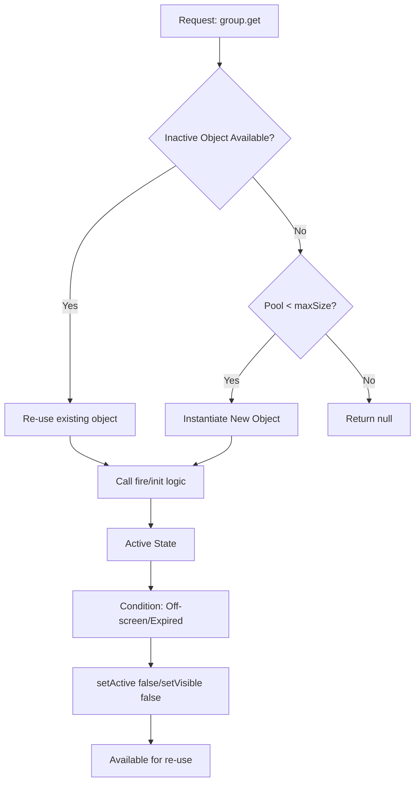

# src — pools

# Object Pooling in Phaser 3

The **Pools** module demonstrates the implementation of the **Object Pool design pattern** using `Phaser.GameObjects.Group`. Object pooling is a critical performance optimization technique used to reduce CPU overhead and prevent "GC pressure" (Garbage Collection pauses) by reusing inactive game objects instead of constantly creating and destroying them.

## Overview

In Phaser 3, a `Group` configured with a `maxSize` acts as a managed pool. When you request an object from the group, it will either:
1. Return an existing inactive member.
2. Create a new instance if the group size is below the `maxSize`.
3. Return `null` if the pool is full and no members are inactive.

## Core Implementation

### 1. The Pooled Object Class
To use a pool effectively, the pooled object (e.g., a `Bullet`) should extend a Phaser Game Object and implement its own lifecycle management.

```javascript
class Bullet extends Phaser.GameObjects.Image {
    constructor(scene) {
        super(scene, 0, 0, 'bullet');
        this.speed = Phaser.Math.GetSpeed(400, 1);
    }

    // Custom method to "activate" the object
    fire(x, y) {
        this.setPosition(x, y - 50);
        this.setActive(true);
        this.setVisible(true);
    }

    update(time, delta) {
        this.y -= this.speed * delta;

        // "Deactivate" when off-screen to return to the pool
        if (this.y < -50) {
            this.setActive(false);
            this.setVisible(false);
        }
    }
}
```

### 2. The Pool (Group) Configuration
The pool is managed by adding a Group to the scene with specific properties:

*   `classType`: The class to instantiate (e.g., `Bullet`).
*   `maxSize`: The maximum number of objects allowed in memory.
*   `runChildUpdate`: When `true`, the Scene's update loop will automatically call the `update` method of every **active** child in the group.

```javascript
this.bullets = this.add.group({
    classType: Bullet,
    maxSize: 10,
    runChildUpdate: true
});
```

## Pool Lifecycle Flow

The following diagram illustrates how an object moves between the "Free" and "Used" states within the pool.



## Key Management Methods

### Retrieving and Reusing
Use `group.get(x, y)` to retrieve an object. If the object exists, you must call your activation logic (like `fire()`).
```javascript
const bullet = this.bullets.get();
if (bullet) {
    bullet.fire(ship.x, ship.y);
}
```

### Pre-allocating (Seeding)
To avoid instantiation spikes during gameplay, you can "seed" the pool by creating several inactive objects during the `create` phase.
```javascript
// Creates 20 inactive instances ready for immediate use
this.bullets.createMultiple({
    quantity: 20,
    active: false
});
```

### Monitoring Capacity
You can query the state of the pool to debug sizing or adjust gameplay:
*   `group.getTotalUsed()`: Count of active objects.
*   `group.getTotalFree()`: Remaining capacity before reaching `maxSize`.

## Usage Patterns

### Standard Bullets (`bullets.js`)
Uses `runChildUpdate: true` and a custom `fire()` method. The bullet deactivates itself based on its `y` position.

### Input-Driven Spawning (`create pool.js`)
Demonstrates a simpler pool using `defaultKey` instead of a custom class. It uses `group.get(x, y)` to both fetch and place the object in one call.

### Multi-Directional Lifecycle (`multi pools.js`)
Uses lifespan-based deactivation. Instead of checking boundaries, the object tracks time:
```javascript
update(time, delta) {
    this.lifespan -= delta;
    if (this.lifespan <= 0) {
        this.setActive(false);
        this.setVisible(false);
    }
}
```

## Best Practices
1.  **Always Reset State**: When an object is reused via `group.get()`, ensure the `fire()` or initialization method resets all properties (velocity, alpha, tint, etc.), as they will persist from the object's previous life.
2.  **Size Appropriately**: Set `maxSize` to the highest plausible number of simultaneous objects to prevent silent spawning failures.
3.  **Use `runChildUpdate`**: This prevents you from having to manually iterate over active children in your Scene's `update` loop.