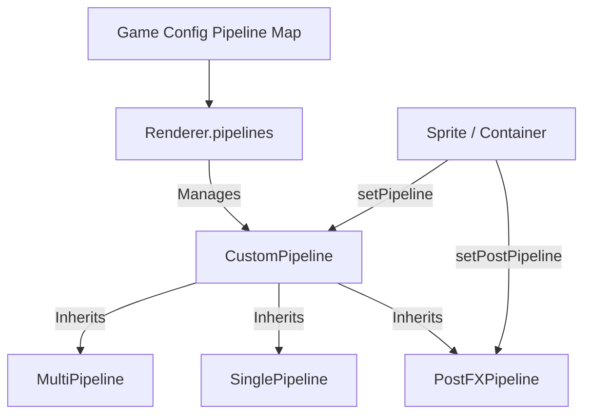

# src — renderer

The `renderer` module in Phaser 3 defines how Game Objects are translated into draw calls for the GPU. This sub-system is primarily built around a **Pipeline Architecture**, allowing developers to intercept the rendering process to apply custom shaders, batching logic, or post-processing effects.

### Core Architecture: The Pipeline System

Phaser's WebGL renderer uses "Pipelines" to manage WebGL programs (shaders), vertex buffers, and uniform data. There are three primary types of pipelines used in this module:

1.  **SinglePipeline**: Used when a draw call only requires a single texture. It is simpler and avoids the overhead of multi-texture array management.
2.  **MultiPipeline**: The standard batching pipeline. It can handle multiple textures simultaneously by passing an array of samplers to the fragment shader, significantly reducing draw calls.
3.  **PostFXPipeline**: A specialized pipeline designed for full-screen or object-specific post-processing. It renders the target into a temporary texture and then applies a shader effect (e.g., Hue Rotate, Swirl, Blur).



---

### Key Components & API Patterns

#### 1. Custom Shader Implementation
When creating a custom pipeline (as seen in `custom pipeline multi texture es6.js`), you must define vertex and fragment shaders. Phaser provides macros like `%count%` and `%forloop%` to handle multi-texture batching dynamically based on the hardware's available texture slots.

*   **Attributes**: Standard attributes include `inPosition`, `inTexCoord`, `inTexId`, and `inTint`.
*   **Uniforms**: Managed via helper methods like `set1f`, `set2f`, or `setMat4`.

```javascript
// Example: Updating a uniform per frame in the Scene update
update() {
    this.customPipeline.set1f('uTime', this.t);
    this.t += 0.05;
}
```

#### 2. Pipeline Registration
Pipelines can be registered globally during game initialization or added dynamically at runtime.

*   **Global (Config-based):**
    ```javascript
    const config = {
        pipeline: { 'Bend': BendPipeline }
    };
    ```
*   **Dynamic (Runtime):**
    ```javascript
    // src/renderer/grayscale pipeline added locally.js
    const grayscalePipeline = this.renderer.pipelines.add('Gray', new GrayScalePipeline(this.game));
    ```

#### 3. Post-Processing (PostFX)
Unlike standard pipelines that change how an object is drawn to the buffer, `PostFXPipeline` operates on the finished texture of an object or a container.

*   **Application**: Use `setPostPipeline('EffectName')`.
*   **Container Support**: As demonstrated in `container pipeline.js`, applying a post-FX pipeline to a `Phaser.GameObjects.Container` allows you to apply a single shader effect to a group of children simultaneously, which is more efficient than applying it to each child individually.

#### 4. Batching and Performance
The renderer batches similar draw calls to optimize CPU-to-GPU communication. 

*   **Batch Size**: You can override the default batch size (usually 2000 quads) in the game config via `render: { batchSize: 1024 }`. This is useful for memory-constrained environments or specific performance tuning.
*   **Texture Slots**: The `renderer.maxTextures` property and `renderer.getMaxTextureSize()` provide hardware-specific limits used by the `MultiPipeline` to decide when to flush a batch.

---

### Development Utilities

The module provides several hooks for debugging and inspecting the WebGL state:

| Feature | Access Pattern | Purpose |
| :--- | :--- | :--- |
| **FPS Tracking** | `this.renderer.getFps()` | Returns the renderer's internal frames-per-second calculation. |
| **Config Info** | `this.renderer.config` | Access hardware capabilities and renderer settings. |
| **Extensions** | `this.renderer.supportedExtensions` | Array of WebGL extensions available (e.g., `ANGLE_instanced_arrays`). |
| **Frame Capture** | `this.renderer.captureFrame(false, true)` | Useful for taking screenshots or debugging visual glitches. |

### Integration with Game Objects
Game Objects (Sprites, Images, Tilemaps) interact with this module primarily through the `setPipeline` and `setPostPipeline` methods. When a pipeline is set, the renderer switches its active WebGL program to that pipeline's shader and passes the object's vertex data into that pipeline's specific vertex buffer.

**Warning for Developers**: When using `MultiPipeline`, ensure your fragment shader includes the `%forloop%` macro. Failing to do so will result in only the first texture in a batch being rendered correctly across all sprites.