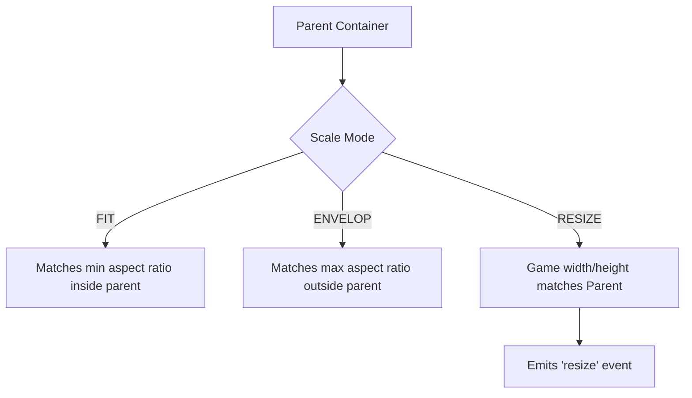

# src — scalemanager

# Scale Manager Module Documentation

The `scalemanager` module handles the scaling, centering, and orientation of the Phaser Game canvas within the browser. It is responsible for ensuring the game looks correct across various devices, screen sizes, and pixel densities.

## Overview

The Scale Manager is accessed via `this.scale` from within any Scene. It is configured through the `scale` property in the Game Configuration object.

### Key Responsibilities
- **Canvas Scaling**: Resizing the `<canvas>` element to fit its parent container.
- **Centering**: Position the canvas within its parent (horizontally, vertically, or both).
- **Fullscreen**: Transitioning the game into and out of browser fullscreen mode.
- **Orientation**: Monitoring and responding to device orientation changes (Portrait/Landscape).
- **Resolution**: Managing High-DPI (Retina) displays.

---

## Configuration Reference

The scale behavior is defined in the initial game setup:

```javascript
const config = {
    scale: {
        mode: Phaser.Scale.FIT, // The scaling strategy
        autoCenter: Phaser.Scale.CENTER_BOTH, // How to center the canvas
        parent: 'phaser-example', // ID of the DOM element
        width: 800,
        height: 600,
        min: { width: 320, height: 240 },
        max: { width: 1600, height: 1200 },
        zoom: 1, // Global zoom factor
        resolution: 1 // Pixel ratio
    }
};
```

---

## Scale Modes

The `Phaser.Scale.ScaleModes` determines how the game canvas fills its parent.

| Mode | Description | Example File |
| :--- | :--- | :--- |
| `NONE` | No scaling is applied. The canvas stays at `width`/`height`. | `no scale.js` |
| `FIT` | Scales the canvas to fit the parent while **preserving aspect ratio**. May result in letterboxing. | `fit.js` |
| `ENVELOP` | Scales to cover the parent while **preserving aspect ratio**. Parts of the game may be cropped. | `envelop.js` |
| `RESIZE` | The game size is changed to match the parent size. Does NOT scale; it expands the world. | `resize.js` |
| `WIDTH_CONTROLS_HEIGHT` | Scales height proportionally based on the width. | `width controls height.js` |
| `HEIGHT_CONTROLS_WIDTH` | Scales width proportionally based on the height. | `height controls width.js` |

### Comparison Diagram



---

## Core Functionality

### 1. Handling Resizes
When using `Phaser.Scale.RESIZE` or manually managing the canvas, you must listen for the `resize` event to update Game Objects, Cameras, and TileSprites.

```javascript
// Inside Scene.create
this.scale.on('resize', (gameSize, baseSize, displaySize, resolution) => {
    const { width, height } = gameSize;
    this.cameras.main.resize(width, height);
    this.bg.setSize(width, height); // Example for TileSprite
}, this);
```

### 2. Fullscreen Management
Fullscreen mode requires a user gesture (pointer down) to trigger.

- `this.scale.startFullscreen()`: Requests the browser enter fullscreen.
- `this.scale.stopFullscreen()`: Returns to windowed mode.
- `this.scale.isFullscreen`: Boolean property to check state.

### 3. Orientation and Mobile Scaling
For mobile-first games, checking orientation is critical. The module provides the `Phaser.Scale.Orientation` constants.

```javascript
checkOrientation(orientation) {
    if (orientation === Phaser.Scale.PORTRAIT) {
        // Show "Please Rotate Device" overlay
    }
}
// Listening for changes
this.scale.on('orientationchange', this.checkOrientation, this);
```

### 4. Advanced UI Scaling: `Phaser.Structs.Size`
In complex scenarios (like `mobile game example.js`), you can combine `RESIZE` mode with manual aspect ratio locking using `Phaser.Structs.Size`. This allows a background scene to fill the whole screen while a UI/Game scene remains aspect-locked.

```javascript
// Define logical parent (the screen) and sizer (the fixed game area)
this.parent = new Phaser.Structs.Size(screenW, screenH);
this.sizer = new Phaser.Structs.Size(gameW, gameH, Phaser.Structs.Size.FIT, this.parent);

// Force logical bounds
this.parent.setSize(screenW, screenH);
this.sizer.setSize(screenW, screenH);

// Update Camera Viewport based on sizer center
const x = (this.parent.width - this.sizer.width) * 0.5;
this.cameras.main.setViewport(x, 0, this.sizer.width, this.sizer.height);
```

---

## Display Attributes

- **`zoom`**: Scales the visual size of the canvas without changing the game's internal resolution. `Phaser.Scale.MAX_ZOOM` can be used to automatically set the largest integer zoom that fits the screen (`manually resize with zoom.js`).
- **`resolution`**: Used for High-DPI rendering. A resolution of `2` on a Retina screen ensures internal textures are rendered sharply (`_fit hi-res.js`).
- **`snap`**: In `fit and snap.js`, you can provide a snap object (`width`, `height`) to force the game to scale in specific increments (useful for pixel-perfect games).

## Integration Notes

- **Input**: The Scale Manager automatically translates screen-space coordinates (mouse clicks) into game-space coordinates based on the current scale and zoom. When cameras are manually resized or moved, use `pointer.positionToCamera(camera)` for accurate world interaction (`world input.js`).
- **Physics**: If using `RESIZE` mode, ensure `this.physics.world.setBounds` is updated if the game area expands or contracts.