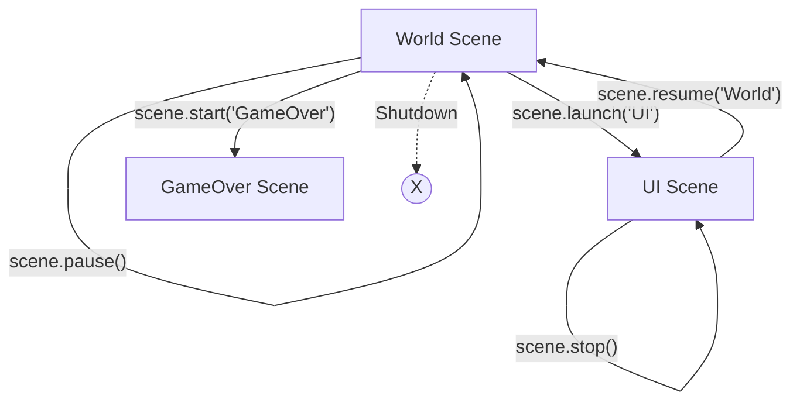

# src — scenes

# Phaser 3 Scenes Module

The `src/scenes` module demonstrates the implementation, management, and orchestration of **Phaser.Scene** instances. In Phaser 3, Scenes are independent containers for logic and display, allowing for modular game architecture (e.g., separating the UI, Game World, and HUD into distinct layers).

## Core Lifecycle Methods

Every Scene follows a standard execution flow. Developers typically override these methods to manage assets and logic:

1.  **`init(data)`**: Called when the scene is first started. Used for initializing variables and receiving data passed from `scene.start()` or `scene.launch()`.
2.  **`preload()`**: Used to queue assets for loading via `this.load`.
3.  **`create(data)`**: Executed once assets are loaded. This is where you instantiate Game Objects.
4.  **`update(time, delta)`**: The main game loop for the scene, running every frame.

### Data Injection & `pack`
Scenes can be configured to load specific assets **before** the `preload` phase using the `pack` property in the scene configuration. This is ideal for loading splash screens or configuration files required by the Scene itself.

```javascript
// Example of Scene configuration with pack
const backgroundSceneConfig = {
    key: 'background',
    pack: {
        files: [{ type: 'image', key: 'face', url: 'assets/pics/bw-face.png' }]
    },
    create: function() { this.add.image(400, 300, 'face'); }
};
```

---

## Scene Management Flow

The `ScenePlugin` (accessed via `this.scene`) provides several methods to control the lifecycle of other scenes:

| Method | Effect on Target Scene | Effect on Current Scene |
| :--- | :--- | :--- |
| `start(key, data)` | Reboots/Starts target | **Shuts down** current scene |
| `launch(key, data)` | Starts target in parallel | No effect (current continues) |
| `pause(key)` | Suspends `update` loop | No effect |
| `resume(key)` | Resumes `update` loop | No effect |
| `sleep(key)` | Suspends `update` and rendering | No effect |
| `wake(key)` | Resumes `update` and rendering | No effect |
| `switch(key)` | Wakes target | **Sleeps** current scene |
| `stop()` | Shuts down target | No effect |

### Transition Flow Diagram
This diagram visualizes how scenes interact when moving from a main game world to a sub-game or menu.



---

## Inter-Scene Communication

Scenes should rarely be tightly coupled. The module demonstrates three primary ways to exchange information:

### 1. The Global Registry
The `game.registry` is a DataManager shared by all Scenes. It is the best way to handle shared state like scores or player health.

```javascript
// SceneA.js (Logic)
this.registry.set('score', 100);

// SceneB.js (HUD/Display)
this.registry.events.on('changedata', (parent, key, data) => {
    if (key === 'score') this.scoreText.setText(data);
});
```

### 2. Direct Reference
Access another scene instance via `this.scene.get(key)`. This allows you to call public methods or check variables directly.

```javascript
// Inside SceneA
const sceneB = this.scene.get('sceneB');
const position = sceneB.getRandomPosition(); // Calling a custom method on SceneB
```

### 3. Startup Data
When calling `start` or `launch`, you can pass an object that becomes available in the `init` and `create` methods of the target scene.

```javascript
this.scene.start('Level1', { difficulty: 'hard', lives: 3 });
```

---

## Z-Order and Layering

When multiple scenes are active simultaneously (parallel scenes), their visual stacking order is determined by the Scene List. 

*   **`bringToTop()`**: Moves the scene to the end of the Scene List (rendered last, appears on top).
*   **`sendToBack()`**: Moves the scene to the start of the list (rendered first, appears behind).
*   **`moveUp()` / `moveDown()`**: Shifts the scene one position in the stack.
*   **`moveAbove(target)`**: Places the scene immediately above a specific scene.

In multi-scene setups (like `src/scenes/moving scenes demo/`), the **Controller** scene often stays at the top to manage the UI, while background game scenes are shifted underneath.

---

## Advanced Usage: Scene Injection Maps

Phaser allows you to remap default plugins to custom property names within a Scene's constructor. This is useful for internationalization or creating shorter aliases for frequently used systems.

```javascript
class MyScene extends Phaser.Scene {
    constructor() {
        super({
            key: 'MyScene',
            map: {
                add: 'make',
                load: 'fetch'
            }
        });
    }

    preload() {
        this.fetch.image('logo', 'path/to/logo.png');
    }

    create() {
        this.make.image(400, 300, 'logo');
    }
}
```

## Creating Scenes Dynamically
Scenes do not have to be defined in the initial game config. You can add them at runtime using `game.scene.add('key', SceneClass, autoStart, data)`. This is highly effective for modular DLC, external levels, or dynamically generated window systems.