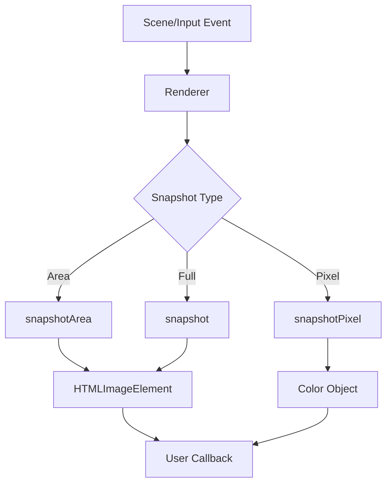

# src — snapshot

# Snapshot Module

The `snapshot` module provides developers with the utility to capture visual data directly from the Phaser Game Canvas. These utilities are exposed through the `Game.renderer` and are compatible with both WebGL and Canvas rendering modes.

The primary purpose of this module is to allow for the creation of in-game screenshots, "photo mode" features, color picking, or dynamically generated textures extracted from the game’s current state.

## Core API

Everything in the snapshot module is executed asynchronously via callbacks, as the renderer must wait for the frame to be fully processed before it can extract image data from the GPU or the buffer.

### 1. `snapshot(callback, type, encoderOptions)`
Captures the entire game canvas.
- **Callback Returns:** An `HTMLImageElement`.
- **Usage:** Ideal for thumbnails, save-game previews, or social sharing.

### 2. `snapshotArea(x, y, width, height, callback, type, encoderOptions)`
Captures a specific rectangular region of the game canvas.
- **Callback Returns:** An `HTMLImageElement`.
- **Usage:** Capturing specific UI elements or creating "portraits" of game characters.

### 3. `snapshotPixel(x, y, callback)`
Captures the color of a single pixel.
- **Callback Returns:** A color object containing the RGBA values and a CSS color string.
- **Usage:** Color pickers, collision detection based on color, or reactive UI elements.

---

## Execution Flow

The snapshot process bridges the gap between the Phaser Rendering loop and the browser's DOM.



---

## Common Implementation Patterns

### Capturing and Texturing
A powerful pattern within this module is taking a snapshot and immediately injecting it back into the game as a new texture using the `TextureManager`.

```javascript
this.game.renderer.snapshotArea(x, y, 128, 128, (image) => {
    // Remove old texture if it exists to prevent memory leaks
    if (this.textures.exists('area')) {
        this.textures.remove('area');
    }
    // Add the snapshot as a new texture
    this.textures.addImage('area', image);
});
```

### Converting to Base64
While the snapshot returns an `HTMLImageElement`, you may need a string for server uploads or local storage. This requires drawing the image to a temporary canvas.

1. Capture snapshot via `this.renderer.snapshot`.
2. Generate a canvas texture using `this.textures.createCanvas('snap', width, height)`.
3. Draw the image to that canvas using `snap.draw(0, 0, image)`.
4. Access the raw data via `snap.canvas.toDataURL()`.

### Handling Pointer Events
Snapshots are frequently triggered by user interaction. When using `pointerdown`, you can pass the pointer's coordinates directly to `snapshotArea` or `snapshotPixel`.

```javascript
this.input.on('pointerdown', (pointer) => {
    this.game.renderer.snapshotPixel(pointer.x, pointer.y, (pixel) => {
        // Access pixel.color (a CSS string) or individual RGBA channels
        this.myGraphics.fillStyle(pixel.color);
    });
});
```

## Technical Notes

- **Performance:** Calling `snapshotPixel` every frame is computationally expensive as it requires reading from the GPU's frame buffer. Use it sparingly (e.g., on click) rather than in the `update` loop.
- **Depth:** Snapshots capture the visual state of the canvas exactly as rendered at the moment of the call. If you have `Graphics` objects drawing overlays (like a selection box), ensure you `clear()` those before the snapshot if you don't want them included in the image.
- **CORS:** If your game uses textures hosted on external domains, ensure they have the appropriate CORS headers (Cross-Origin Resource Sharing), otherwise the snapshot will fail with a "tainted canvas" error.