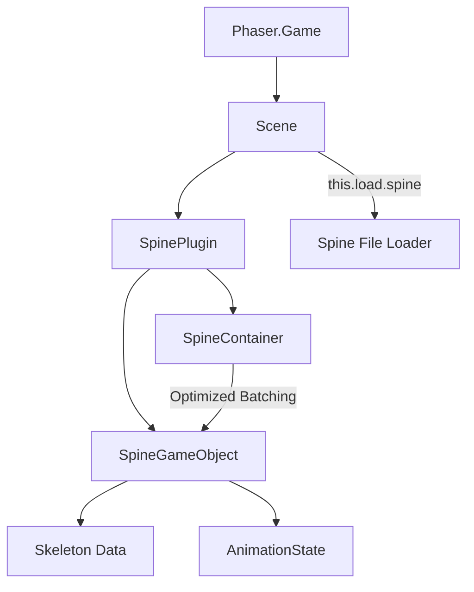

# src — spine3

# Phaser 3 Spine 3.8 Integration

The `spine3` module demonstrates the integration of the **Esoteric Software Spine 3.8** runtimes within Phaser 3. This integration allows for high-performance skeletal animations, skinning, and procedural bone manipulation.

## Core Concepts

The integration relies on the `SpinePlugin`, which must be loaded as a Scene Plugin. This plugin provides the factories (`this.add.spine`) and the specialized rendering logic required for Spine skeletons.

### Plugin Initialization
To use Spine in a scene, the plugin must be registered. The most common pattern in this module is using the `pack` property in the Scene constructor:

```javascript
constructor ()
{
    super({
        pack: {
            files: [
                { 
                    type: 'scenePlugin', 
                    key: 'SpinePlugin', 
                    url: 'plugins/3.8.95/SpinePluginDebug.js', 
                    sceneKey: 'spine' 
                }
            ]
        }
    });
}
```

## Loading Assets
Spine assets consist of a `.json` (or `.skel` binary) export and a `.atlas` file (with accompanying `.png` textures).

```javascript
// Basic loading
this.load.spine('boy', 'spineboy-pro.json', 'spineboy-pro.atlas');

// Multi-atlas loading (for complex characters spread across multiple sheets)
this.load.spine('set1', 'demos.json', [ 'atlas1.atlas', 'atlas2.atlas' ], true);
```

## Adding Spine Objects
Once loaded, you can add Spine objects to your scene using `this.add.spine`.

| Parameter | Type | Description |
| :--- | :--- | :--- |
| `x`, `y` | number | World coordinates. |
| `key` | string | The cache key used in `load.spine`. |
| `animationName` | string | (Optional) The name of the animation to play immediately. |
| `loop` | boolean | (Optional) Whether the animation should loop. |

```javascript
const boy = this.add.spine(400, 600, 'boy', 'idle', true);
```

## Performance & Batching: Spine Containers
For scenes with many Spine objects, standard Phaser Containers may result in excessive draw calls. The `SpinePlugin` provides a specialized `spineContainer` designed to batch Spine objects efficiently.

*   **Standard Container:** Each Spine object inside may trigger individual draw/clear commands (e.g., 278 GL commands for 32 objects).
*   **Spine Container:** Batches compatible Spine objects into a significantly smaller number of GL commands (e.g., 43 GL commands for the same 32 objects).

```javascript
const container = this.add.spineContainer();
for (let i = 0; i < 32; i++) {
    let obj = this.add.spine(i * 64, 100, 'boy', 'idle', true).setScale(0.25);
    container.add(obj);
}
```

## Interactivity & Physics

### Bone Manipulation
You can target individual bones for procedural effects (like look-at logic or IK dragging) using `findBone`. To convert screen coordinates to the skeleton's local space, use `spine.worldToLocal`.

```javascript
const bone = man.findBone('arm-target');
const localCoords = this.spine.worldToLocal(pointer.x, pointer.y, man.skeleton, bone);
bone.x = localCoords.x;
bone.y = localCoords.y;
bone.update();
```

### Arcade Physics
Spine objects can be integrated with Arcade Physics. However, because Spine skeletons often have "invisible" bones for effects (e.g., shine or weapon trails), the default bounds may be too large. It is recommended to call `setSize` manually.

```javascript
const coin = this.add.spine(400, 200, 'coin', 'rotate', true);
coin.setSize(280, 280); // Manually define the hit box
this.physics.add.existing(coin);
coin.body.setVelocity(100, 200).setBounce(1, 1).setCollideWorldBounds(true);
```

## Debugging
The `SpinePluginDebug.js` version provides extensive visualization tools. You can toggle specific debug visuals on the plugin or individual objects:

```javascript
spineBoy.drawDebug = true; // Shows skeleton bones/bounds

// Plugin-level global debug toggles
this.spine.setDebugBones(true);
this.spine.setDebugMeshTriangles(true);
this.spine.setDebugBoundingBoxes(true);
```

## Architecture Diagram



## Advanced Features
*   **Alpha & Blend Modes:** Spine objects support `setAlpha()` and specific blend modes exported from Spine (Additive, Multiply, Screen).
*   **Render Texture:** Spine objects can be drawn to a Render Texture using `rt.draw(spineObject)`.
*   **Post-FX Pipelines:** Use `setPostPipeline(PipelineClass)` on the Camera or the Object to apply shaders (like Bloom or Hue Shifting) to the Spine animation.
*   **Custom Classes:** You can extend `SpinePlugin.SpineGameObject` to create custom entities, but ensure you do so *after* the plugin has loaded.