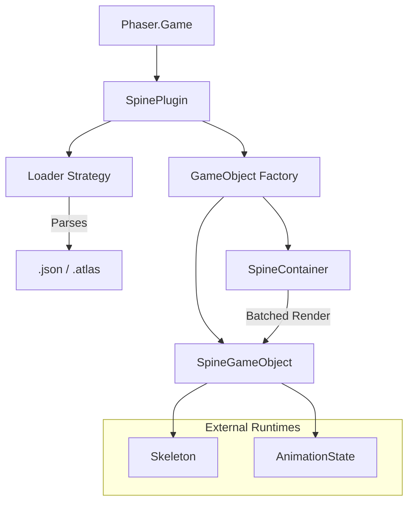

# src — spine4

# Spine 4.1 Integration for Phaser 3

The `spine4` module provides a comprehensive suite of implementation patterns for integrating **Spine 4.1** skeletal animations into Phaser 3. It utilizes the `SpinePlugin` to bridge the Spine Runtimes with Phaser's rendering pipeline (WebGL and Canvas), physics systems, and input handling.

## Plugin Initialization

To use Spine 4.1, the `SpinePlugin` must be loaded via the Scene configuration or Game configuration. Most examples use the `pack` property to ensure the plugin is available before the Scene initializes:

```javascript
scene: {
    pack: {
        files: [
            { 
                type: 'scenePlugin', 
                key: 'SpinePlugin', 
                url: 'plugins/spine4.1/SpinePluginDebug.js', 
                sceneKey: 'spine' 
            }
        ]
    }
}
```

## Asset Loading

Assets are loaded via `this.load.spine`. The plugin supports multi-atlas configurations and pre-multiplied alpha (PMA) settings.

```javascript
// Loading a single skeleton
this.load.spine('boy', 'spineboy-pro.json', 'spineboy-pma.atlas', true);

// Loading multiple skeletons from a single JSON (Demos)
this.load.spine('set1', 'demos.json', ['atlas1.atlas', 'atlas2.atlas'], true);
```

When loading collections like `demos.json`, individual skeletons are accessed using dot notation: `set1.spineboy`, `set1.alien`, etc.

## Core Components

### SpineGameObject
The primary object for rendering animations. Created via `this.add.spine(x, y, key, animationName, loop)`.

| Feature | Method / Property | Description |
| :--- | :--- | :--- |
| **Animation** | `play(name, loop)` | Starts a specific animation. |
| **Skins** | `setSkinByName(name)` | Switches the active skin (e.g., 'Assassin'). |
| **Physics** | `setSize(w, h)` | Manually sets bounds for Arcade Physics. |
| **Flipping** | `setFlipX(bool)` | Reverses the skeleton horizontally. |
| **Interative** | `setInteractive()` | Enables Phaser input events on the skeleton. |

### SpineContainer
A specialized container designed to optimize the rendering of multiple Spine objects.
* **Performance:** Using `this.add.spineContainer` significantly reduces draw calls compared to a standard `Phaser.GameObjects.Container`. 
* **Batching:** As shown in `container batch test.js`, 128 objects in a `spineContainer` can result in as few as 1 draw call, whereas standard containers may trigger multiple clears and draws.

## Advanced Implementation Patterns

### 1. Physics Integration (`arcade physics spine body.js`)
Spine skeletons often contain "bone-only" attachments or world-origin bones that make default bounds check useless. 
1. Call `coin.setSize(width, height)` to define a logical body size.
2. Use `this.physics.add.existing(coin)` to attach an Arcade Physics body.
3. Use `body.setOffset(x, y)` to center the physics body on the skeleton's visual center.

### 2. Bone Manipulation (`control bones.js`)
You can manually control bones for procedural animation or "look-at" logic:
* **Lookup:** `var bone = man.findBone('bone-name')`.
* **Coordinate Conversion:** Use `this.spine.worldToLocal(x, y, skeleton, bone)` to convert Phaser world coordinates into the local coordinate system of the parent bone before applying offsets.

### 3. Debugging Visualization (`draw debug bounds.js`)
The plugin offers granular debug toggles via `this.spine`:
* `setDebugBones(bool)`
* `setDebugRegionAttachments(bool)`
* `setDebugBoundingBoxes(bool)`
* `setDebugMeshHull(bool)`

### 4. Extending Spine Objects (`extend spine gameobject.js`)
Developers can create custom classes by extending `SpinePlugin.SpineGameObject`. Note that the class should be defined *after* the plugin has loaded.

```javascript
class Enemy extends SpinePlugin.SpineGameObject {
    constructor(scene, x, y, skeleton, animation) {
        super(scene, scene.spine, x, y, skeleton, animation, true);
        scene.sys.displayList.add(this);
        scene.sys.updateList.add(this);
    }
}
```

## Architecture Diagram



## Performance & Rendering Notes
* **Alpha:** Controlled via `setAlpha()`, but requires the atlas to be exported with compatible PMA settings.
* **Render Texture:** Spine objects can be drawn to a Render Texture using `rt.draw(spineObj)`, allowing for trails or complex caching effects (`spine to render texture.js`).
* **Batching:** Always prefer `spineContainer` for groups of identical skeleton types to leverage the plugin's internal batching logic.