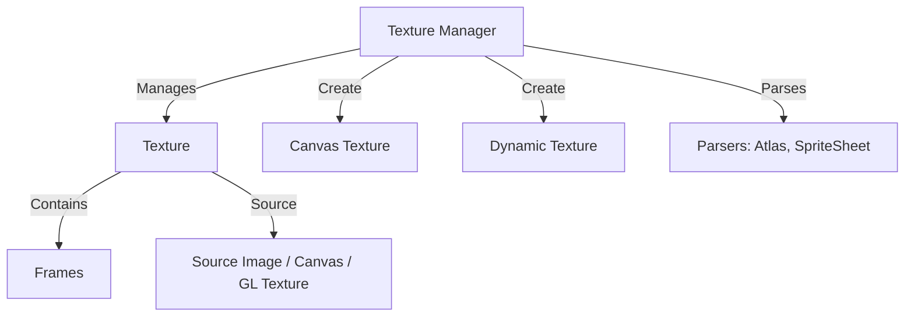

# src — textures

# Textures Module

The **Textures** module is the backbone of Phaser's visual system. It manages the lifecycle of image data—from loading static assets and compressed hardware formats to generating procedural textures at runtime via Canvas or WebGL-accelerated Dynamic Textures.

## The Texture Manager

Accessed via `this.textures` within a Scene, the `TextureManager` is the central registry. Every image loaded or created is stored here as a `Phaser.Textures.Texture` object, which contains one or more `Phaser.Textures.Frame` objects.



---

## Static Assets and Atlases

Standard image loading associates a key with a single file. However, for performance, Phaser utilizes Atlases and SpriteSheets to reduce draw calls.

### Texture Atlases
Atlases use a JSON file to define multiple sub-images (Frames) within a single large texture.
*   **Single Atlas:** `this.load.atlas(key, textureURL, atlasURL)`.
*   **Multi-Atlas:** `this.load.multiatlas(key, jsonURL)` for textures spanning multiple image files.
*   **Trimming:** Phaser automatically handles "trimmed" frames (where whitespace was removed during packing) to ensure Game Objects maintain correct logical dimensions.

### SpriteSheets from Atlases
You can procedurally extract a SpriteSheet from a frame living inside an atlas using `addSpriteSheetFromAtlas`. This is useful for animations packed within a larger texture.

```javascript
this.textures.addSpriteSheetFromAtlas('hero_walk', {
    atlas: 'megaset',
    frame: 'hero_anim_frame',
    frameWidth: 64,
    frameHeight: 64,
    endFrame: 23
});
```

---

## Compressed Textures

For high-performance mobile and desktop cross-platform development, Phaser supports hardware-compressed textures (PVRTC, S3TC, ASTC, ETC1). These stay compressed in GPU memory, significantly reducing VRAM usage.

The loader allows a "fallback" chain, where Phaser detects the hardware's supported format and loads the best match, falling back to a standard `IMG` (PNG/JPG) if necessary.

```javascript
this.load.texture('env_map', {
    'ASTC': 'assets/compressed/env-astc-4x4.pvr',
    'PVRTC': 'assets/compressed/env-pvrtc-4bpp-rgba.pvr',
    'S3TC': 'assets/compressed/env-bc3.pvr',
    'IMG': 'assets/compressed/env.png'
});
```

---

## Runtime Texture Generation

Phaser provides two primary ways to create textures through code.

### 1. Canvas Textures
Created via `textures.createCanvas()`. It provides a standard HTML5 Canvas 2D context.
*   **Best for:** Text generation, complex 2D vector shapes, and per-pixel manipulation using `getImageData`.
*   **Critical Pattern:** When using the WebGL renderer, you **must** call `texture.refresh()` after drawing to the canvas to upload the new data to the GPU.

```javascript
const textBorder = this.textures.createCanvas('border', 256, 256);
const ctx = textBorder.context;
ctx.strokeStyle = '#ffffff';
ctx.strokeRect(0, 0, 256, 256);
textBorder.refresh();
```

### 2. Dynamic Textures
Created via `textures.addDynamicTexture()`. These are WebGL-backed and allow you to draw Game Objects directly into a texture using the GPU.
*   **Best for:** Creating complex sprites at runtime, UI elements with many layers, or "stamping" effects.
*   **Key APIs:**
    *   `stamp(key, frame, x, y, config)`: Draws a specific texture frame with scaling/rotation.
    *   `draw(gameObject, x, y)`: Renders a Game Object (like a Sprite or Text) into the texture.
    *   `snapshotPixel(x, y, callback)`: Reads a specific pixel value from the GPU (async).

---

## Pixel Manipulation and Analysis

### Reading Pixels
Existing textures can be sampled for color data. Note that for standard images, this requires the image to be on the same domain or have correct CORS headers.
*   `this.textures.getPixel(x, y, key)`: Returns a `Phaser.Display.Color` object for the specified coordinate.

### Procedural Generation (Data Bricks)
Phaser can generate textures from an array of strings representing colors (often used for tiny "pixel art" style assets without loading external files).

```javascript
const chick = [
    '...55.......',
    '.....5......',
    '...7888887..'
];
this.textures.generate('chick', { data: chick, pixelWidth: 6 });
```

---

## Cropping

All Game Objects that use textures (Sprites, Images, RenderTextures) support cropping. Cropping does not change the texture itself; it changes the UV coordinates used when rendering that specific instance.

*   `setCrop(x, y, width, height)`: Defines the visible rectangular region.
*   Passing a `Phaser.Geom.Rectangle` as the only argument is also supported.
*   **Note:** Cropping respects `flipX` and `flipY` settings, adjusting the visible window accordingly.

```javascript
const character = this.add.image(400, 300, 'atlas', 'player');
// Crop to only show the top-half of the sprite
character.setCrop(0, 0, character.width, character.height / 2);
```

## Performance Tips
1.  **Mipmapping:** For large textures (e.g., 4096px) scaled down, ensure `mipmapFilter` is set in the Game Config to avoid aliasing.
2.  **Batching:** When using `DynamicTexture`, use `beginDraw()` and `endDraw()` to wrap multiple `batchDraw` calls for efficient rendering.
3.  **Power of Two:** While Phaser 3 supports Non-Power-of-Two (NPOT) textures, using POT textures (256, 512, 1024, etc.) is still recommended for maximum compatibility and mipmap support on older hardware.