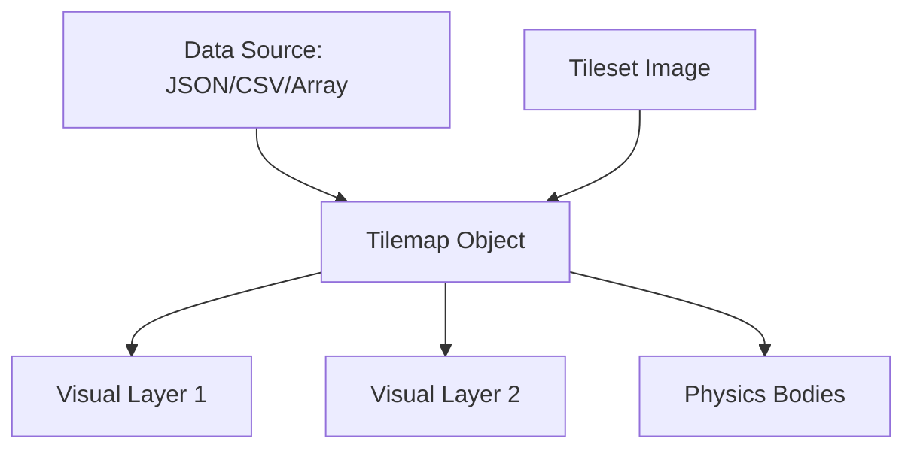

# src — tilemap

# Phaser 3 Tilemap Module

The `tilemap` module provides a robust system for creating, rendering, and interacting with grid-based environments. It supports multiple data formats (CSV, JSON, Arrays), dynamic map manipulation, and complex collision integration with both Arcade and Matter physics engines.

## Core Concepts

### Tilemap vs. Layer
- **Tilemap:** The logical container for all map data, tilesets, and layers. Created via `this.make.tilemap()`.
- **TilemapLayer:** The visual representation of a specific layer of tiles. Multiple layers can coexist (e.g., Background, Ground, Decoration).

### The Base Tile Size
A critical distinction in Phaser 3 is the **Base Tile Size** vs. the **Tileset Tile Size**.
- **Base Tile size:** Defines the grid coordinates (e.g., a 32x32 grid).
- **Tileset Tile size:** The actual dimensions of the source images. 
If your tileset tiles are 32x64 but the base size is 32x32, tiles will overlap vertically, which is useful for creating 2.5D or "boxy" effects.

```javascript
// Example: Setting a 32x32 grid with overlapping 64px tall tiles
const map = this.make.tilemap({ width: 200, height: 200, tileWidth: 32, tileHeight: 32 });
const tiles = map.addTilesetImage('walls_1x2', null, 32, 64);
const layer = map.createBlankLayer('layer1', tiles);
```

---

## Loading and Creation

Maps can be instantiated from three primary sources:

1.  **Tiled JSON:** `this.load.tilemapTiledJSON('key', 'path.json')`
2.  **CSV:** `this.load.tilemapCSV('key', 'path.csv')`
3.  **2D Arrays:** Direct data injection using the `data` property in the config.



---

## Physics & Collision Systems

### Arcade Physics
For fast, axis-aligned bounding box (AABB) collisions.
- **Enable Collision:** Use `setCollision` or `setCollisionBetween` on the map object.
- **Interaction:** Use `this.physics.add.collider(sprite, layer)`.
- **Tile Callbacks:** Trigger logic when a sprite hits a specific tile type without using separate invisible sprites.

```javascript
// Trigger function when hitting tile index 26
this.coinLayer.setTileIndexCallback(26, this.hitCoin, this);

// Custom overlap check for non-colliding pickups
this.physics.world.overlapTiles(this.player, this.pickups, this.hitPickup);
```

### Matter Physics
Matter allows for complex shapes (polygons, compound bodies) and "ghost collision" mitigation.
1.  **Conversion:** Use `this.matter.world.convertTilemapLayer(layer)`. This creates Matter bodies for every tile marked as colliding.
2.  **Ghost Collisions:** When a sprite slides across adjacent tiles, it can "snag" on internal edges. This is mitigated by:
    - Adding **chamfer** (rounded corners) to the player body.
    - Using `findObject` to create a single large Matter rectangle over a row of tiles instead of individual bodies.

---

## Dynamic Map Manipulation

The module allows for "runtime editing" of the environment:

-   **copy:** Duplicates a rectangular area of tiles: `map.copy(srcX, srcY, width, height, destX, destY)`.
-   **putTileAt / removeTileAt:** Single tile modification. Useful for breakable walls or bridge construction.
-   **createFromObjects:** Converts Tiled "Object Layers" into Phaser Sprites (e.g., turning a point into a spinning Coin).
-   **randomize / weightedRandomize:** Fills an area with tiles based on probability, ideal for procedural generation.

---

## Debugging

The `renderDebug` method is indispensable for visualizing collision boundaries and "interesting faces" (edges that will trigger a collision).

```javascript
const debugGraphics = this.add.graphics();
map.renderDebug(debugGraphics, {
    tileColor: null, // Non-colliding tiles
    collidingTileColor: new Phaser.Display.Color(243, 134, 48, 200),
    faceColor: new Phaser.Display.Color(40, 39, 37, 255) // Collision edges
});
```

---

## Advanced Usage: Procedural Generation
As seen in the `dungeon generator.js` example, you can use the Tilemap module to build complex structures at runtime:
1.  Generate a logical map (array/dungeon object).
2.  Create a `createBlankLayer`.
3.  Iterate the logic and use `putTileAt` or `putTilesAt` (for multi-tile structures) to populate the tileset images based on room coordinates.
4.  Optionally use `setRoomAlpha` logic to implement Line-of-Sight or Fog of War.

## Key API Reference

| Class/Method | Purpose |
| :--- | :--- |
| `map.addTilesetImage()` | Links a loaded image to a tileset name defined in the map data. |
| `map.createLayer()` | Creates a TilemapLayer from the data and a tileset. |
| `map.filterTiles()` | Returns an array of Tiles matching a specific criteria (e.g., all coins). |
| `map.setCollisionByProperty()` | Enables collision for all tiles with a specific boolean property (set in Tiled). |
| `tile.physics.matterBody` | Accesses the underlying Matter body of a tile (after conversion). |