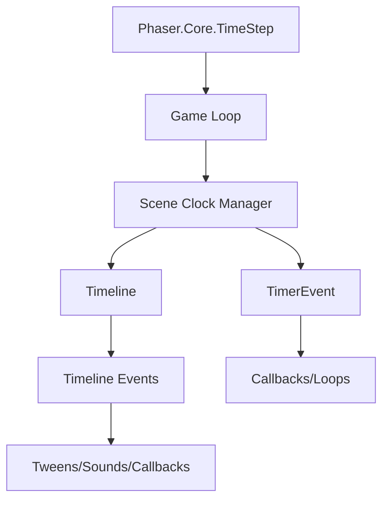

# src — time

# Phaser Time Module Documentation

The `src/time` module is responsible for managing the passage of time, scheduling future events, and controlling the main game loop's synchronization. It provides developers with two primary levels of control: high-level event scheduling (Timers and Timelines) and low-level engine timing (TimeStep).

## Core Architecture

The timing system is hierarchical. The `Game` instance maintains a global `TimeStep` which drives the entire engine. Each `Scene` has its own `Clock` manager (accessible via `this.time`) that handles `TimerEvent` instances and `Timeline` objects.



---

## Timer Events

The `Phaser.Time.TimerEvent` is the fundamental unit for delayed or repeating actions.

### Creating Timers
Timers are typically created through the Scene's Clock:

- **`this.time.addEvent(config)`**: The most flexible way to create a timer.
- **`this.time.delayedCall(delay, callback, args, scope)`**: A shorthand for a single-shot timer (comparable to `setTimeout`).

### Key Configuration Properties
| Property | Type | Description |
| :--- | :--- | :--- |
| `delay` | number | Time in ms before the event fires. |
| `repeat` | number | Number of times to repeat (total executions = repeat + 1). |
| `loop` | boolean | If true, repeats indefinitely. |
| `startAt` | number | Offsets the first iteration (e.g., start 5s into a 10s timer). |
| `timeScale` | number | A multiplier for the delay (0.5 for half speed, 2.0 for double speed). |
| `callback` | function | The function to execute. |

### Monitoring Progress
You can query a timer's state during `update()` loops:
- **`getProgress()`**: Returns a value between 0.0 and 1.0 representing the progress of the *current* iteration.
- **`getOverallProgress()`**: Returns progress across *all* repeat iterations (only valid if `repeat > 0`).

### Manipulation
- **Pausing**: Set `timer.paused = true`.
- **Removal**: Call `timer.remove()` or `this.time.removeEvent(timer)`.
- **Reuse**: As seen in `src/time/reuse a timer event.js`, you can create a `new Phaser.Time.TimerEvent(config)` and pass it to `this.time.addEvent()` multiple times to restart it.

---

## Timelines

The `Phaser.Time.Timeline` class (created via `this.add.timeline()`) allows for complex sequencing of events. Unlike basic timers, Timelines are designed to coordinate different types of actions (tweens, sounds, callbacks) relative to a single playhead.

### Scheduling Methods
Events are added using one of three timing modes:
1.  **`at`**: Absolute time from the start of the timeline.
2.  **`from`**: Time relative to the *previous* event's start time.
3.  **`in`**: Time relative to the *current* real-time (useful for adding events dynamically while the timeline is playing).

### Action Types
Timeline entries can trigger various engine systems:
-   **`run`**: Execute a custom callback.
-   **`tween`**: Fire a Phaser Tween.
-   **`set`**: Directly modify properties on a `target` object (e.g., `alpha`, `scale`).
-   **`sound`**: Play a preloaded audio key.
-   **`event`**: Emit a string-based event on the timeline object itself for decoupled logic.

```javascript
const timeline = this.add.timeline([
    { at: 1000, run: () => console.log('Start') },
    { from: 500, sound: 'explosion', tween: { targets: sprite, alpha: 0 } },
    { at: 5000, stop: true }
]);
timeline.play();
```

---

## TimeStep and the Game Loop

The `Phaser.Core.TimeStep` (found in `src/time/timestep/`) handles the internal heart-beat of the engine.

### Frame-Independent Movement
The `update(time, delta)` method in every Scene receives a `delta` value (time in ms since the last frame). To ensure movement is consistent across different monitor refresh rates (60Hz, 144Hz, etc.), always multiply velocities by `delta`:

```javascript
// src/time/timestep/variable smooth step.js pattern
update (time, delta) {
    // speed is defined as pixels per millisecond
    this.image.x += this.speed * delta;
}
```

### Advanced TimeStep Configuration
Through the Game Config, you can influence how the loop behaves:
-   **`useTicker`**: Utilizes the browser's RequestAnimationFrame via an internal ticker.
-   **`deltaHistory`**: Access `this.sys.game.loop.deltaHistory` to view a running log of recent delta values for performance profiling.
-   **Manual Control**: As shown in `src/time/timestep/split timestep.js`, you can instantiate a standalone `TimeStep` to drive specific logic at a different frequency (e.g., a fixed 30fps update) than the main render loop.

### Debugging Time
The `time` parameter in the Scene `update` represents the total "World Time" elapsed since the game started. This is useful for shaders or time-of-day logic that shouldn't be affected by Scene pausing.