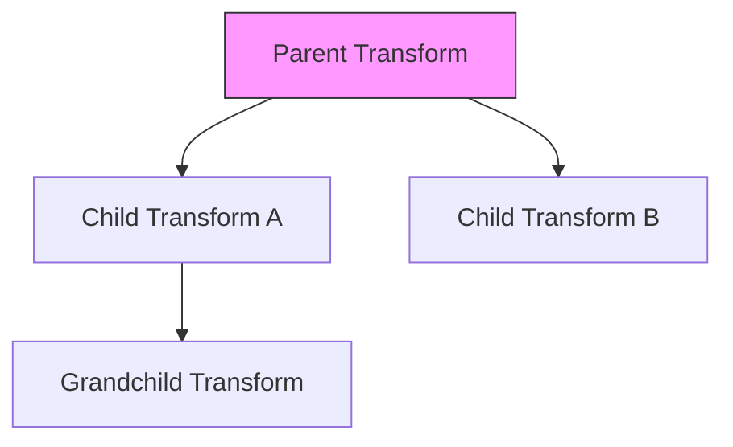

# src — transform

# Transform Module

The **Transform** module handles the spatial orientation, positioning, and sizing of Game Objects within the Phaser coordinate system. It manages how objects are translated (moved), rotated, scaled, and flipped before being rendered to the screen.

## Core Concepts

In Phaser, every renderable Game Object possesses a transform component. This component defines the object's relationship to its parent and the world. 

### Positioning
Objects are positioned using `x` and `y` coordinates. By default, these coordinates refer to the object's **Origin** inside the world space or its parent container.

*   `setPosition(x, y)`: Sets the horizontal and vertical coordinates.
*   `x` / `y`: Public properties for direct manipulation.

### Scaling and Dimensions
The module distinguishes between **Scale** (a multiplier) and **Display Size** (absolute pixel dimensions).

*   **Scale**: Controlled via `scaleX`, `scaleY`, or the `setScale(x, y)` method. A scale of `1` represents the original size.
*   **Display Size**: The `setDisplaySize(width, height)` method calculates the necessary `scale` values to ensure the object occupies a specific pixel area, regardless of its original frame size.

### Rotation and Angle
Phaser provides two ways to manipulate rotation:
1.  **Rotation**: Measured in **Radians**.
2.  **Angle**: Measured in **Degrees** (internally converted to radians).

```javascript
// Both achieve the same result
image.rotation = Math.PI / 2; 
image.angle = 90;
```

---

## The Origin (Pivot Point)
The Origin (or Anchor) determines the point within the texture that `x` and `y` coordinates refer to. It also acts as the pivot point for rotation and scaling.

*   **Default**: `0.5, 0.5` (The center of the object).
*   **Range**: `0.0` (Top/Left) to `1.0` (Bottom/Right).

| Alignment | Method Call |
| :--- | :--- |
| Top-Left | `setOrigin(0, 0)` |
| Center | `setOrigin(0.5, 0.5)` |
| Bottom-Right | `setOrigin(1, 1)` |

---

## Hierarchical Transforms
The WIP (Work In Progress) features of this module suggest a parent-child relationship system for transforms. This allows objects to inherit the transformations of their parents.



In the API, this is managed via `transform.add()`:
- When a child transform is added to a parent, moving the parent automatically moves the child.
- This is used for complex assemblies (e.g., Inverse Kinematics demos) where local rotations stack to create articulated movement.

---

## Utility Functions

### Flip
Flipping mirrors the texture without affecting the actual `rotation` property. This is useful for character sprites changing direction.
- `setFlipX(boolean)` / `setFlipY(boolean)`
- `toggleFlipX()` / `toggleFlipY()`

### Hit Testing (Spatial Detection)
The module includes logic to determine if a specific point in the world (like a mouse cursor) overlaps with a transformed object, accounting for the **Camera** offset.

`transform.hasPoint(x, y, camera)`
- This method transforms the screen coordinates into the object's local space to check for a "hit."
- It is critical for interaction when objects are scaled, rotated, or nested within moving containers.

---

## Implementation Patterns

### Updating Transforms
Transforms are typically updated in the `update()` loop of a Scene. Because many properties are setters, changing `image.scale += 0.01` or `image.x += 4` triggers internal calculations to rebuild the object's transformation matrix.

### Integration with Cameras
Transformations are relative to the Camera through which they are viewed. The `hasPoint` logic specifically requires a `Camera` reference to accurately map screen-space mouse coordinates back to the transformed world-space of the object.