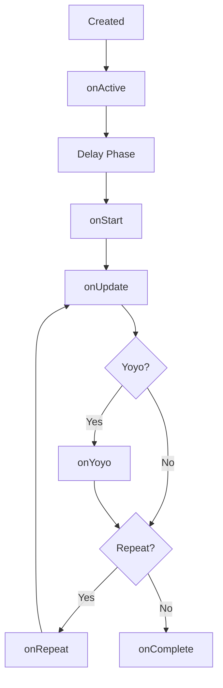

# src — tweens

# Phaser 3 Tweens Module Reference

The **Tweens** module in Phaser 3 is a powerful animation engine used to interpolate numeric properties of JavaScript objects over time. While most commonly used to move Game Objects (changing `x`, `y`, `alpha`, or `scale`), it can manipulate any numeric property of any object.

## Core Concepts

### Tweens vs. Chains
*   **Tween (`Phaser.Tweens.Tween`)**: A single animation involving one or more properties of one or more targets. Properties can have their own individual durations, eases, and delays.
*   **Chain (`Phaser.Tweens.TweenChain`)**: A sequence of multiple tweens executed one after another. Chains allow for complex, multi-stage animations with persistent state control.

---

## Creation and Usage

### Basic Tween
The most common way to create a tween is via `this.tweens.add()` within a Scene.

```javascript
this.tweens.add({
    targets: image,
    x: 600,
    y: 300,
    duration: 2000,
    ease: 'Power2',
    yoyo: true,
    repeat: -1
});
```

### Tween Chains
Chains are created using `this.tweens.chain()`. They are ideal for character sequences (e.g., "walk to point A, then jump, then fade out").

```javascript
this.tweens.chain({
    targets: player,
    tweens: [
        { x: 400, duration: 1000, ease: 'power1' },
        { angle: 360, duration: 500, ease: 'bounce.out' },
        { alpha: 0, duration: 200 }
    ]
});
```

### Counter Tweens
If you need to tween a value that isn't attached to an object (like a score counter in UI), use `addCounter()`.

```javascript
const scoreTween = this.tweens.addCounter({
    from: 0,
    to: 1000,
    duration: 2000,
    onUpdate: (tween) => {
        const value = Math.floor(tween.getValue());
        scoreText.setText(`Score: ${value}`);
    }
});
```

---

## Configuration Properties

The configuration object passed to `add()` or `chain()` supports a wide array of timing and control properties:

| Property | Type | Description |
| :--- | :--- | :--- |
| `targets` | Object\|Array | The object(s) to be tweened. |
| `duration` | Number | Time in ms the tween takes to complete. |
| `ease` | String\|Fn | Easing function (e.g., 'Linear', 'Sine.inOut', 'Bounce.out'). |
| `delay` | Number\|Fn | Delay before the tween starts (can be a function for staggered starts). |
| `hold` | Number | Time in ms to pause at the end for yoyo-ing. |
| `repeat` | Number | Number of times to repeat (-1 for infinite). |
| `repeatDelay` | Number | Delay between repeats. |
| `yoyo` | Boolean | If true, plays the tween in reverse after the forward phase. |
| `persist` | Boolean | If true, the tween isn't destroyed when finished (allows for `restart()`). |
| `flipX`/`flipY` | Boolean | Flips a Game Object's orientation when the tween repeats or yoyos. |

---

## Advanced Features

### Dynamic Value Functions
Properties can be defined as functions to calculate values at the moment the tween starts or repeats.

```javascript
this.tweens.add({
    targets: ball,
    x: {
        // Calculate end value based on current game state
        getEnd: (target, key, value) => target.x + 100,
        // Calculate start value
        getStart: (target, key, value) => value
    },
    delay: (target, key, value, index, total) => index * 100 // Staggered delay
});
```

### Interpolation
For tweening through a path of values (rather than just point A to B), provide an array of numbers and an interpolation mode (e.g., `bezier`, `catmull`).

```javascript
this.tweens.add({
    targets: ship,
    x: [ 100, 300, 200, 600 ], // Moves through these points
    interpolation: 'bezier',
    duration: 4000
});
```

### Changing Textures
Special properties `texture` and `frame` can be passed to swap assets mid-tween (often combined with `delay` or used in `props`).

```javascript
this.tweens.add({
    targets: chest,
    texture: [ 'assets', 'blue-closed' ], // Change texture during tween
    y: '-=50',
    yoyo: true
});
```

---

## Lifecycle & Callbacks

Tweens provide hooks into every stage of their execution. All callbacks receive the `tween` instance as the first argument and the `targets` array as the second.



**Key Callbacks:**
*   `onStart`: Triggered when the tween begins after any initial delay.
*   `onUpdate`: Triggered every frame the tween is active.
*   `onYoyo`: Triggered when a yoyo starts.
*   `onRepeat`: Triggered when a repeat iteration begins.
*   `onComplete`: Triggered when the tween finishes all repeats/yoyos.

---

## Global Tween Control

The Tween Manager (`this.tweens`) provides global controls for all tweens within a Scene:

*   **`this.tweens.pauseAll()` / `resumeAll()`**: Pause or resume every tween in the scene.
*   **`this.tweens.killTweensOf(target)`**: Immediately stops and removes all tweens acting on a specific object.
*   **`this.tweens.timeScale`**: A global multiplier for tween speed. Setting to `0.5` runs all tweens at half speed.

### Individual Control
Individual Tween instances returned by the `add` methods have their own API:
*   `tween.pause()` / `tween.resume()`
*   `tween.stop()`
*   `tween.restart()`
*   `tween.complete()`: Immediately jumps to the end of the tween and triggers `onComplete`.