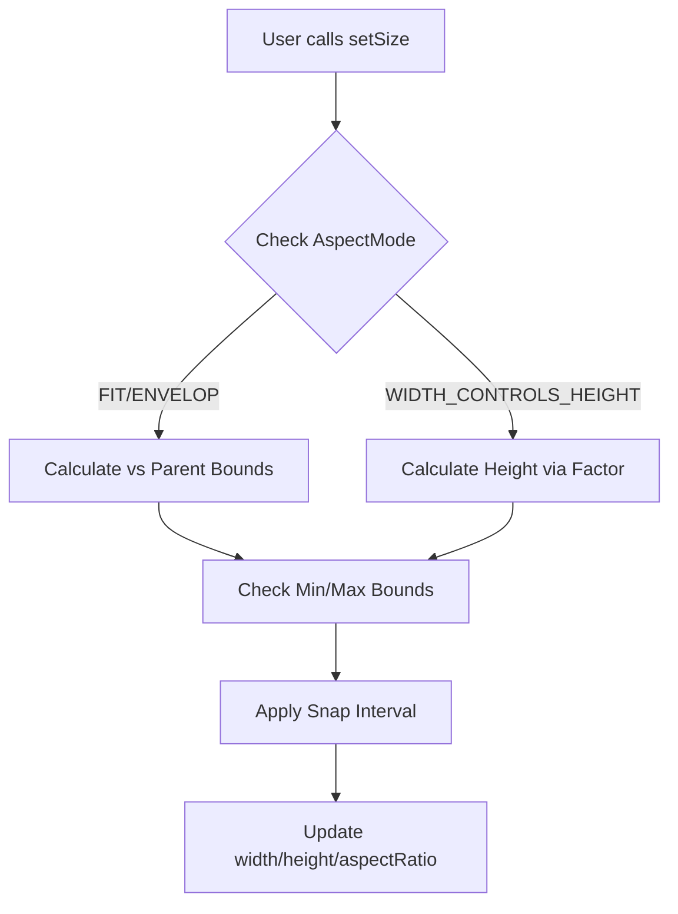

# src — utils

# Phaser 3 Utilities & Structs

The `Utils` and `Structs` modules provide foundational logic for data manipulation, spatial indexing, and responsive layout management. These tools are decoupled from the high-level Game Object logic, making them ideal for managing internal state, grid-based logic, and performance-critical spatial queries.

---

## 1. Array & Matrix Utilities
These utilities provide functions for manipulating standard JavaScript arrays and 2D "Matrix" arrays (arrays of arrays).

### Array Manipulation
Accessed via `Phaser.Utils.Array`:
*   **`BringToTop(array, item)`**: Rearranges the array so the specified item is moved to the last index. Useful for visual z-indexing in custom lists.
*   **`Range(arrayA, arrayB, options)`**: A powerful generator that creates combinations of elements from two arrays. 
    *   **Options**: Supports `repeat`, `yoyo`, `qty` (quantity per item), and `random`.
    *   **Example**: Combining `['a', 'b']` and `[1, 2]` can generate sequences for patterns or spawning waves.

### Matrix Operations
Accessed via `Phaser.Utils.Array.Matrix`. These are essential for tile-based games or puzzle logic where a 2D grid needs to be transformed:
*   **Rotation**: `RotateLeft`, `RotateRight`, `Rotate180`.
*   **Symmetry**: `ReverseRows`, `ReverseColumns`, `TransposeMatrix`.
*   **Translation**: `Translate(matrix, x, y)` shifts elements within the grid, useful for scrolling infinite tile patterns.
*   **Debugging**: `MatrixToString(matrix)` returns a formatted string representation of the grid for console logging or text display.

---

## 2. Spatial Indexing (RTree)
Phaser implements a high-performance R-Tree (via `Phaser.Structs.RTree`) based on RBush. This structure is used to store objects with spatial bounds and query them nearly instantaneously, avoiding $O(N)$ brute-force checks.

### Workflow
1.  **Insert**: Pass an object containing bounding properties (`left`, `right`, `top`, `bottom`) or (`minX`, `minY`, `maxX`, `maxY`).
2.  **Search**: Query the tree with a bounding box to retrieve all overlapping items.

```javascript
const tree = new Phaser.Structs.RTree();
// Insert an entry
tree.insert({ left: 0, top: 0, right: 32, bottom: 32, sprite: player });

// Query an area
const results = tree.search({ minX: 10, minY: 10, maxX: 50, maxY: 50 });
```

---

## 3. Responsive Layout (Size Component)
`Phaser.Structs.Size` is a specialized class for handling dimensions and aspect ratios. It is particularly powerful when one "Size" object is constrained by a parent container.

### Aspect Ratio Modes
When a `Size` object is modified, its `aspectMode` determines how it reacts relative to its parent:

| Mode | Description |
| :--- | :--- |
| `NONE` | No constraints; width and height change independently. |
| `FIT` | The child scales to fit inside the parent while maintaining its aspect ratio. |
| `ENVELOP` | The child scales to cover the entire parent area, potentially bleeding over the edges. |
| `WIDTH_CONTROLS_HEIGHT` | Changing the width automatically adjusts height to maintain ratio. |
| `HEIGHT_CONTROLS_WIDTH` | Changing the height automatically adjusts width to maintain ratio. |

### Constraints & Snapping
The `Size` object supports strict limits and grid-snapping:
*   **`setMin(w, h)` / `setMax(w, h)`**: Prevents the component from scaling outside specific bounds.
*   **`setSnap(gridSize)`**: Forces the width and height to increments of the specified value.

### Architecture: Size Adjustment Flow


## Usage in the Codebase
- **`Phaser.Structs.Size`** is the engine behind the **Phaser Scale Manager**, ensuring games look correct on different devices.
- **`Phaser.Structs.RTree`** is often utilized internally for broad-phase collision detection or determining which Game Objects are currently within a Camera's view.
- **Matrix Utils** are primarily used in **Tilemap** transformations and data-grid manipulations.