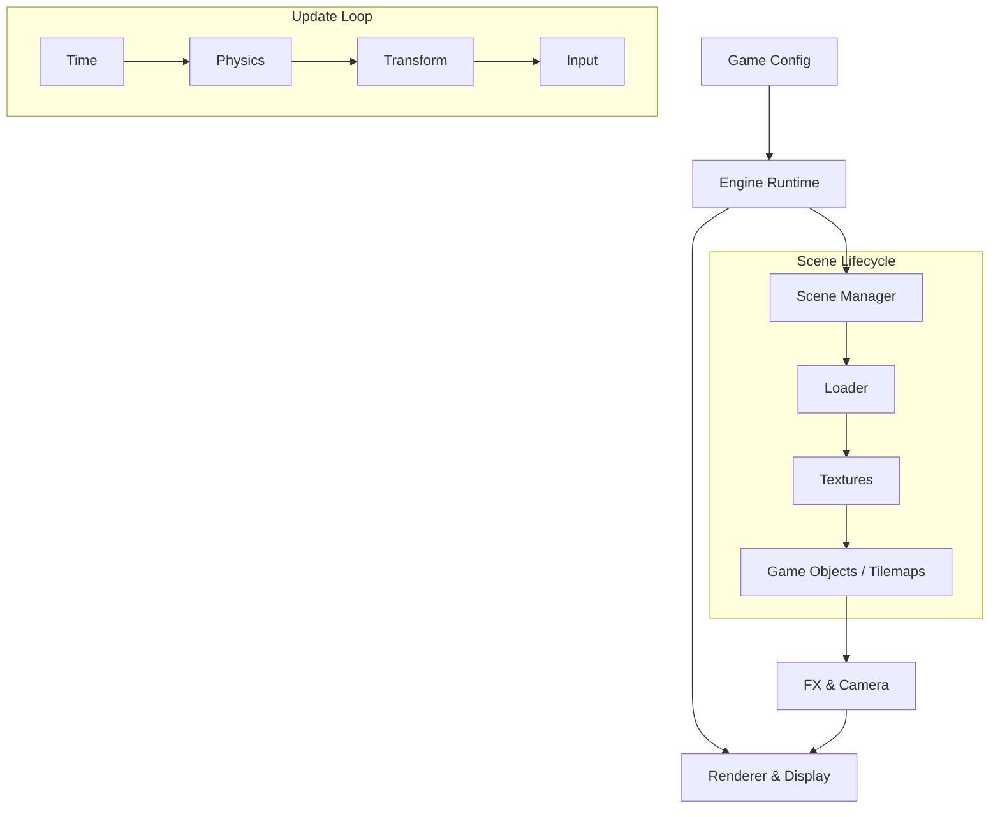

# src

# Phaser 3 Core (`src`) Module Documentation

The `src` module constitutes the heart of the Phaser 3 engine. It is a highly decoupled framework designed to manage the lifecycle of a game—from initial configuration and asset loading to hardware-accelerated rendering and complex physics simulations.

## Architectural Flow

Phaser operates on a hierarchical lifecycle. The [Game Config](src/game config) defines the environment, which initializes the [Renderer](src/renderer) and the [Scale Manager](src/scalemanager). Once the engine is live, the [Scene Manager](src/scenes) orchestrates independent game states, driven by the [Time](src/time) module’s heartbeat.

## Functional Overview

The sub-modules within `src` work together across three primary pillars:

### 1. The Asset & Entity Pipeline
Content begins in the [Loader](src/loader), which populates the [Texture Manager](src/textures). These assets are then instantiated as [Game Objects](src/game objects), [Game Elements](src/game elements), or [Tilemaps](src/tilemap). Complex skeletal animations are handled via the [Spine 3](src/spine3) and [Spine 4](src/spine4) integrations. To maintain performance, [Pools](src/pools) are used to reuse these objects, while [Actions](src/actions) allow for bulk manipulation of object arrays.

### 2. Spatial Logic & Movement
Physical behavior and positioning are calculated using foundational math and geometry:
*   **Positioning:** Objects are placed via [Transform](src/transform) properties and organized by [Depth Sorting](src/depth sorting).
*   **Mathematics:** The [Math](src/math), [Geom](src/geom), and [Paths](src/paths) modules handle trajectory, intersection, and curve-following logic.
*   **Animation:** [Tweens](src/tweens) interpolate properties over time, while the [Animation](src/animation) module manages frame-based sequences.
*   **Physics:** [Arcade Physics](src/physics) provides high-speed collision detection and AABB dynamics.

### 3. System Services & Rendering
*   **Interaction:** The [Input](src/input) module bridges browser events to the game world, while [Events](src/events) facilitate communication between decoupled systems.
*   **Visual Processing:** The [Display](src/display) module sets the state for the [Renderer](src/renderer). Visual polish is applied through [FX](src/fx) (shaders) and viewed through the [Camera](src/camera) system.
*   **State & Metadata:** [Components](src/components) allow for reactive data-binding, and [Utils](src/utils) provide specialized data structures like RTrees for spatial queries.

## Integration & Extension
The engine is designed to be extensible. Developers can inject custom logic using [Plugins](src/plugins) or use the [Snapshot](src/snapshot) utility to capture the canvas state. For engine development and debugging, the [Bugs](src/bugs) module provides a regression suite, while the [Games](src/games) and [Demoscene](src/demoscene) modules offer reference implementations of the systems above.